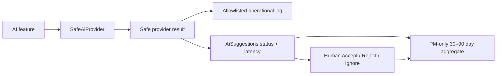

# AI Operational Metrics

## Overview

IDTS-97 adds privacy-safe reliability evidence for the four AI assistance features without introducing a monitoring platform or custom dashboard. The runtime emits allowlisted provider metrics, persists one safe status and latency sample with each `AiSuggestions` audit row, and exposes a PM-only aggregate for a bounded reporting window.

Language and type: SAP CAP Node.js, CDS/OData V4, SQLite/PostgreSQL-compatible application aggregation.

## Implementation Details

- `SafeAiProvider` emits one safe metric per provider operation. A telemetry sink failure is swallowed and never changes the provider result.
- `AiSuggestions.operationStatus` stores a normalized status such as `SUCCESS`, `AI_TIMEOUT`, or `AI_CONFIGURATION_INCOMPLETE`.
- `AiSuggestions.latencyMs` stores a non-negative integer latency. Missing latency remains `null` and is excluded from averages.
- Each AI feature copies only provider status and latency into its existing audit write. Duplicate detection stores total ranking duration while individual embedding calls still emit provider logs.
- `readAiOperationalMetrics(windowDays)` is restricted to `PM`, defaults to 30 days, and caps requests at 90 days.
- Aggregation groups by feature type, provider alias, and model alias. It returns request, success, failure, timeout, unavailable, review-outcome, and latency counts.
- `unavailableCount` covers disabled, incomplete configuration, and unsupported-provider states. `AI_PROVIDER_ERROR` remains a generic failure and `AI_TIMEOUT` remains separate.

Retention and interpretation:

- IDTS-97 adds no deletion job. Operational fields follow the retention of their existing `AiSuggestions` audit row.
- The read API limits its reporting window to 90 days to avoid an unbounded operational query.
- Counts describe AI assistance attempts with a persisted source Bug. They are not model-quality scores and do not prove that a suggestion was correct.
- Accept, Reject, Ignore, and Pending counts come from persisted human review. Acceptance is a review signal, not authorization for autonomous workflow changes.
- Interpret average/max latency together with `latencySampleCount`, because legacy or failed rows may have no latency.

## Dependencies

- Imports: `@sap/cds`, `srv/ai/safety.js`.
- Callers: `srv/ai/provider.js`, `srv/ai/audit.js`, `srv/service.js`.
- Feature audit writers: duplicate detection, classification suggestion, bug summary, assignment explanation.
- Persistence: `db/schema.cds` entity `AiSuggestions`.
- Public contract: `srv/service.cds` type `AiOperationalMetric` and function `readAiOperationalMetrics`.
- Verification: `scripts/qa/test-idts97-ai-operational-metrics.js`.

## Visual Diagrams

## Additional Insights

- Security: log and aggregate builders construct new allowlisted objects; they never copy provider request, prompt, response, error summary, email, attachment content, endpoint, token, or credential.
- Reliability: telemetry is deliberately best-effort. Existing AI fallback behavior remains the source of the user-facing result.
- Portability: aggregation reads a narrow column set and groups in application code, avoiding database-specific JSON or analytical functions for the current small audit volume.
- Risk: if audit volume becomes large, retention/purge and database-side aggregation need a separate reviewed task rather than speculative infrastructure in IDTS-97.

## Metadata

- Date: 2026-07-24
- Analysis depth: 3
- Primary owner: SangVN
- Files: `db/schema.cds`, `srv/service.cds`, `srv/service.js`, `srv/ai/metrics.js`, `srv/ai/provider.js`, `srv/ai/audit.js`, four AI feature modules, `srv/ai/index.js`

## Next Steps

- Run the IDTS-97 focused suite plus AI regressions and the security/secret scan.
- Capture the safe aggregate sample in Jira evidence.
- Keep Jira In Progress until the deferred Knowledge Gate and review policy are completed.
