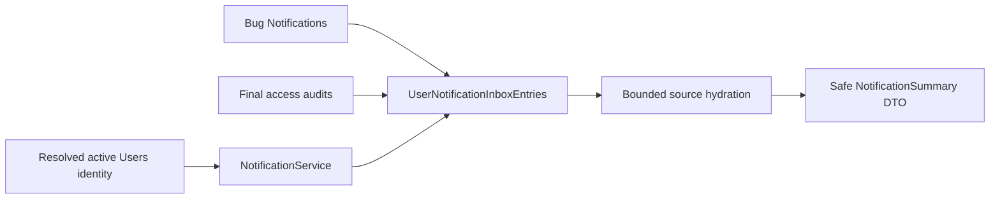
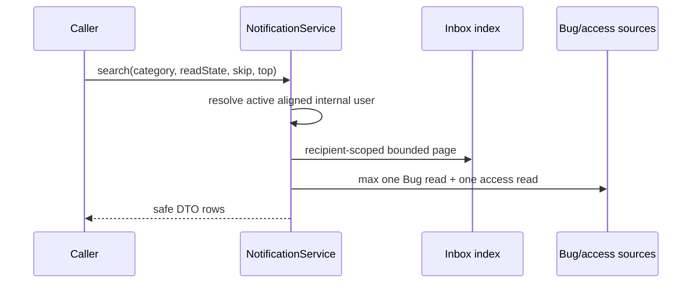

# My Notifications N1 implementation knowledge

## Overview

N1 adds a federated personal inbox index without replacing Bug notifications or access audits. CAP resolves one active aligned internal user before every read or mutation. The implementation is Node.js/CDS with SQLite contract tests and HANA/EDMX compilation.

## Implementation Details

- `db/schema.cds` adds nullable unique Bug `sourceKey`, inbox index/read state, and a future digest delivery snapshot table.
- `srv/notification.cds` exposes two caller-only reads and two read-state actions through a privacy-safe DTO.
- `srv/notification/inbox.js` applies recipient scope before filters/order/page/count, hydrates a page with at most two source reads, and uses optimistic/snapshot read-state updates.
- `scripts/db/backfill-notification-inbox.js` defaults to a non-mutating 30-day Bug-only plan; live `--execute` remains a later migration approval.

## Dependencies

- Imports: existing `resolveRequestUser`, CAP CQL and managed/cuid aspects.
- Services: dedicated `NotificationService`; no new worker/provider/scheduler.
- Persistence: authoritative Bug/access sources plus recipient/read-state index.

## Visual Diagrams

## Additional Insights

- Security: audit detail is never selected for the public DTO; access copy is event-allowlisted.
- Review corrections: inherited sourceKey is excluded from BugService, Bug links use the shared active-key builder, English/Vietnamese copy is generated by CAP i18n, and historical indexing includes already-emailed sources without creating email.
- Concurrency: a repeated already-read version is idempotent; an unread stale version returns 409.
- Performance: stable server order and two-source-read ceiling avoid client sorting and N+1 hydration.
- Scope: no UI, event producer, email policy, digest scheduler, migration or deployment is part of N1.

## Metadata

- Date: 2026-08-27
- Analysis depth: service, source model, authorization helpers, persistence and QA boundaries
- Main files: `db/schema.cds`, `srv/notification.cds`, `srv/notification.js`, `srv/notification/inbox.js`, `scripts/db/backfill-notification-inbox.js`

## Next Steps

- Complete the exact-head source/security review.
- Create one Draft N1 PR only if required severities are zero.
- Keep migration/backfill execution and N2 UI behind later approvals.

## Tiếng Việt

### Tổng quan và implementation

N1 thêm index inbox cá nhân liên nguồn, không thay thế notification Bug hoặc access audit. CAP resolve user nội bộ active và role đúng trước khi đọc hoặc ghi. CDS có sourceKey nullable unique, index/read-state và bảng snapshot digest cho gate sau. Service công khai hai function đọc và hai action read-state; handler scope recipient trước filter/order/page/count, hydrate tối đa hai bulk read và update optimistic/snapshot.

### Dependency và sơ đồ

Flow của hai sơ đồ trên: Bug Notifications và access audit cuối là source; index lưu recipient/read-state; NotificationService resolve Users qua helper identity/platform-role rồi đọc page và hydrate thành DTO an toàn. Dùng CAP CQL/cuid/managed, không thêm worker/provider/scheduler.

### Insight, metadata và bước tiếp

Không select audit detail hoặc sourceKey nội bộ ra API. Copy Anh/Việt lấy từ CAP i18n; link Bug dùng helper active key có sẵn. Backfill 30 ngày gồm cả source đã có email nhưng không tạo email mới, đọc theo batch 500 và mặc định dry-run. Tab lặp đã-read trả idempotent, unread stale trả 409; snapshot giữ notification đến sau unread. Không có UI/producer/email policy/digest scheduler/migration/deploy trong N1.

Ngày phân tích 27/08/2026; depth gồm service, model, helper auth, persistence và QA. File chính: `db/schema.cds`, `srv/notification.cds`, `srv/notification.js`, `srv/notification/inbox.js`, `scripts/db/backfill-notification-inbox.js`. Bước tiếp: review exact head, kiểm human Knowledge Gate trước một Draft PR; N2 và rollout vẫn cần boundary riêng.
