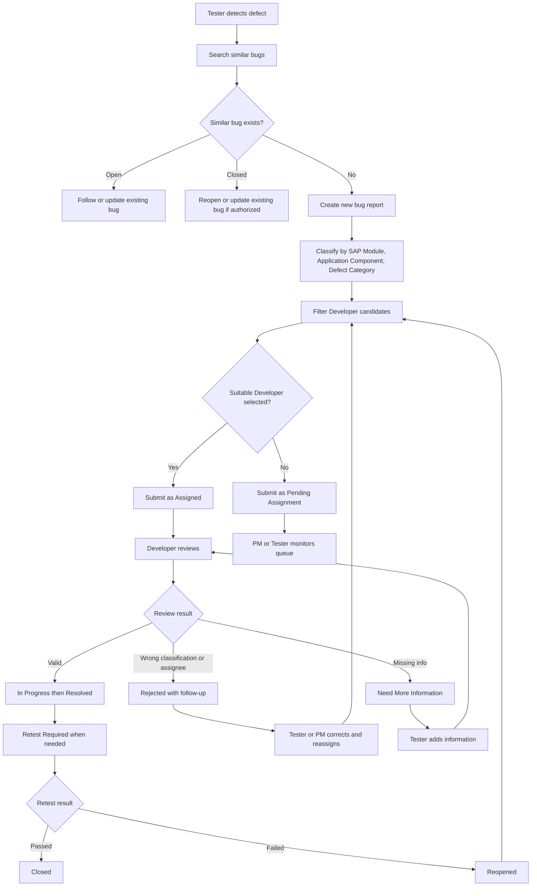
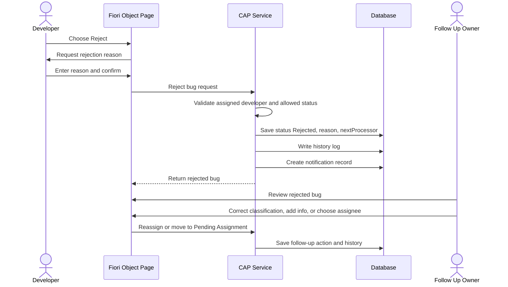
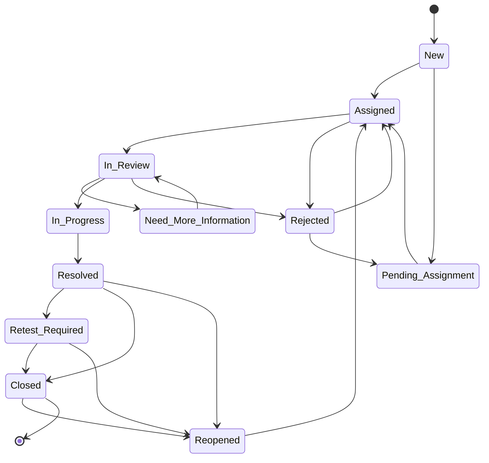
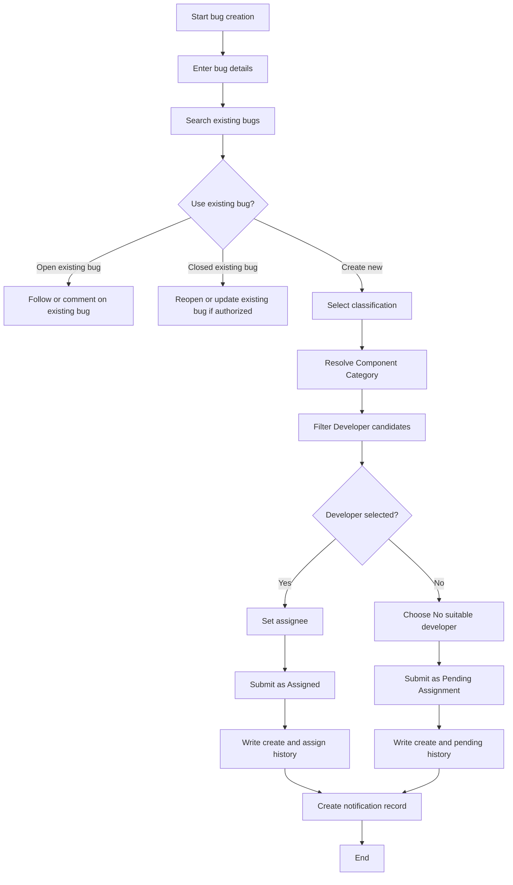
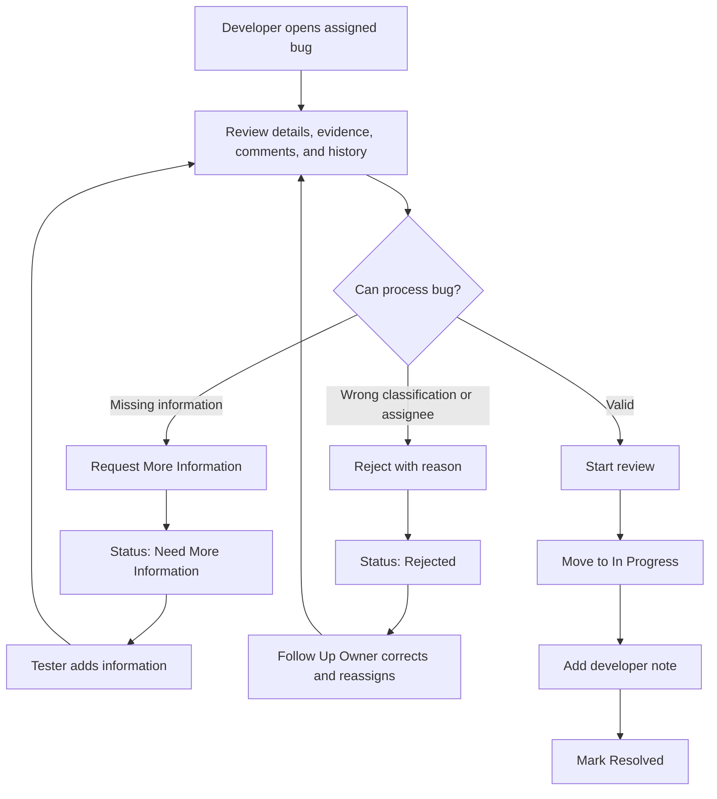
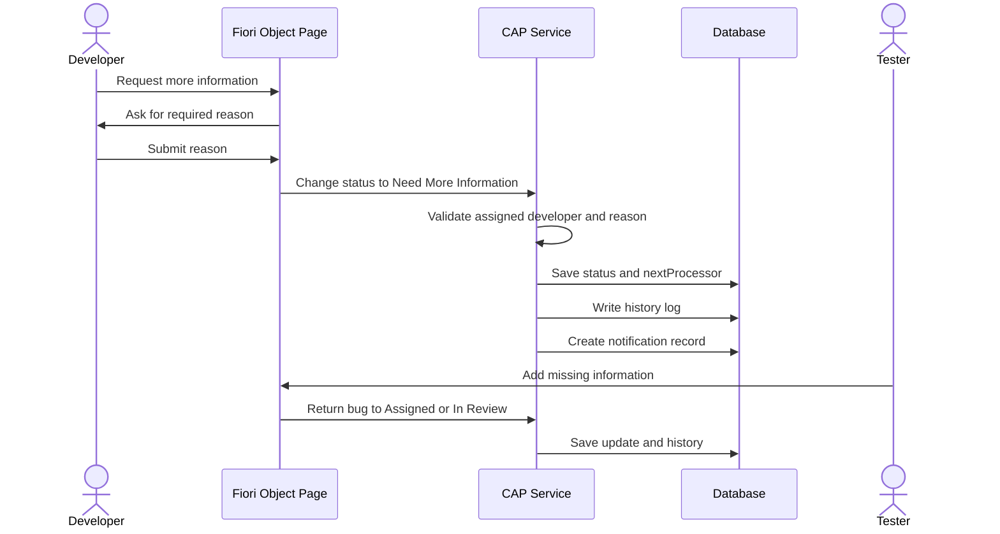
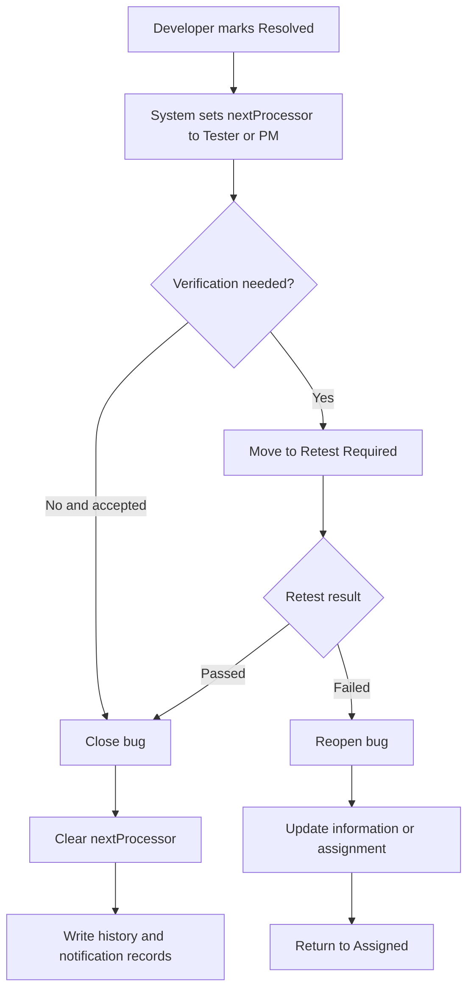
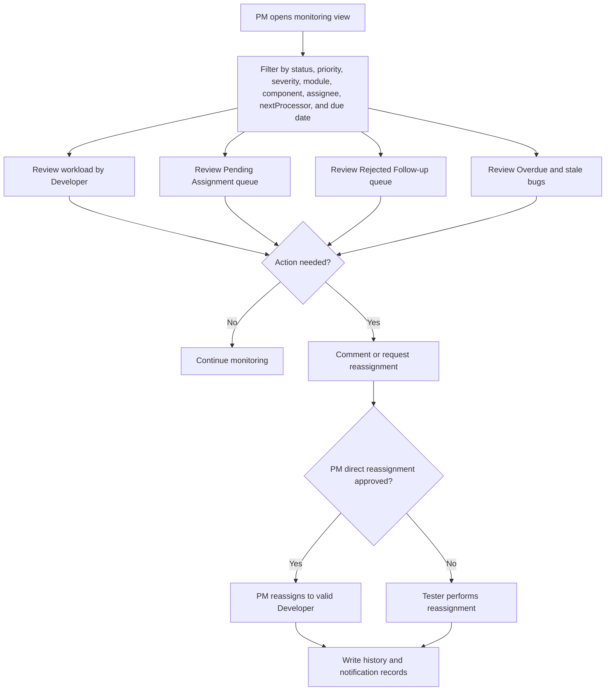

# Functional Requirements Specification

Project: Issue and Defect Tracking System in SAP  
Document type: Functional Requirements Specification (FRS)  
Language: English  
Status: Draft v1.2  
Last updated: 2026-06-03  
Prepared for: SAP490 project delivery, mentor review, Sprint 1 planning, and QA test design  
Document style: SAP490 hybrid, function-detail-first, aligned with BRD v1.2 and SRS v1.1

## 1. Document Control

### 1.1 Version History

| Version | Date | Author | Reviewer | Change Summary | Approval Status |
| --- | --- | --- | --- | --- | --- |
| v1.0 | 2026-06-02 | IDTS Project Team | Mentor / Supervisor | Initial FRS created from BRD v1.1, SRS v1.0, BA baseline, diagrams, and SAP490 guidance. | Draft |
| v1.1 | 2026-06-03 | IDTS Project Team | Mentor / Supervisor | Fixed Mermaid syntax in rejected follow-up sequence and added missing workflow diagrams for create/assign, developer review, request information, retest/closure, and PM monitoring. | Draft |
| v1.2 | 2026-06-03 | IDTS Project Team | Mentor / Supervisor | Updated functional actors and workflows to the MVP role baseline: Tester, Developer, and PM. Reporter and Admin are deferred as separate roles. | Draft |

### 1.2 Review and Sign-Off

| Role | Name | Responsibility | Status | Date |
| --- | --- | --- | --- | --- |
| Prepared by | IDTS Project Team | Prepare and maintain FRS | Drafted | 2026-06-02 |
| Reviewed by | Mentor / Supervisor | Review functional completeness and SAP490 fit | Pending | TBD |
| Approved by | Mentor / Supervisor | Approve FRS for implementation and test case design | Pending | TBD |
| Project owner | Team / PM | Confirm MVP functional priority | Pending | TBD |

## 2. Purpose and Scope

This FRS specifies detailed functional behavior for the IDTS MVP. It describes how users and the system shall perform bug creation, duplicate checking, classification, assignment, developer review, request for information, rejection follow-up, status transitions, comments, history logs, notification records, and PM monitoring.

The FRS is more detailed than the BRD and more workflow-oriented than the SRS. It is intended for CAP/Fiori implementation planning and QA test case design. It does not contain source code, final CDS schema, Fiori annotation code, UI5 controller code, or deployment credentials.

## 3. Functional Scope Summary

| Functional Area | Included in MVP | Notes |
| --- | --- | --- |
| Bug creation | Yes | Structured report with required fields and unique bug number. |
| Duplicate checking | Yes | Manual search/filter support; AI duplicate detection is not required. |
| Classification | Yes | SAP Module optional; Application Component and Defect Category required. |
| Developer matching | Yes | Based on Component Category and optional SAP Module. |
| Assignment | Yes | Assigned or Pending Assignment. |
| Developer review | Yes | Start review, request information, reject, progress, resolve. |
| Rejected follow-up | Yes | Rejected is not final; reason and nextProcessor required. |
| Retest and closure | Yes | Retest Required before close when verification is needed. |
| Comments | Yes | Discussion attached to bug; no direct status change. |
| History log | Yes | Important actions recorded. |
| Notification records | Yes | Event records and triggers; external delivery can be deferred. |
| PM monitoring | Yes | Workload, overdue, queues, nextProcessor, status filters. |
| Attachments | P1 | Metadata and reference support when time allows. |

## 4. Functional Workflow Diagrams

### 4.1 Main Defect Tracking Flow

### 4.2 Rejected Follow-up Flow

### 4.3 Status Lifecycle

### 4.4 Bug Creation and Assignment Activity Flow

### 4.5 Developer Review Decision Flow

### 4.6 Request More Information Flow

### 4.7 Resolve, Retest, Close, and Reopen Flow

### 4.8 PM Monitoring and Escalation Flow

## 5. Detailed Functional Requirements

### 5.1 FRS-BUG-001 - Create Bug Report

| Field | Specification |
| --- | --- |
| Purpose | Capture a structured defect report so the team can review, assign, process, and verify it. |
| Primary actor | Tester. |
| Trigger | User chooses to create a new bug after checking existing bugs or deciding no existing bug is suitable. |
| Preconditions | User is authorized to create bugs; required value-help data is available; duplicate search has been performed or intentionally skipped with user decision. |
| Main flow | User enters title, description, priority, severity, environment, steps to reproduce, actual result, expected result, optional SAP Module, Application Component, Defect Category, optional testCaseRef, optional testRunRef, and optional evidence metadata; system validates required fields; user selects Developer or No suitable developer; system submits the bug. |
| Alternative flow | If the user finds a similar open bug, the user follows, comments, or updates that existing bug instead of creating a new record. |
| Validation rules | Title, description, priority, severity, Application Component, Defect Category, steps to reproduce, actual result, expected result, and assignment decision are required for submit. SAP Module is optional. |
| Status effect | Selected Developer creates status Assigned. No suitable Developer creates status Pending Assignment. |
| History effect | Create and assignment decision must be logged. |
| Notification effect | Assigned bug creates a Developer notification record. Pending Assignment creates a PM or Tester queue notification record. |
| Acceptance criteria | Bug is created with unique bugNumber; required fields block invalid submit; Assigned and Pending Assignment outcomes work; history log exists. |
| Traceability | SRS-FR-BUG-001, SRS-FR-BUG-002, SRS-DATA-001, SRS-DATA-002. |

### 5.2 FRS-BUG-002 - Check Existing Bugs and Duplicate Support

| Field | Specification |
| --- | --- |
| Purpose | Reduce duplicate reports and guide users to existing bug records when appropriate. |
| Primary actor | Tester. |
| Trigger | User starts bug creation or searches bug list. |
| Preconditions | Bug list is accessible to the user according to authorization. |
| Main flow | User searches by title, keyword, status, priority, severity, SAP Module, Application Component, Defect Category, assignee, reporter, created date, or updated date; user reviews similar results; user decides whether to create new, follow existing open bug, or reopen/update closed bug. |
| Alternative flow | If no similar bug is found, user continues bug creation. |
| Validation rules | Reopen closed bug requires reason and authorized role. |
| Status effect | Existing open bug keeps its status unless a separate authorized action changes it. Closed bug can move to Reopened if allowed. |
| History effect | Reopen or duplicate-link action must be logged. |
| Acceptance criteria | Search/filter works; user can avoid new duplicate; closed bug reopen path is controlled; duplicate link can be added when implemented. |
| Traceability | SRS-FR-BUG-003, SRS-FR-BUG-004. |

### 5.3 FRS-CLASS-001 - Classify Bug

| Field | Specification |
| --- | --- |
| Purpose | Classify the bug clearly for assignment and PM reporting. |
| Primary actor | Tester. |
| Trigger | User creates or edits a non-closed bug. |
| Preconditions | Classification master data is active and available. |
| Main flow | User selects SAP Module if the bug belongs to a SAP business context; user selects Application Component; user selects Defect Category; system resolves Component Category. |
| Alternative flow | For pure IDTS bugs, SAP Module can remain empty or Not Applicable. |
| Validation rules | Application Component and Defect Category are required; Component Category must be an active valid pair; invalid pairs are rejected. |
| UI behavior | Application Component value help can be filtered by selected SAP Module; Defect Category value help can be filtered by Application Component. |
| Status effect | Classification changes do not automatically close or resolve a bug. |
| History effect | Important classification changes must be logged, especially after Rejected follow-up. |
| Acceptance criteria | SAP Module, Application Component, and Defect Category are separate; invalid component/category pair is not accepted; Developer candidate list reflects selected classification. |
| Traceability | SRS-FR-CLASS-001 to SRS-FR-CLASS-005. |

### 5.4 FRS-ASSIGN-001 - Filter and Assign Developer

| Field | Specification |
| --- | --- |
| Purpose | Assign a bug to a suitable Developer using responsibility mapping. |
| Primary actor | Tester; PM if direct assignment is approved. |
| Trigger | User submits a bug or chooses Assign/Reassign. |
| Preconditions | Bug has valid Application Component and Defect Category; Component Category can be resolved. |
| Main flow | System uses Component Category and optional SAP Module to filter active Developer Responsibilities; UI shows suitable Developer candidates; user selects one Developer; system assigns bug. |
| Alternative flow | If no Developer matches or all candidates are unsuitable, user selects No suitable developer. |
| Validation rules | Selected Developer must have an active profile and active responsibility for the Component Category and optional SAP Module scope; one bug has one main assignee at a time. |
| Status effect | Assignment from New or Pending Assignment sets status Assigned. Reassignment keeps status meaningful to the current flow unless a specific allowed transition is chosen. |
| History effect | Assign and reassign actions must log old assignee, new assignee, actor, timestamp, and reason when applicable. |
| Notification effect | Assigned or reassigned Developer gets a notification record. |
| Acceptance criteria | Candidate list is filtered; invalid assignee is rejected by backend; assignment creates history and notification records. |
| Traceability | SRS-FR-ASSIGN-001, SRS-FR-ASSIGN-002. |

### 5.5 FRS-ASSIGN-002 - Submit as Pending Assignment

| Field | Specification |
| --- | --- |
| Purpose | Keep valid bugs visible when no suitable Developer is available. |
| Primary actor | Tester. |
| Trigger | User submits a valid bug with No suitable developer. |
| Preconditions | Required bug fields and classification are valid. |
| Main flow | User chooses No suitable developer; system submits bug; system sets status Pending Assignment; system sets nextProcessor to PM queue or Tester; system creates history and notification records. |
| Alternative flow | PM or Tester later assigns a suitable Developer and moves bug to Assigned. |
| Validation rules | Pending Assignment is allowed only for valid bug reports, not as a way to bypass required fields. |
| Status effect | New to Pending Assignment. Pending Assignment to Assigned when a suitable Developer is selected. |
| History effect | Pending Assignment entry and later assignment must be logged. |
| Acceptance criteria | Bug is not lost; Pending Assignment appears in monitoring; follow-up assignment works. |
| Traceability | SRS-FR-ASSIGN-003, SRS-FR-PM-003. |

### 5.6 FRS-ASSIGN-003 - Reassign Bug

| Field | Specification |
| --- | --- |
| Purpose | Move responsibility to another Developer when the current assignment is unsuitable or capacity changes. |
| Primary actor | Tester; PM if direct reassignment is approved. |
| Trigger | User chooses Reassign or handles rejected follow-up. |
| Preconditions | Bug is not Closed or user has reopen authority; new Developer passes responsibility validation. |
| Main flow | User enters reason when required; user selects new Developer from filtered candidates; system updates assignee, nextProcessor, history, and notification records. |
| Alternative flow | If no suitable Developer exists, user moves bug to Pending Assignment. |
| Validation rules | Reassign is an action/history event, not a primary status. Reason is required for rejected follow-up, wrong assignment, or PM escalation. |
| Status effect | Status can remain Assigned/In Review/In Progress when only assignee changes; Rejected can move to Assigned or Pending Assignment after correction. |
| Acceptance criteria | Old and new assignee are visible in history; new assignee is valid; Rejected follow-up cannot be left without owner. |
| Traceability | SRS-FR-ASSIGN-004, SRS-FR-STATUS-004. |

### 5.7 FRS-DEV-001 - Developer Review, Progress, and Resolve

| Field | Specification |
| --- | --- |
| Purpose | Let Developer review and process assigned bugs without treating IDTS as a code fixing tool. |
| Primary actor | Developer. |
| Trigger | Developer opens My Assigned Bugs or receives notification. |
| Preconditions | Bug is assigned to Developer or Developer is otherwise authorized. |
| Main flow | Developer opens bug details; reviews classification, reproduction steps, evidence, comments, and history; starts review; adds note or comment; moves valid bug to In Progress; marks Resolved when response or resolution result is complete. |
| Alternative flow | Developer requests more information or rejects unsuitable classification/assignment. |
| Validation rules | Developer cannot close bug directly in recommended MVP; Developer can only update assigned or authorized bugs. |
| Status effect | Assigned to In Review; In Review to In Progress; In Progress to Resolved. |
| History effect | Start review, progress, developer note, and resolved actions should be logged where meaningful. |
| Notification effect | Status update or resolved event creates Tester/PM notification record when applicable. |
| Acceptance criteria | Developer can perform review flow; direct close is not available for Developer; history records status changes. |
| Traceability | SRS-FR-STATUS-001, SRS-FR-STATUS-005. |

### 5.8 FRS-INFO-001 - Request More Information

| Field | Specification |
| --- | --- |
| Purpose | Prevent unclear bugs from being processed without enough information. |
| Primary actor | Developer. |
| Trigger | Developer identifies missing or unclear information. |
| Preconditions | Bug is Assigned or In Review and Developer is assigned or authorized. |
| Main flow | Developer selects Request More Information; system requires reason; system sets status Need More Information; system sets nextProcessor to Tester; system writes history and notification record. |
| Alternative flow | Tester updates missing information and returns bug to Assigned or In Review. |
| Validation rules | Reason is required; closed bugs cannot enter Need More Information without Reopen. |
| Status effect | Assigned or In Review to Need More Information; then Need More Information to Assigned or In Review after Tester action. |
| Acceptance criteria | Reason is required; Tester can see required action; Developer can continue review after information is supplied. |
| Traceability | SRS-FR-STATUS-002, SRS-FR-STATUS-009. |

### 5.9 FRS-REJECT-001 - Reject Unsuitable Assignment or Classification

| Field | Specification |
| --- | --- |
| Purpose | Give Developer a controlled rejection path without making Rejected a final state. |
| Primary actor | Developer, then Tester or PM as follow-up owner. |
| Trigger | Developer determines the bug is wrongly classified, wrongly assigned, or outside responsibility. |
| Preconditions | Bug is Assigned or In Review; Developer is assigned or authorized. |
| Main flow | Developer selects Reject; system requires rejection reason; system sets status Rejected; system sets nextProcessor to Tester or PM; system writes history and notification record; follow-up owner reviews reason, corrects classification or information, then reassigns to a suitable Developer or moves bug to Pending Assignment. |
| Alternative flow | PM comments or requests reassignment if PM direct reassignment is not approved. |
| Validation rules | Rejection reason is required; nextProcessor is required unless represented by a configured role queue; Rejected cannot transition directly to Closed; follow-up transition must be Assigned or Pending Assignment. |
| Status effect | Assigned/In Review to Rejected; Rejected to Assigned or Pending Assignment after correction. |
| History effect | Reject reason, actor, old status, new status, and follow-up action must be logged. |
| Notification effect | Tester and PM when applicable receive notification records. |
| Acceptance criteria | Rejected bug is visible as a follow-up queue; reason is shown on Object Page; no rejected bug is left without owner/action. |
| Traceability | SRS-FR-STATUS-003, SRS-FR-STATUS-004, SRS-FR-STATUS-009. |

### 5.10 FRS-STATUS-002 - Resolve, Retest, and Close

| Field | Specification |
| --- | --- |
| Purpose | Prevent bug closure before verification when retest is needed. |
| Primary actor | Developer, Tester/PM. |
| Trigger | Developer marks a bug Resolved. |
| Preconditions | Bug is In Progress and Developer is assigned or authorized. |
| Main flow | Developer marks Resolved with note when needed; system sets nextProcessor to Tester/PM; Tester/PM sends bug to Retest Required if verification is needed; if retest passes, Tester/PM closes the bug. |
| Alternative flow | If no retest is needed and result is accepted, Tester/PM can close directly from Resolved when rule allows. |
| Validation rules | Developer should not close directly in recommended MVP. Close requires authorized Tester/PM. |
| Status effect | In Progress to Resolved; Resolved to Retest Required or Closed; Retest Required to Closed. |
| History effect | Resolve, retest, and close actions must be logged. |
| Acceptance criteria | Resolved does not silently become Closed; retest pass closes; action history is visible. |
| Traceability | SRS-FR-STATUS-006, SRS-FR-STATUS-007. |

### 5.11 FRS-STATUS-003 - Reopen Bug

| Field | Specification |
| --- | --- |
| Purpose | Continue processing when a resolved or closed bug still exists. |
| Primary actor | Tester/PM. |
| Trigger | Retest fails or user discovers the issue still exists after closure. |
| Preconditions | User is authorized to reopen. |
| Main flow | User selects Reopen; system requires reason; system sets status Reopened; user updates information or assigns Developer; system logs history and notification. |
| Alternative flow | If the bug is still under Retest Required, retest failure moves to Reopened. |
| Validation rules | Reopen reason is required; Closed bugs should not be freely edited without Reopen. |
| Status effect | Resolved, Retest Required, or Closed to Reopened; Reopened to Assigned after reassignment. |
| Acceptance criteria | Reason is captured; processing can continue; history preserves closure and reopen path. |
| Traceability | SRS-FR-BUG-005, SRS-FR-STATUS-007. |

### 5.12 FRS-STATUS-005 - Status Transition Validation

| Field | Specification |
| --- | --- |
| Purpose | Ensure lifecycle consistency across UI and backend. |
| Primary actor | System. |
| Trigger | Any status-changing action or update. |
| Preconditions | Current bug status is known. |
| Main flow | System checks requested transition against the status transition matrix; system validates actor role and required reason; system rejects invalid transition with actionable error message. |
| Alternative flow | PM escalation override can be considered only if explicitly approved later. |
| Validation rules | Backend validation is authoritative; hidden Fiori actions do not replace backend checks. |
| Status effect | Only allowed transitions persist. |
| Acceptance criteria | Invalid transitions fail; required reason is enforced; accepted transition logs history. |
| Traceability | SRS-FR-STATUS-008, SRS-NFR-INT-001. |

### 5.13 FRS-NEXTP-001 - Maintain nextProcessor

| Field | Specification |
| --- | --- |
| Purpose | Show who or which queue must act next. |
| Primary actor | System. |
| Trigger | Bug creation, assignment, reassignment, status change, request information, reject, resolve, retest, close, or reopen. |
| Preconditions | Action and target status are known. |
| Main flow | System sets nextProcessor using mapping rules: Assigned/In Review/In Progress to assigned Developer; Need More Information to Tester; Pending Assignment to PM queue or Tester; Rejected to Tester or PM; Resolved/Retest Required to Tester/PM; Closed to empty. |
| Alternative flow | PM may override nextProcessor only for escalation or exceptional reassignment if approved. |
| Validation rules | nextProcessor does not replace assignee. Rejected must have nextProcessor or a configured follow-up queue. |
| History effect | Important nextProcessor changes should be logged. |
| Acceptance criteria | My Action Items and PM queues reflect nextProcessor; Closed has no nextProcessor; Rejected has a clear follow-up owner. |
| Traceability | SRS-FR-STATUS-009. |

### 5.14 FRS-COMMENT-001 - Add Comments

| Field | Specification |
| --- | --- |
| Purpose | Keep collaboration attached to a bug record. |
| Primary actor | Tester, Developer, PM. |
| Trigger | Authorized user adds a comment on Object Page. |
| Preconditions | User can view the bug and is allowed to comment. |
| Main flow | User enters comment content; system stores content, author, author role, timestamp, and bug reference; system displays comment list in chronological order. |
| Alternative flow | Comment can support a later status action, but status must be changed through a separate authorized action. |
| Validation rules | Comment content is required; comment cannot directly change status. |
| History effect | Comment event may be logged when audit policy requires. |
| Acceptance criteria | Comment is visible on bug; status remains unchanged; author and timestamp are stored. |
| Traceability | SRS-FR-COMMENT-001, SRS-FR-COMMENT-002. |

### 5.15 FRS-AUDIT-001 - History Log

| Field | Specification |
| --- | --- |
| Purpose | Preserve traceability of important changes. |
| Primary actor | System. |
| Trigger | Important business action occurs. |
| Preconditions | Bug and actor context are available. |
| Main flow | System records bug reference, actor, actor role, timestamp, action type, old value, new value, and reason when applicable. |
| Logged actions | Create, edit, assign, reassign, status change, request information, reject, resolve, retest, close, reopen, comment event, attachment event, notification event. |
| Validation rules | Reason is required for reject, reopen, request information, and selected reassignment cases. |
| Acceptance criteria | History answers who did what, when, and why where applicable. |
| Traceability | SRS-FR-AUDIT-001, SRS-FR-AUDIT-002. |

### 5.16 FRS-NOTIF-001 - Notification Records

| Field | Specification |
| --- | --- |
| Purpose | Record important notification events without hardcoding delivery channels. |
| Primary actor | System. |
| Trigger | Assignment, reassignment, request information, bug update, rejection, overdue, resolved, retest, or close event. |
| Preconditions | Event and recipient can be determined. |
| Main flow | System creates notification record with bug reference, recipient, eventType, channel where known, deliveryStatus, and timestamp. |
| Alternative flow | External delivery adapter can be added later; failure to deliver shall not remove history log. |
| Validation rules | No private endpoint, webhook URL, token, or service key is stored in repo code. |
| Acceptance criteria | Notification records exist for important events; Rejected notification makes follow-up owner clear. |
| Traceability | SRS-FR-NOTIF-001, SRS-FR-NOTIF-002. |

### 5.17 FRS-PM-001 - PM Monitoring Dashboard and Lists

| Field | Specification |
| --- | --- |
| Purpose | Help PM monitor risk, workload, overdue items, and ownership. |
| Primary actor | PM. |
| Trigger | PM opens List Report, dashboard, or monitoring view. |
| Preconditions | PM has monitoring authorization. |
| Main flow | PM filters bugs by status, priority, severity, SAP Module, Application Component, Defect Category, assignee, nextProcessor, created date, updated date, due date, and overdue state; PM reviews workload by Developer and queues. |
| Queue views | All Bugs, My Action Items, Pending Assignment, Need More Information, Retest Required, Rejected Follow-up, Overdue, My Assigned Bugs where relevant. |
| Validation rules | PM can view all bugs; PM direct reassignment depends on authorization decision. |
| Acceptance criteria | PM can identify unassigned, overdue, rejected, stale, and overloaded areas quickly. |
| Traceability | SRS-FR-PM-001, SRS-FR-PM-002, SRS-FR-PM-003. |

### 5.18 FRS-PM-002 - PM Reassignment Request or Direct Reassignment

| Field | Specification |
| --- | --- |
| Purpose | Let PM coordinate reassignment without replacing Developer or Tester responsibilities. |
| Primary actor | PM. |
| Trigger | PM detects overload, overdue, wrong assignment, repeated rejection, or long pending item. |
| Preconditions | PM can view the bug. |
| Main flow | PM comments or requests reassignment; Tester performs reassignment by default. |
| Alternative flow | If mentor/team approves PM direct reassignment, PM selects a valid Developer and system logs the action. |
| Validation rules | PM direct reassignment must be explicitly enabled in authorization; reason should be recorded. |
| Acceptance criteria | PM can coordinate reassignment; ownership stays clear; action is logged. |
| Traceability | SRS-FR-PM-004. |

### 5.19 FRS-UX-001 - Fiori List Report and Object Page Behavior

| Field | Specification |
| --- | --- |
| Purpose | Provide a usable enterprise UI aligned with Fiori Elements. |
| Primary actor | Tester, Developer, PM. |
| Trigger | User opens bug management app. |
| Preconditions | OData service and annotations are available. |
| List Report behavior | Show bugNumber, title, status, priority, severity, SAP Module, Application Component, Defect Category, assignee, nextProcessor, due date, updatedAt, and createdAt where available. |
| Filter behavior | Support status, priority, severity, SAP Module, Application Component, Defect Category, assignee, nextProcessor, overdue, created date, and updated date filters. |
| Object Page sections | Bug Details, Classification, Assignment, Reproduction, Comments, Attachments, History, Notifications, PM Monitoring. |
| Message behavior | Use inline value states for missing fields, Message Popover for multiple issues, and confirmation dialogs for Reject, Reopen, Close, or destructive attachment removal. |
| Semantic colors | Positive for Resolved and Closed; Critical for Pending Assignment, Need More Information, Retest Required, Overdue; Negative for Rejected; Neutral or Information for New, Assigned, In Review, In Progress, Reopened. |
| Acceptance criteria | Core fields are visible; dependent value helps are understandable; actions match role/status; Rejected details are visible; validation messages are actionable. |
| Traceability | SRS-IF-UI-001 to SRS-IF-UI-005, SRS-NFR-USE-001, SRS-NFR-USE-002. |

## 6. Functional Data Rules

| Rule ID | Rule |
| --- | --- |
| FRS-DATA-RULE-001 | Application Component and Defect Category are required for submit. |
| FRS-DATA-RULE-002 | SAP Module is optional and must not be confused with IDTS Application Component. |
| FRS-DATA-RULE-003 | Component Category must be a valid active pair. |
| FRS-DATA-RULE-004 | Developer candidate must have active Developer Responsibility. |
| FRS-DATA-RULE-005 | A bug has one main assignee at a time. |
| FRS-DATA-RULE-006 | Rejected requires reason and nextProcessor or configured follow-up queue. |
| FRS-DATA-RULE-007 | Closed bugs are not freely edited; Reopen is used when processing continues. |
| FRS-DATA-RULE-008 | Comments do not directly change status. |
| FRS-DATA-RULE-009 | History log must record important actions. |

## 7. Acceptance Criteria Summary

| Functional Area | Minimum acceptance criteria |
| --- | --- |
| Bug creation | Valid bug can be submitted as Assigned or Pending Assignment; invalid bug is blocked. |
| Duplicate support | User can search existing bugs before creation and decide follow, reopen, or create new. |
| Classification | Required classification fields and valid pair rules work. |
| Assignment | Developer list filters by responsibility and rejects invalid assignee. |
| Pending Assignment | Queue is visible to PM/Tester and can later be assigned. |
| Developer review | Developer can review, request information, reject, progress, and resolve. |
| Rejected follow-up | Rejected bug always has reason, nextProcessor, history, notification, and follow-up transition. |
| Retest and closure | Resolved bug can go to Retest Required; pass closes; fail reopens. |
| Comments | Comment stores author, role, timestamp, and content without status change. |
| History | Important actions show actor, time, old/new value, and reason where applicable. |
| Notifications | Event records exist without hardcoded external endpoints. |
| PM monitoring | PM can identify workload, overdue, pending, rejected, retest, and nextProcessor queues. |

## 8. Traceability to SRS

| FRS ID | Related SRS IDs |
| --- | --- |
| FRS-BUG-001 | SRS-FR-BUG-001, SRS-FR-BUG-002, SRS-DATA-001, SRS-DATA-002 |
| FRS-BUG-002 | SRS-FR-BUG-003, SRS-FR-BUG-004 |
| FRS-CLASS-001 | SRS-FR-CLASS-001 to SRS-FR-CLASS-005 |
| FRS-ASSIGN-001 | SRS-FR-ASSIGN-001, SRS-FR-ASSIGN-002 |
| FRS-ASSIGN-002 | SRS-FR-ASSIGN-003, SRS-FR-PM-003 |
| FRS-ASSIGN-003 | SRS-FR-ASSIGN-004, SRS-FR-STATUS-004 |
| FRS-DEV-001 | SRS-FR-STATUS-001, SRS-FR-STATUS-005 |
| FRS-INFO-001 | SRS-FR-STATUS-002, SRS-FR-STATUS-009 |
| FRS-REJECT-001 | SRS-FR-STATUS-003, SRS-FR-STATUS-004, SRS-FR-STATUS-009 |
| FRS-STATUS-002 | SRS-FR-STATUS-006, SRS-FR-STATUS-007 |
| FRS-STATUS-003 | SRS-FR-BUG-005, SRS-FR-STATUS-007 |
| FRS-STATUS-005 | SRS-FR-STATUS-008, SRS-NFR-INT-001 |
| FRS-NEXTP-001 | SRS-FR-STATUS-009 |
| FRS-COMMENT-001 | SRS-FR-COMMENT-001, SRS-FR-COMMENT-002 |
| FRS-AUDIT-001 | SRS-FR-AUDIT-001, SRS-FR-AUDIT-002 |
| FRS-NOTIF-001 | SRS-FR-NOTIF-001, SRS-FR-NOTIF-002 |
| FRS-PM-001 | SRS-FR-PM-001, SRS-FR-PM-002, SRS-FR-PM-003 |
| FRS-PM-002 | SRS-FR-PM-004 |
| FRS-UX-001 | SRS-IF-UI-001 to SRS-IF-UI-005, SRS-NFR-USE-001, SRS-NFR-USE-002 |

## 9. Open Issues

| ID | Open Issue | Owner | Functional Impact |
| --- | --- | --- | --- |
| OI-FRS-001 | Confirm PM direct reassignment permission. | Team / Mentor | Determines whether PM sees Assign/Reassign actions or only request/comment actions. |
| OI-FRS-002 | Confirm notification channel for MVP. | Team / Mentor | Determines whether notification records alone satisfy MVP. |
| OI-FRS-003 | Confirm attachment storage approach. | Team / Mentor | Determines whether Attachments are metadata-only or actual file handling. |
| OI-FRS-004 | Confirm overdue thresholds and workload limits. | Team / PM | Determines PM dashboard calculations. |
| OI-FRS-005 | Confirm whether Mermaid diagram source in Markdown should be rendered as images for DOCX submission. | Team / Mentor | Affects final DOCX visual format only, not functional scope. |
