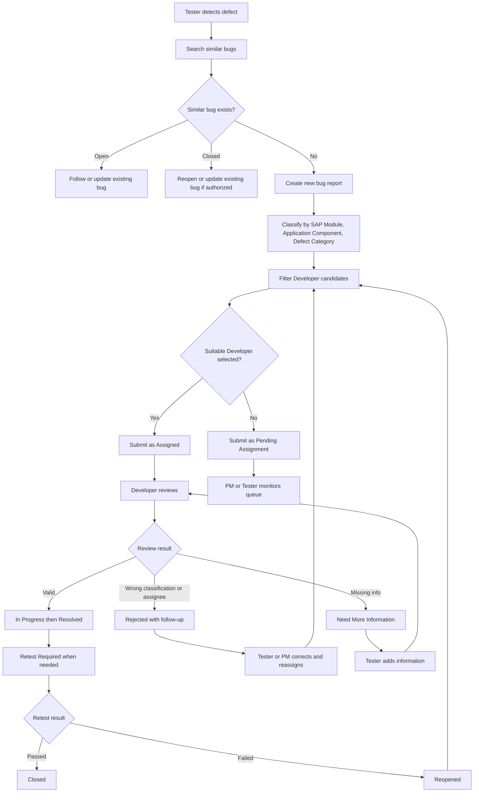
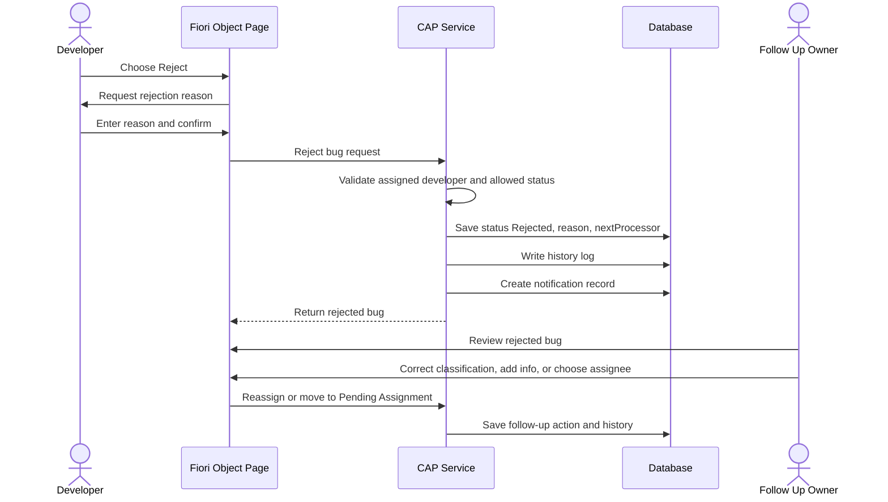
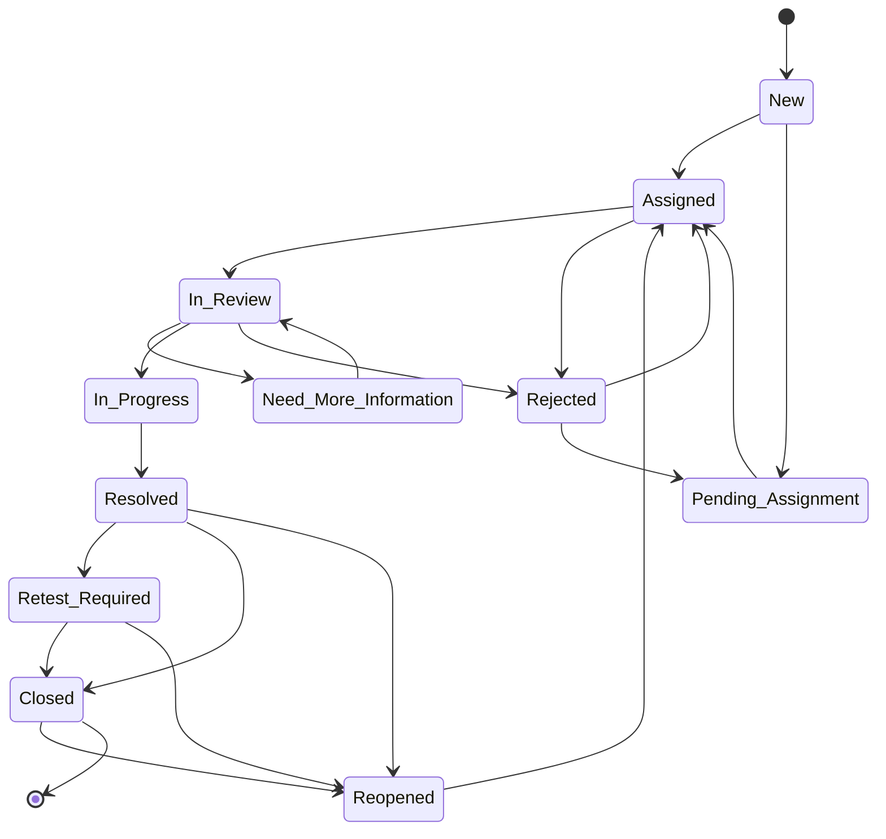
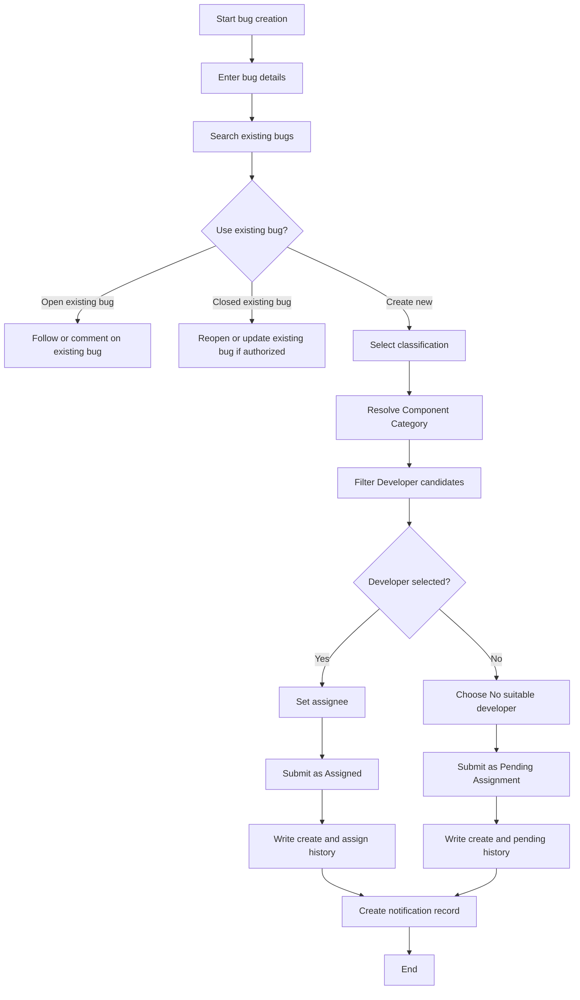
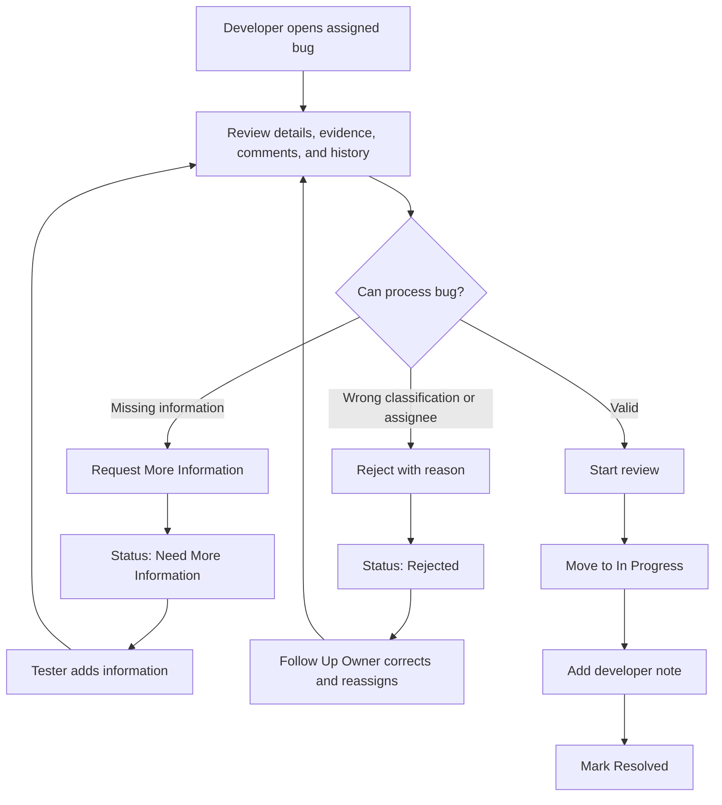
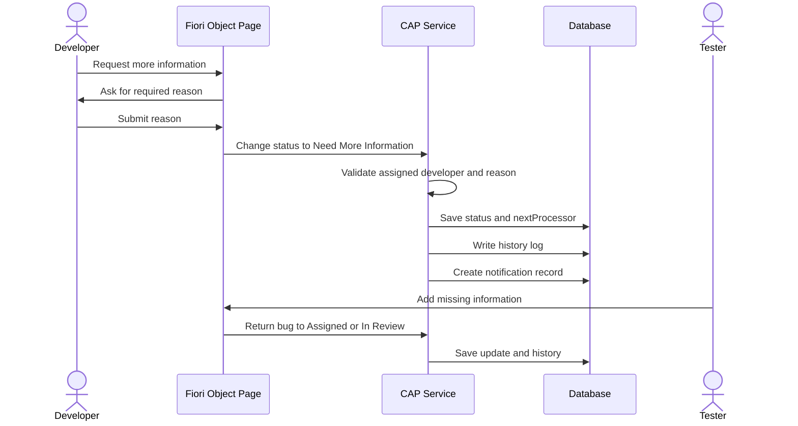
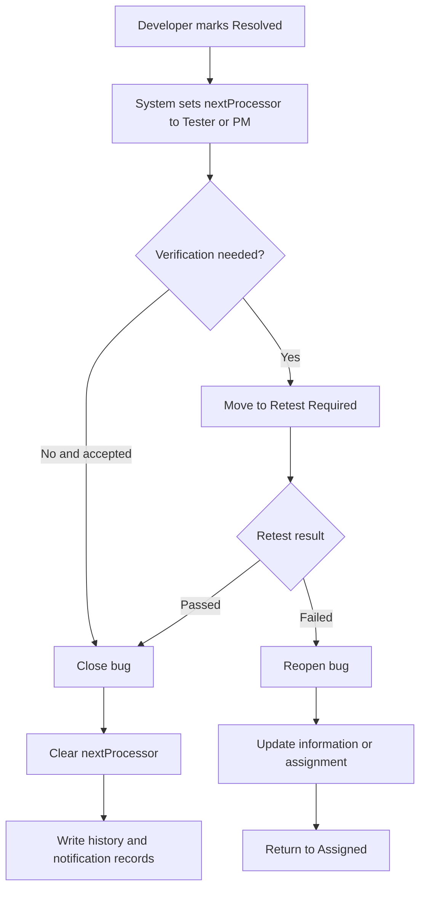
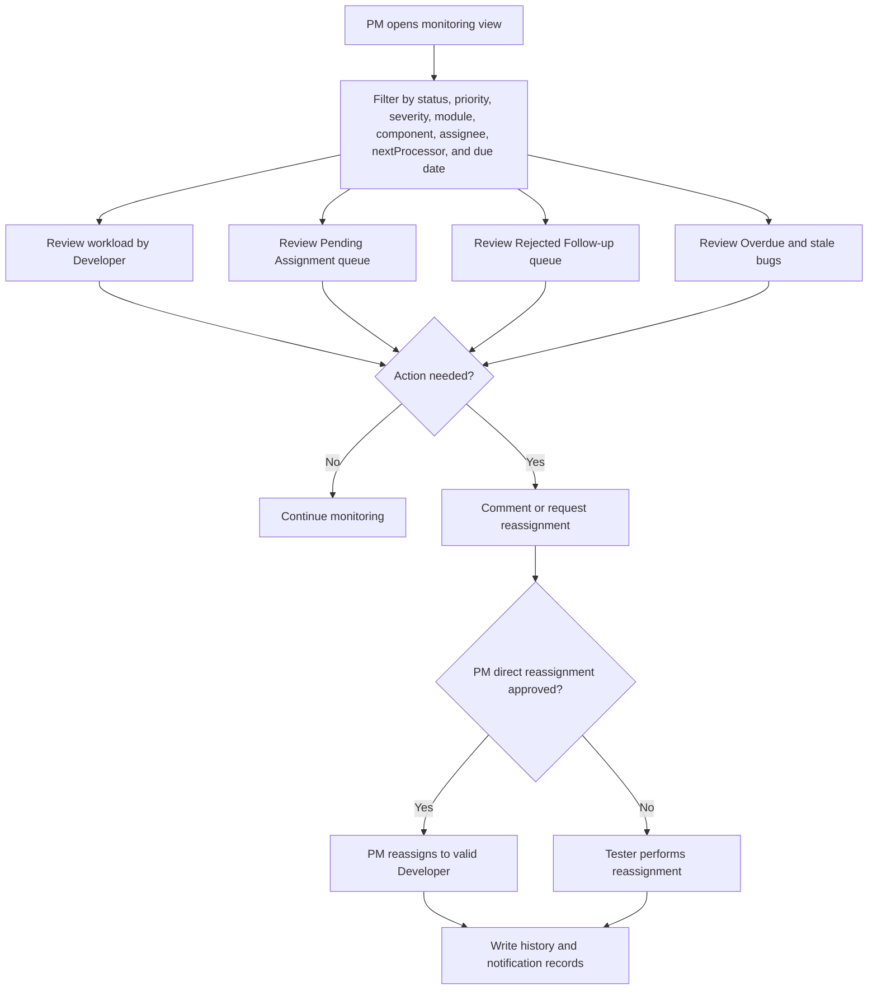

# Tài liệu Đặc tả Yêu cầu Chức năng

Dự án: Issue and Defect Tracking System in SAP  
Loại tài liệu: Functional Requirements Specification (FRS)  
Ngôn ngữ: Tiếng Việt  
Trạng thái: Draft v1.2  
Cập nhật lần cuối: 2026-06-03  
Chuẩn bị cho: SAP490 project delivery, mentor review, Sprint 1 planning và QA test design  
Phong cách tài liệu: SAP490 hybrid, ưu tiên functional detail, aligned với BRD v1.2 và SRS v1.1

## 1. Kiểm soát tài liệu

### 1.1 Lịch sử phiên bản

| Phiên bản | Ngày | Người viết | Người review | Tóm tắt thay đổi | Trạng thái duyệt |
| --- | --- | --- | --- | --- | --- |
| v1.0 | 2026-06-02 | IDTS Project Team | Mentor / Supervisor | Tạo bản FRS đầu tiên từ BRD v1.1, SRS v1.0, BA baseline, diagrams và SAP490 guidance. | Draft |
| v1.1 | 2026-06-03 | IDTS Project Team | Mentor / Supervisor | Sửa lỗi Mermaid syntax trong rejected follow-up sequence và bổ sung workflow diagrams còn thiếu cho create/assign, developer review, request information, retest/closure và PM monitoring. | Draft |
| v1.2 | 2026-06-03 | IDTS Project Team | Mentor / Supervisor | Cập nhật functional actors và workflows theo MVP role baseline: Tester, Developer và PM. Reporter và Admin được hoãn như role tách riêng. | Draft |

### 1.2 Review và phê duyệt

| Vai trò | Tên | Trách nhiệm | Trạng thái | Ngày |
| --- | --- | --- | --- | --- |
| Prepared by | IDTS Project Team | Chuẩn bị và duy trì FRS | Drafted | 2026-06-02 |
| Reviewed by | Mentor / Supervisor | Review độ đầy đủ chức năng và mức phù hợp SAP490 | Pending | TBD |
| Approved by | Mentor / Supervisor | Phê duyệt FRS cho implementation và test case design | Pending | TBD |
| Project owner | Team / PM | Xác nhận priority chức năng trong MVP | Pending | TBD |

## 2. Mục đích và phạm vi

FRS này đặc tả chi tiết hành vi chức năng cho IDTS MVP. Tài liệu mô tả cách user và system thực hiện tạo bug, kiểm tra duplicate, phân loại, assign, developer review, request information, rejected follow-up, status transitions, comments, history logs, notification records và PM monitoring.

FRS chi tiết hơn BRD và thiên về workflow hơn SRS. Tài liệu dùng cho CAP/Fiori implementation planning và QA test case design. FRS không chứa source code, CDS schema cuối cùng, Fiori annotation code, UI5 controller code hoặc deployment credentials.

## 3. Tóm tắt phạm vi chức năng

| Functional Area | Có trong MVP | Ghi chú |
| --- | --- | --- |
| Bug creation | Có | Bug report có cấu trúc với required fields và unique bug number. |
| Duplicate checking | Có | Manual search/filter support; không bắt buộc AI duplicate detection. |
| Classification | Có | SAP Module optional; Application Component và Defect Category required. |
| Developer matching | Có | Dựa trên Component Category và optional SAP Module. |
| Assignment | Có | Assigned hoặc Pending Assignment. |
| Developer review | Có | Start review, request information, reject, progress, resolve. |
| Rejected follow-up | Có | Rejected không phải final; bắt buộc reason và nextProcessor. |
| Retest and closure | Có | Retest Required trước khi close khi cần verification. |
| Comments | Có | Trao đổi gắn với bug; không đổi status trực tiếp. |
| History log | Có | Important actions được ghi nhận. |
| Notification records | Có | Event records và triggers; external delivery có thể defer. |
| PM monitoring | Có | Workload, overdue, queues, nextProcessor, status filters. |
| Attachments | P1 | Metadata và reference support nếu còn thời gian. |

## 4. Functional Workflow Diagrams

### 4.1 Main Defect Tracking Flow

### 4.2 Rejected Follow-up Flow

### 4.3 Status Lifecycle

### 4.4 Bug Creation and Assignment Activity Flow

### 4.5 Developer Review Decision Flow

### 4.6 Request More Information Flow

### 4.7 Resolve, Retest, Close, and Reopen Flow

### 4.8 PM Monitoring and Escalation Flow

## 5. Detailed Functional Requirements

### 5.1 FRS-BUG-001 - Create Bug Report

| Field | Specification |
| --- | --- |
| Purpose | Ghi nhận defect report có cấu trúc để team có thể review, assign, process và verify. |
| Primary actor | Tester. |
| Trigger | User chọn tạo bug mới sau khi kiểm tra existing bugs hoặc xác định không có bug hiện có phù hợp. |
| Preconditions | User có quyền tạo bug; value-help data cần thiết có sẵn; duplicate search đã thực hiện hoặc user chủ động quyết định bỏ qua. |
| Main flow | User nhập title, description, priority, severity, environment, steps to reproduce, actual result, expected result, optional SAP Module, Application Component, Defect Category, optional testCaseRef, optional testRunRef và optional evidence metadata; system validate required fields; user chọn Developer hoặc No suitable developer; system submit bug. |
| Alternative flow | Nếu user tìm thấy similar open bug, user follow, comment hoặc update existing bug thay vì tạo record mới. |
| Validation rules | Title, description, priority, severity, Application Component, Defect Category, steps to reproduce, actual result, expected result và assignment decision là required để submit. SAP Module optional. |
| Status effect | Chọn Developer tạo status Assigned. No suitable Developer tạo status Pending Assignment. |
| History effect | Create và assignment decision phải được log. |
| Notification effect | Assigned bug tạo Developer notification record. Pending Assignment tạo notification record cho PM hoặc Tester queue. |
| Acceptance criteria | Bug được tạo với unique bugNumber; required fields block invalid submit; Assigned và Pending Assignment đều hoạt động; history log tồn tại. |
| Traceability | SRS-FR-BUG-001, SRS-FR-BUG-002, SRS-DATA-001, SRS-DATA-002. |

### 5.2 FRS-BUG-002 - Check Existing Bugs and Duplicate Support

| Field | Specification |
| --- | --- |
| Purpose | Giảm duplicate reports và hướng user đến existing bug records khi phù hợp. |
| Primary actor | Tester. |
| Trigger | User bắt đầu bug creation hoặc search bug list. |
| Preconditions | Bug list accessible với user theo authorization. |
| Main flow | User search theo title, keyword, status, priority, severity, SAP Module, Application Component, Defect Category, assignee, reporter, created date hoặc updated date; user review similar results; user quyết định create new, follow existing open bug hoặc reopen/update closed bug. |
| Alternative flow | Nếu không có similar bug, user tiếp tục bug creation. |
| Validation rules | Reopen closed bug cần reason và authorized role. |
| Status effect | Existing open bug giữ status trừ khi có action hợp lệ khác thay đổi. Closed bug có thể chuyển Reopened nếu allowed. |
| History effect | Reopen hoặc duplicate-link action phải được log. |
| Acceptance criteria | Search/filter hoạt động; user tránh tạo duplicate mới; closed bug reopen path có kiểm soát; duplicate link có thể thêm khi implemented. |
| Traceability | SRS-FR-BUG-003, SRS-FR-BUG-004. |

### 5.3 FRS-CLASS-001 - Classify Bug

| Field | Specification |
| --- | --- |
| Purpose | Phân loại bug rõ ràng cho assignment và PM reporting. |
| Primary actor | Tester. |
| Trigger | User create hoặc edit bug chưa Closed. |
| Preconditions | Classification master data active và available. |
| Main flow | User chọn SAP Module nếu bug thuộc SAP business context; user chọn Application Component; user chọn Defect Category; system resolve Component Category. |
| Alternative flow | Với pure IDTS bugs, SAP Module có thể empty hoặc Not Applicable. |
| Validation rules | Application Component và Defect Category required; Component Category phải là active valid pair; invalid pairs bị reject. |
| UI behavior | Application Component value help có thể filter theo selected SAP Module; Defect Category value help có thể filter theo Application Component. |
| Status effect | Classification change không tự động close hoặc resolve bug. |
| History effect | Important classification changes phải được log, đặc biệt sau Rejected follow-up. |
| Acceptance criteria | SAP Module, Application Component và Defect Category tách riêng; invalid component/category pair không được accept; Developer candidate list phản ánh classification đã chọn. |
| Traceability | SRS-FR-CLASS-001 đến SRS-FR-CLASS-005. |

### 5.4 FRS-ASSIGN-001 - Filter and Assign Developer

| Field | Specification |
| --- | --- |
| Purpose | Assign bug cho Developer phù hợp bằng responsibility mapping. |
| Primary actor | Tester; PM nếu direct assignment được approve. |
| Trigger | User submit bug hoặc chọn Assign/Reassign. |
| Preconditions | Bug có Application Component và Defect Category hợp lệ; Component Category resolve được. |
| Main flow | System dùng Component Category và optional SAP Module để filter active Developer Responsibilities; UI hiển thị Developer candidates phù hợp; user chọn một Developer; system assign bug. |
| Alternative flow | Nếu không có Developer match hoặc mọi candidate không phù hợp, user chọn No suitable developer. |
| Validation rules | Selected Developer phải có active profile và active responsibility cho Component Category và optional SAP Module scope; một bug chỉ có một main assignee tại một thời điểm. |
| Status effect | Assignment từ New hoặc Pending Assignment set status Assigned. Reassignment giữ status có ý nghĩa theo flow hiện tại trừ khi chọn transition hợp lệ khác. |
| History effect | Assign và reassign actions phải log old assignee, new assignee, actor, timestamp và reason khi áp dụng. |
| Notification effect | Assigned hoặc reassigned Developer nhận notification record. |
| Acceptance criteria | Candidate list được filter; invalid assignee bị backend reject; assignment tạo history và notification records. |
| Traceability | SRS-FR-ASSIGN-001, SRS-FR-ASSIGN-002. |

### 5.5 FRS-ASSIGN-002 - Submit as Pending Assignment

| Field | Specification |
| --- | --- |
| Purpose | Giữ bug hợp lệ hiển thị được khi chưa có Developer phù hợp. |
| Primary actor | Tester. |
| Trigger | User submit bug hợp lệ với No suitable developer. |
| Preconditions | Required bug fields và classification hợp lệ. |
| Main flow | User chọn No suitable developer; system submit bug; system set status Pending Assignment; system set nextProcessor to PM queue hoặc Tester; system tạo history và notification records. |
| Alternative flow | PM hoặc Tester sau đó assign Developer phù hợp và chuyển bug sang Assigned. |
| Validation rules | Pending Assignment chỉ được dùng cho bug report hợp lệ, không dùng để bypass required fields. |
| Status effect | New to Pending Assignment. Pending Assignment to Assigned khi chọn suitable Developer. |
| History effect | Pending Assignment entry và assignment sau đó phải được log. |
| Acceptance criteria | Bug không bị mất; Pending Assignment xuất hiện trong monitoring; follow-up assignment hoạt động. |
| Traceability | SRS-FR-ASSIGN-003, SRS-FR-PM-003. |

### 5.6 FRS-ASSIGN-003 - Reassign Bug

| Field | Specification |
| --- | --- |
| Purpose | Chuyển responsibility sang Developer khác khi assignment hiện tại không phù hợp hoặc capacity thay đổi. |
| Primary actor | Tester; PM nếu direct reassignment được approve. |
| Trigger | User chọn Reassign hoặc xử lý rejected follow-up. |
| Preconditions | Bug chưa Closed hoặc user có quyền reopen; Developer mới pass responsibility validation. |
| Main flow | User nhập reason khi required; user chọn Developer mới từ filtered candidates; system update assignee, nextProcessor, history và notification records. |
| Alternative flow | Nếu không có suitable Developer, user chuyển bug sang Pending Assignment. |
| Validation rules | Reassign là action/history event, không phải primary status. Reason required cho rejected follow-up, wrong assignment hoặc PM escalation. |
| Status effect | Status có thể giữ Assigned/In Review/In Progress khi chỉ đổi assignee; Rejected có thể chuyển Assigned hoặc Pending Assignment sau correction. |
| Acceptance criteria | Old và new assignee visible trong history; new assignee hợp lệ; Rejected follow-up không bị bỏ lại không owner. |
| Traceability | SRS-FR-ASSIGN-004, SRS-FR-STATUS-004. |

### 5.7 FRS-DEV-001 - Developer Review, Progress, and Resolve

| Field | Specification |
| --- | --- |
| Purpose | Cho Developer review và process assigned bugs mà không biến IDTS thành công cụ sửa code. |
| Primary actor | Developer. |
| Trigger | Developer mở My Assigned Bugs hoặc nhận notification. |
| Preconditions | Bug được assign cho Developer hoặc Developer có quyền tương ứng. |
| Main flow | Developer mở bug details; review classification, reproduction steps, evidence, comments và history; start review; add note/comment; chuyển valid bug sang In Progress; mark Resolved khi response hoặc resolution result hoàn tất. |
| Alternative flow | Developer request more information hoặc reject unsuitable classification/assignment. |
| Validation rules | Developer không close bug trực tiếp trong recommended MVP; Developer chỉ update assigned hoặc authorized bugs. |
| Status effect | Assigned to In Review; In Review to In Progress; In Progress to Resolved. |
| History effect | Start review, progress, developer note và resolved actions nên được log khi có ý nghĩa. |
| Notification effect | Status update hoặc resolved event tạo Tester/PM notification record khi áp dụng. |
| Acceptance criteria | Developer thực hiện được review flow; direct close không available cho Developer; history records status changes. |
| Traceability | SRS-FR-STATUS-001, SRS-FR-STATUS-005. |

### 5.8 FRS-INFO-001 - Request More Information

| Field | Specification |
| --- | --- |
| Purpose | Tránh xử lý bug chưa đủ thông tin. |
| Primary actor | Developer. |
| Trigger | Developer nhận thấy thông tin thiếu hoặc chưa rõ. |
| Preconditions | Bug ở Assigned hoặc In Review và Developer là assignee hoặc authorized. |
| Main flow | Developer chọn Request More Information; system yêu cầu reason; system set status Need More Information; system set nextProcessor to Tester; system write history và notification record. |
| Alternative flow | Tester cập nhật missing information và đưa bug về Assigned hoặc In Review. |
| Validation rules | Reason required; Closed bug không vào Need More Information nếu chưa Reopen. |
| Status effect | Assigned hoặc In Review to Need More Information; sau đó Need More Information to Assigned hoặc In Review sau Tester action. |
| Acceptance criteria | Reason required; Tester thấy action cần làm; Developer tiếp tục review sau khi thông tin được bổ sung. |
| Traceability | SRS-FR-STATUS-002, SRS-FR-STATUS-009. |

### 5.9 FRS-REJECT-001 - Reject Unsuitable Assignment or Classification

| Field | Specification |
| --- | --- |
| Purpose | Cho Developer rejection path có kiểm soát mà không biến Rejected thành final state. |
| Primary actor | Developer, sau đó Tester hoặc PM là follow-up owner. |
| Trigger | Developer xác định bug bị phân loại sai, assign sai hoặc ngoài responsibility. |
| Preconditions | Bug ở Assigned hoặc In Review; Developer là assignee hoặc authorized. |
| Main flow | Developer chọn Reject; system yêu cầu rejection reason; system set status Rejected; system set nextProcessor to Tester hoặc PM; system write history và notification record; follow-up owner review reason, sửa classification hoặc information, rồi reassign suitable Developer hoặc move to Pending Assignment. |
| Alternative flow | PM comment hoặc request reassignment nếu PM direct reassignment chưa được approve. |
| Validation rules | Rejection reason required; nextProcessor required trừ khi được biểu diễn bằng configured role queue; Rejected không được transition trực tiếp sang Closed; follow-up transition phải là Assigned hoặc Pending Assignment. |
| Status effect | Assigned/In Review to Rejected; Rejected to Assigned hoặc Pending Assignment sau correction. |
| History effect | Reject reason, actor, old status, new status và follow-up action phải được log. |
| Notification effect | Tester và PM khi áp dụng nhận notification records. |
| Acceptance criteria | Rejected bug visible như follow-up queue; reason hiển thị trên Object Page; không có rejected bug nào không owner/action. |
| Traceability | SRS-FR-STATUS-003, SRS-FR-STATUS-004, SRS-FR-STATUS-009. |

### 5.10 FRS-STATUS-002 - Resolve, Retest, and Close

| Field | Specification |
| --- | --- |
| Purpose | Tránh close bug trước verification khi cần retest. |
| Primary actor | Developer, Tester/PM. |
| Trigger | Developer marks bug Resolved. |
| Preconditions | Bug ở In Progress và Developer là assignee hoặc authorized. |
| Main flow | Developer marks Resolved với note khi cần; system set nextProcessor to Tester/PM; Tester/PM send bug to Retest Required nếu cần verification; nếu retest pass, Tester/PM close bug. |
| Alternative flow | Nếu không cần retest và result được accept, Tester/PM có thể close trực tiếp từ Resolved khi rule cho phép. |
| Validation rules | Developer không nên close trực tiếp trong recommended MVP. Close yêu cầu authorized Tester/PM. |
| Status effect | In Progress to Resolved; Resolved to Retest Required hoặc Closed; Retest Required to Closed. |
| History effect | Resolve, retest và close actions phải được log. |
| Acceptance criteria | Resolved không tự động thành Closed; retest pass thì close; action history visible. |
| Traceability | SRS-FR-STATUS-006, SRS-FR-STATUS-007. |

### 5.11 FRS-STATUS-003 - Reopen Bug

| Field | Specification |
| --- | --- |
| Purpose | Tiếp tục xử lý khi resolved hoặc closed bug vẫn còn issue. |
| Primary actor | Tester/PM. |
| Trigger | Retest fail hoặc user phát hiện issue vẫn còn sau closure. |
| Preconditions | User có quyền reopen. |
| Main flow | User chọn Reopen; system yêu cầu reason; system set status Reopened; user cập nhật information hoặc assign Developer; system log history và notification. |
| Alternative flow | Nếu bug đang Retest Required, retest failure chuyển sang Reopened. |
| Validation rules | Reopen reason required; Closed bugs không được edit tự do nếu chưa Reopen. |
| Status effect | Resolved, Retest Required hoặc Closed to Reopened; Reopened to Assigned sau reassignment. |
| Acceptance criteria | Reason được capture; processing tiếp tục; history giữ được closure và reopen path. |
| Traceability | SRS-FR-BUG-005, SRS-FR-STATUS-007. |

### 5.12 FRS-STATUS-005 - Status Transition Validation

| Field | Specification |
| --- | --- |
| Purpose | Đảm bảo lifecycle consistency giữa UI và backend. |
| Primary actor | System. |
| Trigger | Bất kỳ status-changing action hoặc update nào. |
| Preconditions | Current bug status được biết. |
| Main flow | System kiểm tra requested transition theo status transition matrix; system validate actor role và required reason; system reject invalid transition bằng actionable error message. |
| Alternative flow | PM escalation override chỉ xem xét nếu được approve rõ sau này. |
| Validation rules | Backend validation là authoritative; hidden Fiori actions không thay thế backend checks. |
| Status effect | Chỉ allowed transitions được persist. |
| Acceptance criteria | Invalid transitions fail; required reason được enforce; accepted transition log history. |
| Traceability | SRS-FR-STATUS-008, SRS-NFR-INT-001. |

### 5.13 FRS-NEXTP-001 - Maintain nextProcessor

| Field | Specification |
| --- | --- |
| Purpose | Thể hiện ai hoặc queue nào cần hành động tiếp theo. |
| Primary actor | System. |
| Trigger | Bug creation, assignment, reassignment, status change, request information, reject, resolve, retest, close hoặc reopen. |
| Preconditions | Action và target status được biết. |
| Main flow | System set nextProcessor theo mapping rules: Assigned/In Review/In Progress to assigned Developer; Need More Information to Tester; Pending Assignment to PM queue hoặc Tester; Rejected to Tester hoặc PM; Resolved/Retest Required to Tester/PM; Closed to empty. |
| Alternative flow | PM chỉ override nextProcessor cho escalation hoặc exceptional reassignment nếu được approve. |
| Validation rules | nextProcessor không thay thế assignee. Rejected phải có nextProcessor hoặc configured follow-up queue. |
| History effect | Important nextProcessor changes nên được log. |
| Acceptance criteria | My Action Items và PM queues phản ánh nextProcessor; Closed không có nextProcessor; Rejected có follow-up owner rõ. |
| Traceability | SRS-FR-STATUS-009. |

### 5.14 FRS-COMMENT-001 - Add Comments

| Field | Specification |
| --- | --- |
| Purpose | Giữ collaboration gắn với bug record. |
| Primary actor | Tester, Developer, PM. |
| Trigger | Authorized user add comment trên Object Page. |
| Preconditions | User có thể view bug và được phép comment. |
| Main flow | User nhập comment content; system lưu content, author, author role, timestamp và bug reference; system hiển thị comment list theo thời gian. |
| Alternative flow | Comment có thể hỗ trợ status action sau đó, nhưng status phải đổi bằng action được authorize riêng. |
| Validation rules | Comment content required; comment không trực tiếp đổi status. |
| History effect | Comment event có thể log khi audit policy yêu cầu. |
| Acceptance criteria | Comment visible trên bug; status không đổi; author và timestamp được lưu. |
| Traceability | SRS-FR-COMMENT-001, SRS-FR-COMMENT-002. |

### 5.15 FRS-AUDIT-001 - History Log

| Field | Specification |
| --- | --- |
| Purpose | Duy trì traceability cho important changes. |
| Primary actor | System. |
| Trigger | Important business action xảy ra. |
| Preconditions | Bug và actor context available. |
| Main flow | System record bug reference, actor, actor role, timestamp, action type, old value, new value và reason khi áp dụng. |
| Logged actions | Create, edit, assign, reassign, status change, request information, reject, resolve, retest, close, reopen, comment event, attachment event, notification event. |
| Validation rules | Reason required cho reject, reopen, request information và một số reassignment cases. |
| Acceptance criteria | History trả lời được ai làm gì, khi nào và vì sao khi áp dụng. |
| Traceability | SRS-FR-AUDIT-001, SRS-FR-AUDIT-002. |

### 5.16 FRS-NOTIF-001 - Notification Records

| Field | Specification |
| --- | --- |
| Purpose | Record important notification events mà không hardcode delivery channels. |
| Primary actor | System. |
| Trigger | Assignment, reassignment, request information, bug update, rejection, overdue, resolved, retest hoặc close event. |
| Preconditions | Event và recipient xác định được. |
| Main flow | System tạo notification record với bug reference, recipient, eventType, channel khi biết, deliveryStatus và timestamp. |
| Alternative flow | External delivery adapter có thể thêm sau; delivery failure không được xóa history log. |
| Validation rules | Không lưu private endpoint, webhook URL, token hoặc service key trong repo code. |
| Acceptance criteria | Notification records tồn tại cho important events; Rejected notification làm rõ follow-up owner. |
| Traceability | SRS-FR-NOTIF-001, SRS-FR-NOTIF-002. |

### 5.17 FRS-PM-001 - PM Monitoring Dashboard and Lists

| Field | Specification |
| --- | --- |
| Purpose | Giúp PM monitor risk, workload, overdue items và ownership. |
| Primary actor | PM. |
| Trigger | PM mở List Report, dashboard hoặc monitoring view. |
| Preconditions | PM có monitoring authorization. |
| Main flow | PM filter bugs theo status, priority, severity, SAP Module, Application Component, Defect Category, assignee, nextProcessor, created date, updated date, due date và overdue state; PM review workload by Developer và queues. |
| Queue views | All Bugs, My Action Items, Pending Assignment, Need More Information, Retest Required, Rejected Follow-up, Overdue, My Assigned Bugs khi phù hợp. |
| Validation rules | PM có thể view all bugs; PM direct reassignment phụ thuộc authorization decision. |
| Acceptance criteria | PM nhanh chóng nhận diện unassigned, overdue, rejected, stale và overloaded areas. |
| Traceability | SRS-FR-PM-001, SRS-FR-PM-002, SRS-FR-PM-003. |

### 5.18 FRS-PM-002 - PM Reassignment Request or Direct Reassignment

| Field | Specification |
| --- | --- |
| Purpose | Cho PM điều phối reassignment mà không thay thế responsibility của Developer hoặc Tester. |
| Primary actor | PM. |
| Trigger | PM phát hiện overload, overdue, wrong assignment, repeated rejection hoặc long pending item. |
| Preconditions | PM có thể view bug. |
| Main flow | PM comment hoặc request reassignment; Tester thực hiện reassignment theo mặc định. |
| Alternative flow | Nếu mentor/team approve PM direct reassignment, PM chọn valid Developer và system log action. |
| Validation rules | PM direct reassignment phải được enable rõ trong authorization; reason nên được record. |
| Acceptance criteria | PM có thể điều phối reassignment; ownership vẫn rõ; action được log. |
| Traceability | SRS-FR-PM-004. |

### 5.19 FRS-UX-001 - Fiori List Report and Object Page Behavior

| Field | Specification |
| --- | --- |
| Purpose | Cung cấp enterprise UI dễ dùng và aligned với Fiori Elements. |
| Primary actor | Tester, Developer, PM. |
| Trigger | User mở bug management app. |
| Preconditions | OData service và annotations available. |
| List Report behavior | Hiển thị bugNumber, title, status, priority, severity, SAP Module, Application Component, Defect Category, assignee, nextProcessor, due date, updatedAt và createdAt khi available. |
| Filter behavior | Hỗ trợ status, priority, severity, SAP Module, Application Component, Defect Category, assignee, nextProcessor, overdue, created date và updated date filters. |
| Object Page sections | Bug Details, Classification, Assignment, Reproduction, Comments, Attachments, History, Notifications, PM Monitoring. |
| Message behavior | Dùng inline value states cho missing fields, Message Popover cho multiple issues và confirmation dialogs cho Reject, Reopen, Close hoặc destructive attachment removal. |
| Semantic colors | Positive cho Resolved và Closed; Critical cho Pending Assignment, Need More Information, Retest Required, Overdue; Negative cho Rejected; Neutral hoặc Information cho New, Assigned, In Review, In Progress, Reopened. |
| Acceptance criteria | Core fields visible; dependent value helps dễ hiểu; actions match role/status; Rejected details visible; validation messages actionable. |
| Traceability | SRS-IF-UI-001 đến SRS-IF-UI-005, SRS-NFR-USE-001, SRS-NFR-USE-002. |

## 6. Functional Data Rules

| Rule ID | Rule |
| --- | --- |
| FRS-DATA-RULE-001 | Application Component và Defect Category required để submit. |
| FRS-DATA-RULE-002 | SAP Module optional và không được nhầm với IDTS Application Component. |
| FRS-DATA-RULE-003 | Component Category phải là active valid pair. |
| FRS-DATA-RULE-004 | Developer candidate phải có active Developer Responsibility. |
| FRS-DATA-RULE-005 | Một bug chỉ có một main assignee tại một thời điểm. |
| FRS-DATA-RULE-006 | Rejected requires reason và nextProcessor hoặc configured follow-up queue. |
| FRS-DATA-RULE-007 | Closed bugs không được edit tự do; Reopen dùng khi tiếp tục xử lý. |
| FRS-DATA-RULE-008 | Comments không trực tiếp đổi status. |
| FRS-DATA-RULE-009 | History log phải record important actions. |

## 7. Acceptance Criteria Summary

| Functional Area | Minimum acceptance criteria |
| --- | --- |
| Bug creation | Valid bug có thể submit as Assigned hoặc Pending Assignment; invalid bug bị block. |
| Duplicate support | User search existing bugs trước creation và quyết định follow, reopen hoặc create new. |
| Classification | Required classification fields và valid pair rules hoạt động. |
| Assignment | Developer list filter by responsibility và reject invalid assignee. |
| Pending Assignment | Queue visible cho PM/Tester và có thể assign sau. |
| Developer review | Developer có thể review, request information, reject, progress và resolve. |
| Rejected follow-up | Rejected bug luôn có reason, nextProcessor, history, notification và follow-up transition. |
| Retest and closure | Resolved bug có thể vào Retest Required; pass thì close; fail thì reopen. |
| Comments | Comment lưu author, role, timestamp và content mà không đổi status. |
| History | Important actions hiển thị actor, time, old/new value và reason khi áp dụng. |
| Notifications | Event records tồn tại và không hardcode external endpoints. |
| PM monitoring | PM nhận diện workload, overdue, pending, rejected, retest và nextProcessor queues. |

## 8. Traceability to SRS

| FRS ID | Related SRS IDs |
| --- | --- |
| FRS-BUG-001 | SRS-FR-BUG-001, SRS-FR-BUG-002, SRS-DATA-001, SRS-DATA-002 |
| FRS-BUG-002 | SRS-FR-BUG-003, SRS-FR-BUG-004 |
| FRS-CLASS-001 | SRS-FR-CLASS-001 đến SRS-FR-CLASS-005 |
| FRS-ASSIGN-001 | SRS-FR-ASSIGN-001, SRS-FR-ASSIGN-002 |
| FRS-ASSIGN-002 | SRS-FR-ASSIGN-003, SRS-FR-PM-003 |
| FRS-ASSIGN-003 | SRS-FR-ASSIGN-004, SRS-FR-STATUS-004 |
| FRS-DEV-001 | SRS-FR-STATUS-001, SRS-FR-STATUS-005 |
| FRS-INFO-001 | SRS-FR-STATUS-002, SRS-FR-STATUS-009 |
| FRS-REJECT-001 | SRS-FR-STATUS-003, SRS-FR-STATUS-004, SRS-FR-STATUS-009 |
| FRS-STATUS-002 | SRS-FR-STATUS-006, SRS-FR-STATUS-007 |
| FRS-STATUS-003 | SRS-FR-BUG-005, SRS-FR-STATUS-007 |
| FRS-STATUS-005 | SRS-FR-STATUS-008, SRS-NFR-INT-001 |
| FRS-NEXTP-001 | SRS-FR-STATUS-009 |
| FRS-COMMENT-001 | SRS-FR-COMMENT-001, SRS-FR-COMMENT-002 |
| FRS-AUDIT-001 | SRS-FR-AUDIT-001, SRS-FR-AUDIT-002 |
| FRS-NOTIF-001 | SRS-FR-NOTIF-001, SRS-FR-NOTIF-002 |
| FRS-PM-001 | SRS-FR-PM-001, SRS-FR-PM-002, SRS-FR-PM-003 |
| FRS-PM-002 | SRS-FR-PM-004 |
| FRS-UX-001 | SRS-IF-UI-001 đến SRS-IF-UI-005, SRS-NFR-USE-001, SRS-NFR-USE-002 |

## 9. Open Issues

| ID | Open Issue | Owner | Functional Impact |
| --- | --- | --- | --- |
| OI-FRS-001 | Xác nhận quyền PM direct reassignment. | Team / Mentor | Quyết định PM thấy Assign/Reassign actions hay chỉ request/comment actions. |
| OI-FRS-002 | Xác nhận notification channel cho MVP. | Team / Mentor | Quyết định notification records alone có thỏa MVP hay không. |
| OI-FRS-003 | Xác nhận attachment storage approach. | Team / Mentor | Quyết định Attachments metadata-only hay actual file handling. |
| OI-FRS-004 | Xác nhận overdue thresholds và workload limits. | Team / PM | Quyết định PM dashboard calculations. |
| OI-FRS-005 | Xác nhận Mermaid diagram source trong Markdown có cần render thành image cho DOCX submission không. | Team / Mentor | Ảnh hưởng visual format của DOCX cuối cùng, không đổi functional scope. |
