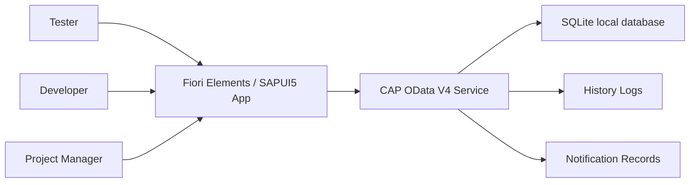

# Software Requirements Specification

Project: Issue and Defect Tracking System in SAP  
Document type: Software Requirements Specification (SRS)  
Language: English  
Status: Draft v1.1  
Last updated: 2026-06-03  
Prepared for: SAP490 project delivery, mentor review, and Sprint 1 planning  
Document style: Traditional SRS outline with ISO/IEC/IEEE 29148-style requirement quality, traceability, and verification discipline

## 1. Document Control

### 1.1 Version History

| Version | Date | Author | Reviewer | Change Summary | Approval Status |
| --- | --- | --- | --- | --- | --- |
| v1.0 | 2026-06-02 | IDTS Project Team | Mentor / Supervisor | Initial SRS created from BRD v1.1, BA baseline, diagrams, PM plan, and SAP490 guidance. | Draft |
| v1.1 | 2026-06-03 | IDTS Project Team | Mentor / Supervisor | Updated user classes and functional requirements to the MVP role baseline: Tester, Developer, and PM. Reporter and Admin are deferred as separate roles. | Draft |

### 1.2 Review and Sign-Off

| Role | Name | Responsibility | Status | Date |
| --- | --- | --- | --- | --- |
| Prepared by | IDTS Project Team | Prepare and maintain SRS | Drafted | 2026-06-02 |
| Reviewed by | Mentor / Supervisor | Review requirement completeness and SAP490 fit | Pending | TBD |
| Approved by | Mentor / Supervisor | Approve SRS baseline for FRS, test design, and implementation | Pending | TBD |
| Project owner | Team / PM | Confirm MVP requirement priority | Pending | TBD |

### 1.3 Document Purpose

This SRS defines the software-level requirements for the Issue and Defect Tracking System in SAP (IDTS). It translates the approved business direction into verifiable system requirements for SAP CAP, OData V4, Fiori Elements/SAPUI5, local SQLite development, and later HANA Cloud or PostgreSQL deployment planning.

This SRS uses a traditional SRS outline for readability and aligns requirement quality, traceability, and verification with ISO/IEC/IEEE 29148-style requirements engineering and the SAP490 hybrid delivery context. It does not claim strict certification against the official standard.

### 1.4 Intended Audience

| Audience | Use of this SRS |
| --- | --- |
| Mentor / Supervisor | Review project requirement completeness and SAP490 alignment. |
| BA / PM | Maintain scope, traceability, open questions, and release priority. |
| Backend CAP Developer | Implement CDS model, service projections, actions, handlers, validations, audit, and notification records. |
| Fiori/UI5 Developer | Implement List Report/Object Page, value helps, actions, messages, and UI behavior. |
| QA / Tester | Derive functional, integration, and UAT test cases. |

## 2. Product Scope

IDTS shall support defect reporting and tracking in an SAP software testing context. The system shall let Tester, Developer, and PM users create, classify, assign, review, request information, reject with follow-up, progress, resolve, retest, close, reopen, comment, audit, notify, and monitor bugs.

IDTS shall not become a full Jira, SAP Cloud ALM, SAP Solution Manager, ServiceNow, source-code management, CI/CD, code review, sprint planning, or mandatory AI root cause analysis platform.

## 3. References and Source Documents

| Source | Purpose |
| --- | --- |
| `docs/ba/brd/brd.en.md` | Primary BRD source for business objectives, scope, requirements, risks, and traceability. |
| `IDTS-SUMMARY.md` | Canonical business summary and core flows. |
| `IDTS-Business-Rule.md` | Canonical business rules. |
| `IDTS-PROJECT-SCOPE-SAP01.md` | Canonical project scope. |
| `docs/project-context.md` | Current project context and handover baseline. |
| `docs/ba/01-mvp-scope.md` | MVP and out-of-scope baseline. |
| `docs/ba/03-status-transition-matrix.md` | Status transition and nextProcessor rules. |
| `docs/ba/04-requirement-backlog.md` | Requirement backlog and acceptance criteria. |
| `docs/ba/05-data-dictionary.md` | Conceptual data expectations. |
| `docs/ba/06-authorization-matrix.md` | Role and action permissions. |
| `docs/ba/07-fiori-ux-requirements.md` | Fiori UX expectations. |
| `docs/diagrams/` | Existing use case, workflow, status, data, audit, and notification diagrams. |
| `docs/knowledge/sap490-deliverable-guidance.md` | SAP490 deliverable interpretation for CAP/Fiori. |

## 4. Product Context

### 4.1 System Context

IDTS is a SAP CAP Node.js application exposed through OData V4 and consumed by a SAP Fiori Elements/SAPUI5 frontend. Local development uses SQLite. Future deployment may use SAP HANA Cloud or PostgreSQL, but endpoints and credentials shall not be hardcoded.

### 4.2 User Classes

| User class | Main responsibilities |
| --- | --- |
| Tester | Create, classify, update, assign, reassign, provide information, retest, close, and reopen bugs where allowed. |
| Developer | Review assigned bugs, request information, reject unsuitable assignment or classification, progress, resolve, and comment. |
| PM | Monitor all bugs, workload, overdue items, queues, rejected follow-up, nextProcessor, and escalation risks. |

Reporter and Admin are not separate MVP user classes. Tester performs internal reporting responsibilities, while lightweight administrative responsibilities are handled by Tester or PM where authorized.

### 4.3 Operating Environment

| Area | Requirement baseline |
| --- | --- |
| Backend | SAP CAP Node.js. |
| API | OData V4. |
| Frontend | Fiori Elements List Report/Object Page as default; SAPUI5 extensions only when needed. |
| Local database | SQLite. |
| Future database | SAP HANA Cloud or PostgreSQL, decided later. |
| Authentication / authorization | Role-based behavior must be designed; concrete XSUAA/BTP setup may be finalized during deployment planning. |

## 5. Assumptions, Constraints, and Dependencies

### 5.1 Assumptions

| ID | Assumption |
| --- | --- |
| ASM-001 | SAP Module is optional because not every IDTS defect belongs to a SAP functional module. |
| ASM-002 | Application Component and Defect Category are required for assignment filtering. |
| ASM-003 | Component Category is the valid pair of Application Component and Defect Category. |
| ASM-004 | Developer Responsibility maps Developers to Component Categories and optionally to SAP Modules. |
| ASM-005 | Notification delivery can start as notification records and triggers; real channel delivery can be added later. |
| ASM-006 | Attachments can start as metadata or storage references. |
| ASM-007 | BRD v1.2 is the business baseline for this SRS. |

### 5.2 Constraints

| ID | Constraint |
| --- | --- |
| CON-001 | The solution shall stay within SAP490 MVP scope and shall not become a full ALM or project management system. |
| CON-002 | The system shall not hardcode SAP BTP, HANA Cloud, PostgreSQL, email, webhook, or private endpoints. |
| CON-003 | The system shall not store credentials, tokens, passwords, or service keys in repository files. |
| CON-004 | Backend validation shall enforce business-critical rules; UI-only validation is not sufficient. |
| CON-005 | Fiori implementation should prefer annotation-driven Fiori Elements before custom SAPUI5. |

### 5.3 Dependencies

| ID | Dependency | Impact |
| --- | --- | --- |
| DEP-001 | Mentor acceptance of SAP CAP/Fiori as SAP490 coding deliverable | May affect final report mapping. |
| DEP-002 | Stable CDS model and service projections | Required before stable Fiori value helps and actions. |
| DEP-003 | Confirm PM reassignment authority | Determines whether PM can directly assign/reassign or only request reassignment. |
| DEP-004 | Confirm notification channel for MVP | Determines whether notification records are enough or external delivery is required. |

## 6. Requirement Identification

SRS requirements use stable IDs:

| Prefix | Area |
| --- | --- |
| `SRS-FR-BUG` | Bug creation and duplicate support |
| `SRS-FR-CLASS` | Classification |
| `SRS-FR-ASSIGN` | Assignment and Developer Responsibility |
| `SRS-FR-STATUS` | Status lifecycle |
| `SRS-FR-COMMENT` | Comments |
| `SRS-FR-AUDIT` | History and audit |
| `SRS-FR-NOTIF` | Notification records |
| `SRS-FR-PM` | PM monitoring |
| `SRS-DATA` | Data requirements |
| `SRS-IF` | Interface and UI requirements |
| `SRS-NFR` | Non-functional requirements |

Priorities use MoSCoW: Must, Should, Could, Won't for MVP.

Verification methods:

| Method | Meaning |
| --- | --- |
| Inspection | Review documents, data model, generated metadata, records, UI annotations, or stored data. |
| Demonstration | Manually demonstrate a Fiori or CAP flow. |
| Test | Execute manual or automated test cases with expected results. |
| Analysis | Evaluate derived output such as workload, overdue state, traceability, or queue logic. |

## 7. Functional Software Requirements

### 7.1 Bug Reporting and Duplicate Support

| ID | Source | Requirement Statement | Priority | Verification | Trace To |
| --- | --- | --- | --- | --- | --- |
| SRS-FR-BUG-001 | BRD-BR-001, REQ-BUG-001 | IDTS shall allow Tester users to create a bug report with title, description, priority, severity, environment, reproduction steps, actual result, expected result, SAP Module when relevant, Application Component, Defect Category, optional test references, and optional evidence metadata. | Must | Demonstration and test | FRS-BUG-001 |
| SRS-FR-BUG-002 | BR-RULE-001, BR-05 | IDTS shall validate mandatory bug fields before submit and reject submission when required data is missing. | Must | Test | FRS-BUG-001 |
| SRS-FR-BUG-003 | BR-RULE-002, REQ-BUG-002 | IDTS shall provide search and filter support before creating a new bug so Tester users can identify similar open or closed bugs. | Must | Demonstration | FRS-BUG-002 |
| SRS-FR-BUG-004 | REQ-DUP-001 | IDTS should support duplicate, similar, or related bug links after MVP core creation works. | Should | Inspection and demonstration | FRS-BUG-002 |
| SRS-FR-BUG-005 | BR-RULE-011 | IDTS shall prevent free editing of closed bugs and shall require reopen when processing must continue. | Must | Test | FRS-STATUS-004 |

### 7.2 Classification

| ID | Source | Requirement Statement | Priority | Verification | Trace To |
| --- | --- | --- | --- | --- | --- |
| SRS-FR-CLASS-001 | BRD-BR-003, BR-RULE-003 | IDTS shall distinguish SAP Module, Application Component, and Defect Category as separate classification concepts. | Must | Inspection and demonstration | FRS-CLASS-001 |
| SRS-FR-CLASS-002 | BR-42, REQ-CLS-001 | IDTS shall treat SAP Module as optional business context and shall allow pure IDTS bugs to leave it empty or use Not Applicable. | Must | Test | FRS-CLASS-001 |
| SRS-FR-CLASS-003 | BR-42, REQ-CLS-001 | IDTS shall require Application Component and Defect Category for bug submission. | Must | Test | FRS-CLASS-001 |
| SRS-FR-CLASS-004 | Data Dictionary | IDTS shall resolve a valid Component Category from the selected Application Component and Defect Category pair. | Must | Test | FRS-CLASS-001 |
| SRS-FR-CLASS-005 | Fiori UX Requirements | IDTS should support dependent value help for Application Component and Defect Category in the Fiori create/edit flow. | Should | Demonstration | FRS-UX-001 |

### 7.3 Assignment and Pending Assignment

| ID | Source | Requirement Statement | Priority | Verification | Trace To |
| --- | --- | --- | --- | --- | --- |
| SRS-FR-ASSIGN-001 | BRD-BR-004, BR-RULE-005, REQ-ASSIGN-001 | IDTS shall filter Developer candidates by active Developer Responsibility for the selected Component Category and optional SAP Module. | Must | Test and demonstration | FRS-ASSIGN-001 |
| SRS-FR-ASSIGN-002 | BR-RULE-006 | IDTS shall allow only one main Developer assignee for a bug at a time. | Must | Test | FRS-ASSIGN-001 |
| SRS-FR-ASSIGN-003 | BRD-BR-005, REQ-ASSIGN-002 | IDTS shall allow a valid bug to be submitted as Pending Assignment when no suitable Developer is selected. | Must | Test | FRS-ASSIGN-002 |
| SRS-FR-ASSIGN-004 | BR-11, REQ-REJECT-001 | IDTS shall treat reassignment as an action and history event, not as a primary status. | Must | Inspection and test | FRS-ASSIGN-003 |
| SRS-FR-ASSIGN-005 | BR-10, REQ-WORKLOAD-001 | IDTS should provide workload warning or workload visibility before assignment when enough data exists. | Should | Demonstration and analysis | FRS-PM-001 |

### 7.4 Developer Review and Status Lifecycle

| ID | Source | Requirement Statement | Priority | Verification | Trace To |
| --- | --- | --- | --- | --- | --- |
| SRS-FR-STATUS-001 | BRD-BR-006, REQ-DEV-001 | IDTS shall allow an assigned Developer to move an assigned bug to In Review. | Must | Test | FRS-DEV-001 |
| SRS-FR-STATUS-002 | BRD-BR-006, REQ-INFO-001 | IDTS shall allow an assigned Developer to request more information with a required reason. | Must | Test | FRS-INFO-001 |
| SRS-FR-STATUS-003 | BRD-BR-007, BRD-BR-008, DEC-008 | IDTS shall allow an assigned Developer to reject an unsuitable assignment or wrong classification only when a rejection reason and follow-up owner are recorded. | Must | Test | FRS-REJECT-001 |
| SRS-FR-STATUS-004 | BR-RULE-008, BR-RULE-009 | IDTS shall treat Rejected as a follow-up status, not a terminal state, and shall allow follow-up transitions to Assigned or Pending Assignment after correction. | Must | Test | FRS-REJECT-001 |
| SRS-FR-STATUS-005 | REQ-DEV-001 | IDTS shall allow Developer users to move valid reviewed bugs to In Progress and later to Resolved. | Must | Test | FRS-DEV-001 |
| SRS-FR-STATUS-006 | BRD-BR-009, BR-44 | IDTS shall support Retest Required between Resolved and Closed when verification is needed. | Must | Test | FRS-STATUS-002 |
| SRS-FR-STATUS-007 | BRD-BR-009 | IDTS shall allow Tester/PM users to close accepted resolved bugs or reopen bugs when the issue still exists. | Must | Test | FRS-STATUS-003 |
| SRS-FR-STATUS-008 | Status Transition Matrix | IDTS shall validate critical status transitions in backend logic according to the status transition matrix. | Must | Test | FRS-STATUS-005 |
| SRS-FR-STATUS-009 | BR-RULE-007, REQ-NEXTP-001 | IDTS shall automatically maintain nextProcessor based on status, assignee, and action rules. | Must | Test and inspection | FRS-NEXTP-001 |

### 7.5 Comments, Audit, and Notifications

| ID | Source | Requirement Statement | Priority | Verification | Trace To |
| --- | --- | --- | --- | --- | --- |
| SRS-FR-COMMENT-001 | BRD-BR-010, REQ-COMMENT-001 | IDTS shall allow authorized Tester, Developer, and PM users to add comments to a bug. | Must | Demonstration and test | FRS-COMMENT-001 |
| SRS-FR-COMMENT-002 | BR-RULE-012 | IDTS shall not change bug status directly from a comment. | Must | Test | FRS-COMMENT-001 |
| SRS-FR-AUDIT-001 | BRD-BR-011, REQ-HISTORY-001 | IDTS shall write history logs for create, edit, assign, reassign, status change, request information, reject, resolve, retest, close, reopen, attachment, comment, and key notification events. | Must | Inspection and test | FRS-AUDIT-001 |
| SRS-FR-AUDIT-002 | BR-32 | IDTS shall store actor, role, timestamp, action type, old value, new value, and reason when available in history logs. | Must | Inspection | FRS-AUDIT-001 |
| SRS-FR-NOTIF-001 | BRD-BR-012, BR-29 | IDTS shall create notification records for assigned, reassigned, information request, bug update, rejected, overdue, resolved, retest, and closed events when applicable. | Must | Inspection and test | FRS-NOTIF-001 |
| SRS-FR-NOTIF-002 | BR-30 | IDTS should keep external notification delivery pluggable and shall not hardcode channel endpoints. | Should | Inspection | FRS-NOTIF-001 |

### 7.6 PM Monitoring

| ID | Source | Requirement Statement | Priority | Verification | Trace To |
| --- | --- | --- | --- | --- | --- |
| SRS-FR-PM-001 | BRD-BR-013, REQ-PM-001 | IDTS shall allow PM users to view all bugs and filter by status, priority, severity, SAP Module, Application Component, Defect Category, assignee, nextProcessor, date fields, and overdue state. | Must | Demonstration | FRS-PM-001 |
| SRS-FR-PM-002 | BR-21 | IDTS shall provide workload visibility by Developer using assigned and open bug counts. | Must | Analysis and demonstration | FRS-PM-001 |
| SRS-FR-PM-003 | BR-23 | IDTS shall expose Pending Assignment, Need More Information, Retest Required, Rejected follow-up, and Overdue queues for PM monitoring. | Must | Demonstration | FRS-PM-001 |
| SRS-FR-PM-004 | BR-22 | IDTS shall allow PM users to comment or request reassignment; direct reassignment by PM shall depend on an explicit authorization decision. | Must | Inspection and test | FRS-PM-002 |

## 8. Data Requirements

| ID | Entity / Data Area | Requirement Statement | Priority | Verification |
| --- | --- | --- | --- | --- |
| SRS-DATA-001 | Bugs | IDTS shall store a unique technical ID and a human-readable bugNumber for every bug. | Must | Inspection |
| SRS-DATA-002 | Bugs | IDTS shall store status, priority, severity, environment, reproduction steps, actual result, expected result, reporter, assignee when assigned, and nextProcessor when applicable. | Must | Inspection |
| SRS-DATA-003 | Bugs | IDTS shall store optional testCaseRef and testRunRef without implementing a full test management module. | Must | Inspection |
| SRS-DATA-004 | Classification | IDTS shall store SAPModules, ApplicationComponents, DefectCategories, ComponentCategories, and DeveloperResponsibilities as maintainable master data or value-help data. | Must | Inspection |
| SRS-DATA-005 | Responsibility | IDTS shall store active/inactive state for Developer profiles and responsibility mappings to prevent inactive Developers from being selected. | Must | Test |
| SRS-DATA-006 | Comments | IDTS shall store comment content, author, author role, timestamp, and parent bug reference. | Must | Inspection |
| SRS-DATA-007 | Attachments | IDTS should store attachment metadata including file name, media type, storage reference, uploader, and timestamp. | Should | Inspection |
| SRS-DATA-008 | Notifications | IDTS shall store notification event type, recipient, channel where known, delivery status, timestamp, and parent bug reference. | Must | Inspection |
| SRS-DATA-009 | HistoryLogs | IDTS shall store history logs as bug-owned audit records. | Must | Inspection |

## 9. External Interface and UI Interface Requirements

### 9.1 OData Interface

| ID | Requirement Statement | Priority | Verification |
| --- | --- | --- | --- |
| SRS-IF-ODATA-001 | IDTS shall expose core bug tracking data through OData V4 services suitable for Fiori Elements consumption. | Must | Inspection and compile |
| SRS-IF-ODATA-002 | IDTS shall expose value-help data required for SAP Module, Application Component, Defect Category, Component Category, Developer, priority, severity, and status selection. | Must | Inspection and demonstration |
| SRS-IF-ODATA-003 | IDTS shall expose actions or update operations for business-critical status transitions when simple field updates are not sufficient to enforce rules. | Should | Inspection and test |

### 9.2 Fiori UI Interface

| ID | Requirement Statement | Priority | Verification |
| --- | --- | --- | --- |
| SRS-IF-UI-001 | IDTS shall use Fiori Elements List Report/Object Page as the default user interface for bug management. | Must | Demonstration |
| SRS-IF-UI-002 | The List Report shall show key columns for bugNumber, title, status, priority, severity, SAP Module, Application Component, Defect Category, assignee, nextProcessor, due date, and update date where available. | Must | Demonstration |
| SRS-IF-UI-003 | The Object Page shall group fields into Bug Details, Classification, Assignment, Reproduction, Comments, Attachments, History, Notifications, and PM Monitoring sections where implemented. | Must | Demonstration |
| SRS-IF-UI-004 | UI actions shall be visible only when appropriate for role and status, while backend validation shall remain authoritative. | Must | Test |
| SRS-IF-UI-005 | The UI shall show Rejected bugs with rejection reason, nextProcessor, and available follow-up actions. | Must | Demonstration |

## 10. Non-Functional Requirements

| ID | Category | Requirement Statement | Priority | Verification |
| --- | --- | --- | --- | --- |
| SRS-NFR-SEC-001 | Security | IDTS shall enforce role-based permissions for create, edit, assign, reject, resolve, close, reopen, monitoring, and administrative actions. | Must | Test |
| SRS-NFR-AUD-001 | Auditability | IDTS shall preserve an audit trail for important lifecycle changes. | Must | Inspection |
| SRS-NFR-INT-001 | Data integrity | IDTS shall enforce required fields, valid classification pairs, valid assignee responsibility, and allowed status transitions. | Must | Test |
| SRS-NFR-USE-001 | Usability | IDTS shall provide clear Fiori labels and value helps for SAP Module, Application Component, Defect Category, Assignee, and Next Processor. | Must | Demonstration |
| SRS-NFR-USE-002 | Accessibility | IDTS should follow SAP Fiori accessibility and message handling guidance for forms, tables, validation messages, and status indicators. | Should | Inspection |
| SRS-NFR-PERF-001 | Performance | IDTS shall support responsive search, filter, create, and status update behavior for educational and demo-scale data. | Must | Demonstration |
| SRS-NFR-MAINT-001 | Maintainability | IDTS shall keep classification, value-help, and Developer Responsibility data maintainable rather than hardcoded in handlers. | Must | Inspection |
| SRS-NFR-CONF-001 | Configuration | IDTS shall keep environment-specific values outside source code and shall not commit credentials or private endpoints. | Must | Inspection |
| SRS-NFR-LOC-001 | Localization | User-facing UI text should be prepared for i18n during implementation. | Should | Inspection |

## 11. Traceability Matrix

| BRD Requirement | SRS Requirement IDs | FRS Target |
| --- | --- | --- |
| BRD-BR-001 Structured bug reporting | SRS-FR-BUG-001, SRS-FR-BUG-002, SRS-DATA-001, SRS-DATA-002 | FRS-BUG-001 |
| BRD-BR-002 Duplicate checking | SRS-FR-BUG-003, SRS-FR-BUG-004 | FRS-BUG-002 |
| BRD-BR-003 Classification | SRS-FR-CLASS-001 to SRS-FR-CLASS-005, SRS-DATA-004 | FRS-CLASS-001, FRS-UX-001 |
| BRD-BR-004 Developer assignment | SRS-FR-ASSIGN-001, SRS-FR-ASSIGN-002, SRS-DATA-005 | FRS-ASSIGN-001 |
| BRD-BR-005 Pending Assignment | SRS-FR-ASSIGN-003, SRS-FR-PM-003 | FRS-ASSIGN-002 |
| BRD-BR-006 Developer review | SRS-FR-STATUS-001, SRS-FR-STATUS-002, SRS-FR-STATUS-005 | FRS-DEV-001, FRS-INFO-001 |
| BRD-BR-007 Controlled rejection | SRS-FR-STATUS-003, SRS-FR-STATUS-004 | FRS-REJECT-001 |
| BRD-BR-008 Rejected follow-up | SRS-FR-STATUS-003, SRS-FR-STATUS-004, SRS-FR-STATUS-009 | FRS-REJECT-001, FRS-NEXTP-001 |
| BRD-BR-009 Status lifecycle | SRS-FR-STATUS-006 to SRS-FR-STATUS-008 | FRS-STATUS-002 to FRS-STATUS-005 |
| BRD-BR-010 Comments | SRS-FR-COMMENT-001, SRS-FR-COMMENT-002 | FRS-COMMENT-001 |
| BRD-BR-011 History log | SRS-FR-AUDIT-001, SRS-FR-AUDIT-002 | FRS-AUDIT-001 |
| BRD-BR-012 Notification records | SRS-FR-NOTIF-001, SRS-FR-NOTIF-002 | FRS-NOTIF-001 |
| BRD-BR-013 PM monitoring | SRS-FR-PM-001 to SRS-FR-PM-004 | FRS-PM-001, FRS-PM-002 |

## 12. Verification Approach

| Area | Verification approach |
| --- | --- |
| Requirements review | Review SRS against BRD, BA backlog, status matrix, authorization matrix, and project scope. |
| CAP model and service | Run CAP compile and inspect generated OData metadata when implementation exists. |
| Backend rules | Use manual or automated tests for required fields, assignment, status transition, Rejected follow-up, nextProcessor, history, and authorization. |
| Fiori behavior | Demonstrate List Report/Object Page creation, value helps, actions, validation messages, and semantic status indicators. |
| PM monitoring | Demonstrate filters, queues, workload, overdue state, and nextProcessor views with seed/demo data. |
| DOCX deliverable | Confirm Markdown tables render as true Word tables in generated DOCX. |

## 13. Open Issues

| ID | Open Issue | Owner | Impact |
| --- | --- | --- | --- |
| OI-SRS-001 | Confirm whether PM can directly assign/reassign in MVP or only request reassignment. | Team / Mentor | Authorization and Fiori action visibility. |
| OI-SRS-002 | Confirm notification delivery scope for MVP. | Team / Mentor | Whether notification records are enough. |
| OI-SRS-003 | Confirm attachment storage approach. | Team / Mentor | File storage design and test evidence handling. |
| OI-SRS-004 | Confirm overdue thresholds by priority/severity. | Team / PM | PM dashboard and escalation logic. |
| OI-SRS-005 | Confirm SAP490 acceptance of CAP/Fiori artifacts as SAP Coding deliverables. | Team / Mentor | Final report structure and evidence mapping. |

## 14. Glossary

| Term | Meaning |
| --- | --- |
| SAP Module | Optional SAP business context such as FI, MM, SD, CO, PP, or HCM. |
| Application Component | The app, screen, service, or feature area where the bug appears. |
| Defect Category | The defect type or technical layer such as Fiori/UI5, CAP backend, database, authorization, integration, workflow, notification, or reporting. |
| Component Category | A valid Application Component and Defect Category pair. |
| Developer Responsibility | Mapping that defines which Developer can handle a Component Category and optional SAP Module. |
| Assignee | The main Developer responsible for technical handling of the bug. |
| nextProcessor | The current action owner or queue. It does not replace assignee. |
| Rejected | Follow-up status used when assignment or classification is unsuitable. It must have reason and next action. |
| Retest Required | Verification status between Resolved and Closed. |
| OData V4 | API protocol used by CAP service and consumed by Fiori Elements. |
