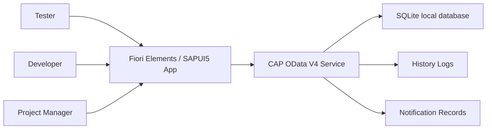

# Tài liệu Đặc tả Yêu cầu Phần mềm

Dự án: Issue and Defect Tracking System in SAP  
Loại tài liệu: Software Requirements Specification (SRS)  
Ngôn ngữ: Tiếng Việt  
Trạng thái: Draft v1.1  
Cập nhật lần cuối: 2026-06-03  
Chuẩn bị cho: SAP490 project delivery, mentor review và Sprint 1 planning  
Phong cách tài liệu: Cấu trúc SRS truyền thống, kết hợp nguyên tắc chất lượng requirement, traceability và verification theo hướng ISO/IEC/IEEE 29148

## 1. Kiểm soát tài liệu

### 1.1 Lịch sử phiên bản

| Phiên bản | Ngày | Người viết | Người review | Tóm tắt thay đổi | Trạng thái duyệt |
| --- | --- | --- | --- | --- | --- |
| v1.0 | 2026-06-02 | IDTS Project Team | Mentor / Supervisor | Tạo bản SRS đầu tiên từ BRD v1.1, BA baseline, diagrams, PM plan và SAP490 guidance. | Draft |
| v1.1 | 2026-06-03 | IDTS Project Team | Mentor / Supervisor | Cập nhật user class và functional requirements theo MVP role baseline: Tester, Developer và PM. Reporter và Admin được hoãn như role tách riêng. | Draft |

### 1.2 Review và phê duyệt

| Vai trò | Tên | Trách nhiệm | Trạng thái | Ngày |
| --- | --- | --- | --- | --- |
| Prepared by | IDTS Project Team | Chuẩn bị và duy trì SRS | Drafted | 2026-06-02 |
| Reviewed by | Mentor / Supervisor | Review độ đầy đủ requirement và mức phù hợp SAP490 | Pending | TBD |
| Approved by | Mentor / Supervisor | Phê duyệt SRS baseline cho FRS, test design và implementation | Pending | TBD |
| Project owner | Team / PM | Xác nhận priority requirement trong MVP | Pending | TBD |

### 1.3 Mục đích tài liệu

SRS này định nghĩa các yêu cầu phần mềm cho Issue and Defect Tracking System in SAP (IDTS). Tài liệu chuyển hóa hướng nghiệp vụ đã chốt thành các yêu cầu hệ thống có thể kiểm chứng cho SAP CAP, OData V4, Fiori Elements/SAPUI5, SQLite local development và định hướng triển khai HANA Cloud hoặc PostgreSQL sau này.

SRS này dùng cấu trúc SRS truyền thống để dễ đọc và áp dụng nguyên tắc requirement hiện đại theo hướng ISO/IEC/IEEE 29148 cho chất lượng requirement, traceability và verification trong bối cảnh SAP490 hybrid. Tài liệu không tuyên bố chứng nhận hoặc tuân thủ đầy đủ tiêu chuẩn chính thức.

### 1.4 Đối tượng sử dụng

| Đối tượng | Cách sử dụng SRS |
| --- | --- |
| Mentor / Supervisor | Review độ đầy đủ requirement và alignment với SAP490. |
| BA / PM | Duy trì scope, traceability, open questions và release priority. |
| Backend CAP Developer | Triển khai CDS model, service projections, actions, handlers, validations, audit và notification records. |
| Fiori/UI5 Developer | Triển khai List Report/Object Page, value helps, actions, messages và UI behavior. |
| QA / Tester | Tạo functional test, integration test và UAT test cases. |

## 2. Phạm vi sản phẩm

IDTS hỗ trợ quy trình report và tracking defect trong bối cảnh kiểm thử phần mềm SAP. Hệ thống cho phép Tester, Developer và PM tạo, phân loại, phân công, review, yêu cầu thêm thông tin, reject có follow-up, xử lý trạng thái, resolve, retest, close, reopen, comment, audit, notification và monitoring bug.

IDTS không phải Jira đầy đủ, không phải SAP Cloud ALM, SAP Solution Manager, ServiceNow, công cụ quản lý source code, CI/CD, code review, sprint planning hoặc nền tảng AI root cause analysis bắt buộc.

## 3. Tài liệu tham chiếu

| Nguồn | Mục đích |
| --- | --- |
| `docs/ba/brd/brd.vi.md` | Nguồn BRD chính cho objective, scope, requirement, risk và traceability. |
| `docs/ba/brd/brd.en.md` | Bản tiếng Anh tương ứng của BRD. |
| `IDTS-SUMMARY.md` | Tóm tắt nghiệp vụ canonical và core flows. |
| `IDTS-Business-Rule.md` | Business rules canonical. |
| `IDTS-PROJECT-SCOPE-SAP01.md` | Project scope canonical. |
| `docs/project-context.md` | Project context và handover baseline hiện tại. |
| `docs/ba/01-mvp-scope.md` | MVP và out-of-scope baseline. |
| `docs/ba/03-status-transition-matrix.md` | Status transition và nextProcessor rules. |
| `docs/ba/04-requirement-backlog.md` | Requirement backlog và acceptance criteria. |
| `docs/ba/05-data-dictionary.md` | Conceptual data expectations. |
| `docs/ba/06-authorization-matrix.md` | Role và action permissions. |
| `docs/ba/07-fiori-ux-requirements.md` | Fiori UX expectations. |
| `docs/diagrams/` | Use case, workflow, status, data, audit và notification diagrams đã có. |
| `docs/knowledge/sap490-deliverable-guidance.md` | Cách diễn giải SAP490 cho CAP/Fiori. |

## 4. Bối cảnh sản phẩm

### 4.1 System Context

IDTS là ứng dụng SAP CAP Node.js, expose qua OData V4 và được sử dụng bởi frontend SAP Fiori Elements/SAPUI5. Local development dùng SQLite. Future deployment có thể dùng SAP HANA Cloud hoặc PostgreSQL, nhưng endpoint và credential không được hardcode.

### 4.2 Nhóm người dùng

| Nhóm người dùng | Trách nhiệm chính |
| --- | --- |
| Tester | Tạo, phân loại, cập nhật, assign, reassign, bổ sung thông tin, retest, close và reopen bug khi được phép. |
| Developer | Review bug được assign, request information, reject assignment hoặc classification không phù hợp, progress, resolve và comment. |
| PM | Monitor toàn bộ bug, workload, overdue, queues, rejected follow-up, nextProcessor và escalation risks. |

Reporter và Admin không phải user class tách riêng trong MVP. Tester đảm nhiệm trách nhiệm reporting nội bộ, còn trách nhiệm quản trị nhẹ do Tester hoặc PM xử lý theo quyền được cấp.

### 4.3 Môi trường vận hành

| Khu vực | Baseline requirement |
| --- | --- |
| Backend | SAP CAP Node.js. |
| API | OData V4. |
| Frontend | Fiori Elements List Report/Object Page là mặc định; SAPUI5 extension chỉ dùng khi cần. |
| Local database | SQLite. |
| Future database | SAP HANA Cloud hoặc PostgreSQL, quyết định sau. |
| Authentication / authorization | Role-based behavior phải được thiết kế; setup XSUAA/BTP cụ thể có thể chốt khi deployment planning. |

## 5. Assumptions, Constraints và Dependencies

### 5.1 Assumptions

| ID | Assumption |
| --- | --- |
| ASM-001 | SAP Module là optional vì không phải defect IDTS nào cũng thuộc SAP functional module. |
| ASM-002 | Application Component và Defect Category là bắt buộc để lọc assignee. |
| ASM-003 | Component Category là cặp hợp lệ giữa Application Component và Defect Category. |
| ASM-004 | Developer Responsibility map Developer với Component Category và optional SAP Module. |
| ASM-005 | Notification delivery có thể bắt đầu bằng notification records và triggers; delivery channel thật có thể thêm sau. |
| ASM-006 | Attachment có thể bắt đầu bằng metadata hoặc storage reference. |
| ASM-007 | BRD v1.2 là business baseline cho SRS này. |

### 5.2 Constraints

| ID | Constraint |
| --- | --- |
| CON-001 | Solution phải nằm trong SAP490 MVP scope và không trở thành full ALM hoặc project management system. |
| CON-002 | Hệ thống không được hardcode SAP BTP, HANA Cloud, PostgreSQL, email, webhook hoặc private endpoint. |
| CON-003 | Hệ thống không được lưu credentials, token, password hoặc service key trong repo files. |
| CON-004 | Backend validation phải enforce business-critical rules; UI-only validation không đủ. |
| CON-005 | Fiori implementation nên ưu tiên annotation-driven Fiori Elements trước custom SAPUI5. |

### 5.3 Dependencies

| ID | Dependency | Impact |
| --- | --- | --- |
| DEP-001 | Mentor chấp nhận SAP CAP/Fiori là SAP490 coding deliverable | Có thể ảnh hưởng final report mapping. |
| DEP-002 | CDS model và service projections ổn định | Cần trước khi ổn định Fiori value helps và actions. |
| DEP-003 | Chốt quyền reassignment của PM | Quyết định PM được assign/reassign trực tiếp hay chỉ request. |
| DEP-004 | Chốt notification channel cho MVP | Quyết định notification records có đủ hay cần external delivery. |

## 6. Quy ước mã yêu cầu

SRS requirements dùng ID ổn định:

| Prefix | Khu vực |
| --- | --- |
| `SRS-FR-BUG` | Bug creation và duplicate support |
| `SRS-FR-CLASS` | Classification |
| `SRS-FR-ASSIGN` | Assignment và Developer Responsibility |
| `SRS-FR-STATUS` | Status lifecycle |
| `SRS-FR-COMMENT` | Comments |
| `SRS-FR-AUDIT` | History và audit |
| `SRS-FR-NOTIF` | Notification records |
| `SRS-FR-PM` | PM monitoring |
| `SRS-DATA` | Data requirements |
| `SRS-IF` | Interface và UI requirements |
| `SRS-NFR` | Non-functional requirements |

Priority dùng MoSCoW: Must, Should, Could, Won't for MVP.

Verification methods:

| Method | Ý nghĩa |
| --- | --- |
| Inspection | Review tài liệu, data model, metadata, records, UI annotations hoặc stored data. |
| Demonstration | Demo thủ công một Fiori hoặc CAP flow. |
| Test | Chạy manual hoặc automated test case với expected result. |
| Analysis | Đánh giá output suy ra như workload, overdue state, traceability hoặc queue logic. |

## 7. Functional Software Requirements

### 7.1 Bug Reporting và Duplicate Support

| ID | Source | Requirement Statement | Priority | Verification | Trace To |
| --- | --- | --- | --- | --- | --- |
| SRS-FR-BUG-001 | BRD-BR-001, REQ-BUG-001 | IDTS shall cho phép Tester tạo bug report với title, description, priority, severity, environment, reproduction steps, actual result, expected result, SAP Module khi liên quan, Application Component, Defect Category, optional test references và optional evidence metadata. | Must | Demonstration và test | FRS-BUG-001 |
| SRS-FR-BUG-002 | BR-RULE-001, BR-05 | IDTS shall validate các field bug bắt buộc trước submit và từ chối submit khi thiếu required data. | Must | Test | FRS-BUG-001 |
| SRS-FR-BUG-003 | BR-RULE-002, REQ-BUG-002 | IDTS shall cung cấp search/filter trước khi tạo bug mới để Tester nhận diện bug mở hoặc bug đã đóng tương tự. | Must | Demonstration | FRS-BUG-002 |
| SRS-FR-BUG-004 | REQ-DUP-001 | IDTS should hỗ trợ duplicate, similar hoặc related bug links sau khi core creation của MVP hoạt động. | Should | Inspection và demonstration | FRS-BUG-002 |
| SRS-FR-BUG-005 | BR-RULE-011 | IDTS shall ngăn sửa tự do bug đã Closed và yêu cầu Reopen khi cần tiếp tục xử lý. | Must | Test | FRS-STATUS-004 |

### 7.2 Classification

| ID | Source | Requirement Statement | Priority | Verification | Trace To |
| --- | --- | --- | --- | --- | --- |
| SRS-FR-CLASS-001 | BRD-BR-003, BR-RULE-003 | IDTS shall tách SAP Module, Application Component và Defect Category thành các khái niệm phân loại riêng. | Must | Inspection và demonstration | FRS-CLASS-001 |
| SRS-FR-CLASS-002 | BR-42, REQ-CLS-001 | IDTS shall xem SAP Module là business context optional và cho phép bug thuần IDTS để trống hoặc dùng Not Applicable. | Must | Test | FRS-CLASS-001 |
| SRS-FR-CLASS-003 | BR-42, REQ-CLS-001 | IDTS shall bắt buộc Application Component và Defect Category khi submit bug. | Must | Test | FRS-CLASS-001 |
| SRS-FR-CLASS-004 | Data Dictionary | IDTS shall resolve Component Category hợp lệ từ cặp Application Component và Defect Category đã chọn. | Must | Test | FRS-CLASS-001 |
| SRS-FR-CLASS-005 | Fiori UX Requirements | IDTS should hỗ trợ dependent value help cho Application Component và Defect Category trong Fiori create/edit flow. | Should | Demonstration | FRS-UX-001 |

### 7.3 Assignment và Pending Assignment

| ID | Source | Requirement Statement | Priority | Verification | Trace To |
| --- | --- | --- | --- | --- | --- |
| SRS-FR-ASSIGN-001 | BRD-BR-004, BR-RULE-005, REQ-ASSIGN-001 | IDTS shall lọc Developer candidates theo active Developer Responsibility cho Component Category đã chọn và optional SAP Module. | Must | Test và demonstration | FRS-ASSIGN-001 |
| SRS-FR-ASSIGN-002 | BR-RULE-006 | IDTS shall chỉ cho phép một main Developer assignee cho một bug tại một thời điểm. | Must | Test | FRS-ASSIGN-001 |
| SRS-FR-ASSIGN-003 | BRD-BR-005, REQ-ASSIGN-002 | IDTS shall cho phép submit bug hợp lệ dưới trạng thái Pending Assignment khi không chọn được Developer phù hợp. | Must | Test | FRS-ASSIGN-002 |
| SRS-FR-ASSIGN-004 | BR-11, REQ-REJECT-001 | IDTS shall xem reassignment là action và history event, không phải primary status. | Must | Inspection và test | FRS-ASSIGN-003 |
| SRS-FR-ASSIGN-005 | BR-10, REQ-WORKLOAD-001 | IDTS should cung cấp workload warning hoặc workload visibility trước khi assign khi có đủ dữ liệu. | Should | Demonstration và analysis | FRS-PM-001 |

### 7.4 Developer Review và Status Lifecycle

| ID | Source | Requirement Statement | Priority | Verification | Trace To |
| --- | --- | --- | --- | --- | --- |
| SRS-FR-STATUS-001 | BRD-BR-006, REQ-DEV-001 | IDTS shall cho phép assigned Developer chuyển bug được assign sang In Review. | Must | Test | FRS-DEV-001 |
| SRS-FR-STATUS-002 | BRD-BR-006, REQ-INFO-001 | IDTS shall cho phép assigned Developer request more information với reason bắt buộc. | Must | Test | FRS-INFO-001 |
| SRS-FR-STATUS-003 | BRD-BR-007, BRD-BR-008, DEC-008 | IDTS shall chỉ cho phép assigned Developer reject unsuitable assignment hoặc wrong classification khi có rejection reason và follow-up owner. | Must | Test | FRS-REJECT-001 |
| SRS-FR-STATUS-004 | BR-RULE-008, BR-RULE-009 | IDTS shall xem Rejected là follow-up status, không phải terminal state, và cho phép transition follow-up sang Assigned hoặc Pending Assignment sau khi correction. | Must | Test | FRS-REJECT-001 |
| SRS-FR-STATUS-005 | REQ-DEV-001 | IDTS shall cho phép Developer chuyển bug đã review hợp lệ sang In Progress và sau đó sang Resolved. | Must | Test | FRS-DEV-001 |
| SRS-FR-STATUS-006 | BRD-BR-009, BR-44 | IDTS shall hỗ trợ Retest Required giữa Resolved và Closed khi cần verification. | Must | Test | FRS-STATUS-002 |
| SRS-FR-STATUS-007 | BRD-BR-009 | IDTS shall cho phép Tester/PM close bug resolved đã được accepted hoặc reopen khi issue vẫn còn. | Must | Test | FRS-STATUS-003 |
| SRS-FR-STATUS-008 | Status Transition Matrix | IDTS shall validate các status transition quan trọng ở backend logic theo status transition matrix. | Must | Test | FRS-STATUS-005 |
| SRS-FR-STATUS-009 | BR-RULE-007, REQ-NEXTP-001 | IDTS shall tự động maintain nextProcessor dựa trên status, assignee và action rules. | Must | Test và inspection | FRS-NEXTP-001 |

### 7.5 Comments, Audit và Notifications

| ID | Source | Requirement Statement | Priority | Verification | Trace To |
| --- | --- | --- | --- | --- | --- |
| SRS-FR-COMMENT-001 | BRD-BR-010, REQ-COMMENT-001 | IDTS shall cho phép authorized Tester, Developer và PM add comment vào bug. | Must | Demonstration và test | FRS-COMMENT-001 |
| SRS-FR-COMMENT-002 | BR-RULE-012 | IDTS shall không đổi bug status trực tiếp từ comment. | Must | Test | FRS-COMMENT-001 |
| SRS-FR-AUDIT-001 | BRD-BR-011, REQ-HISTORY-001 | IDTS shall ghi history logs cho create, edit, assign, reassign, status change, request information, reject, resolve, retest, close, reopen, attachment, comment và key notification events. | Must | Inspection và test | FRS-AUDIT-001 |
| SRS-FR-AUDIT-002 | BR-32 | IDTS shall lưu actor, role, timestamp, action type, old value, new value và reason khi có trong history logs. | Must | Inspection | FRS-AUDIT-001 |
| SRS-FR-NOTIF-001 | BRD-BR-012, BR-29 | IDTS shall tạo notification records cho các event assigned, reassigned, information request, bug update, rejected, overdue, resolved, retest và closed khi áp dụng. | Must | Inspection và test | FRS-NOTIF-001 |
| SRS-FR-NOTIF-002 | BR-30 | IDTS should giữ external notification delivery ở dạng pluggable và không hardcode channel endpoints. | Should | Inspection | FRS-NOTIF-001 |

### 7.6 PM Monitoring

| ID | Source | Requirement Statement | Priority | Verification | Trace To |
| --- | --- | --- | --- | --- | --- |
| SRS-FR-PM-001 | BRD-BR-013, REQ-PM-001 | IDTS shall cho phép PM view all bugs và filter theo status, priority, severity, SAP Module, Application Component, Defect Category, assignee, nextProcessor, date fields và overdue state. | Must | Demonstration | FRS-PM-001 |
| SRS-FR-PM-002 | BR-21 | IDTS shall cung cấp workload visibility theo Developer bằng assigned/open bug counts. | Must | Analysis và demonstration | FRS-PM-001 |
| SRS-FR-PM-003 | BR-23 | IDTS shall expose các queue Pending Assignment, Need More Information, Retest Required, Rejected follow-up và Overdue cho PM monitoring. | Must | Demonstration | FRS-PM-001 |
| SRS-FR-PM-004 | BR-22 | IDTS shall cho phép PM comment hoặc request reassignment; PM direct reassignment phụ thuộc decision authorization rõ ràng. | Must | Inspection và test | FRS-PM-002 |

## 8. Data Requirements

| ID | Entity / Data Area | Requirement Statement | Priority | Verification |
| --- | --- | --- | --- | --- |
| SRS-DATA-001 | Bugs | IDTS shall lưu technical ID duy nhất và bugNumber dễ đọc cho mỗi bug. | Must | Inspection |
| SRS-DATA-002 | Bugs | IDTS shall lưu status, priority, severity, environment, reproduction steps, actual result, expected result, reporter, assignee khi đã assign và nextProcessor khi áp dụng. | Must | Inspection |
| SRS-DATA-003 | Bugs | IDTS shall lưu optional testCaseRef và testRunRef mà không triển khai full test management module. | Must | Inspection |
| SRS-DATA-004 | Classification | IDTS shall lưu SAPModules, ApplicationComponents, DefectCategories, ComponentCategories và DeveloperResponsibilities như master data hoặc value-help data có thể maintain. | Must | Inspection |
| SRS-DATA-005 | Responsibility | IDTS shall lưu active/inactive state cho Developer profiles và responsibility mappings để tránh chọn inactive Developers. | Must | Test |
| SRS-DATA-006 | Comments | IDTS shall lưu comment content, author, author role, timestamp và parent bug reference. | Must | Inspection |
| SRS-DATA-007 | Attachments | IDTS should lưu attachment metadata gồm file name, media type, storage reference, uploader và timestamp. | Should | Inspection |
| SRS-DATA-008 | Notifications | IDTS shall lưu notification event type, recipient, channel khi biết, delivery status, timestamp và parent bug reference. | Must | Inspection |
| SRS-DATA-009 | HistoryLogs | IDTS shall lưu history logs như bug-owned audit records. | Must | Inspection |

## 9. External Interface và UI Interface Requirements

### 9.1 OData Interface

| ID | Requirement Statement | Priority | Verification |
| --- | --- | --- | --- |
| SRS-IF-ODATA-001 | IDTS shall expose core bug tracking data qua OData V4 services phù hợp cho Fiori Elements consumption. | Must | Inspection và compile |
| SRS-IF-ODATA-002 | IDTS shall expose value-help data cần cho SAP Module, Application Component, Defect Category, Component Category, Developer, priority, severity và status selection. | Must | Inspection và demonstration |
| SRS-IF-ODATA-003 | IDTS shall expose actions hoặc update operations cho business-critical status transitions khi simple field update không đủ enforce rules. | Should | Inspection và test |

### 9.2 Fiori UI Interface

| ID | Requirement Statement | Priority | Verification |
| --- | --- | --- | --- |
| SRS-IF-UI-001 | IDTS shall dùng Fiori Elements List Report/Object Page làm user interface mặc định cho bug management. | Must | Demonstration |
| SRS-IF-UI-002 | List Report shall hiển thị key columns cho bugNumber, title, status, priority, severity, SAP Module, Application Component, Defect Category, assignee, nextProcessor, due date và update date khi có. | Must | Demonstration |
| SRS-IF-UI-003 | Object Page shall nhóm field vào các section Bug Details, Classification, Assignment, Reproduction, Comments, Attachments, History, Notifications và PM Monitoring khi được triển khai. | Must | Demonstration |
| SRS-IF-UI-004 | UI actions shall chỉ visible khi phù hợp với role và status, nhưng backend validation vẫn là nguồn kiểm soát chính. | Must | Test |
| SRS-IF-UI-005 | UI shall hiển thị bug Rejected với rejection reason, nextProcessor và available follow-up actions. | Must | Demonstration |

## 10. Non-Functional Requirements

| ID | Category | Requirement Statement | Priority | Verification |
| --- | --- | --- | --- | --- |
| SRS-NFR-SEC-001 | Security | IDTS shall enforce role-based permissions cho create, edit, assign, reject, resolve, close, reopen, monitoring và administrative actions. | Must | Test |
| SRS-NFR-AUD-001 | Auditability | IDTS shall duy trì audit trail cho important lifecycle changes. | Must | Inspection |
| SRS-NFR-INT-001 | Data integrity | IDTS shall enforce required fields, valid classification pairs, valid assignee responsibility và allowed status transitions. | Must | Test |
| SRS-NFR-USE-001 | Usability | IDTS shall cung cấp Fiori labels và value helps rõ ràng cho SAP Module, Application Component, Defect Category, Assignee và Next Processor. | Must | Demonstration |
| SRS-NFR-USE-002 | Accessibility | IDTS should tuân theo SAP Fiori accessibility và message handling guidance cho forms, tables, validation messages và status indicators. | Should | Inspection |
| SRS-NFR-PERF-001 | Performance | IDTS shall hỗ trợ search, filter, create và status update responsive với dữ liệu demo/educational-scale. | Must | Demonstration |
| SRS-NFR-MAINT-001 | Maintainability | IDTS shall giữ classification, value-help và Developer Responsibility data ở dạng maintainable, không hardcode trong handlers. | Must | Inspection |
| SRS-NFR-CONF-001 | Configuration | IDTS shall giữ environment-specific values bên ngoài source code và không commit credentials hoặc private endpoints. | Must | Inspection |
| SRS-NFR-LOC-001 | Localization | User-facing UI text should được chuẩn bị cho i18n khi implementation. | Should | Inspection |

## 11. Traceability Matrix

| BRD Requirement | SRS Requirement IDs | FRS Target |
| --- | --- | --- |
| BRD-BR-001 Structured bug reporting | SRS-FR-BUG-001, SRS-FR-BUG-002, SRS-DATA-001, SRS-DATA-002 | FRS-BUG-001 |
| BRD-BR-002 Duplicate checking | SRS-FR-BUG-003, SRS-FR-BUG-004 | FRS-BUG-002 |
| BRD-BR-003 Classification | SRS-FR-CLASS-001 đến SRS-FR-CLASS-005, SRS-DATA-004 | FRS-CLASS-001, FRS-UX-001 |
| BRD-BR-004 Developer assignment | SRS-FR-ASSIGN-001, SRS-FR-ASSIGN-002, SRS-DATA-005 | FRS-ASSIGN-001 |
| BRD-BR-005 Pending Assignment | SRS-FR-ASSIGN-003, SRS-FR-PM-003 | FRS-ASSIGN-002 |
| BRD-BR-006 Developer review | SRS-FR-STATUS-001, SRS-FR-STATUS-002, SRS-FR-STATUS-005 | FRS-DEV-001, FRS-INFO-001 |
| BRD-BR-007 Controlled rejection | SRS-FR-STATUS-003, SRS-FR-STATUS-004 | FRS-REJECT-001 |
| BRD-BR-008 Rejected follow-up | SRS-FR-STATUS-003, SRS-FR-STATUS-004, SRS-FR-STATUS-009 | FRS-REJECT-001, FRS-NEXTP-001 |
| BRD-BR-009 Status lifecycle | SRS-FR-STATUS-006 đến SRS-FR-STATUS-008 | FRS-STATUS-002 đến FRS-STATUS-005 |
| BRD-BR-010 Comments | SRS-FR-COMMENT-001, SRS-FR-COMMENT-002 | FRS-COMMENT-001 |
| BRD-BR-011 History log | SRS-FR-AUDIT-001, SRS-FR-AUDIT-002 | FRS-AUDIT-001 |
| BRD-BR-012 Notification records | SRS-FR-NOTIF-001, SRS-FR-NOTIF-002 | FRS-NOTIF-001 |
| BRD-BR-013 PM monitoring | SRS-FR-PM-001 đến SRS-FR-PM-004 | FRS-PM-001, FRS-PM-002 |

## 12. Verification Approach

| Area | Verification approach |
| --- | --- |
| Requirements review | Review SRS với BRD, BA backlog, status matrix, authorization matrix và project scope. |
| CAP model and service | Khi implementation có, chạy CAP compile và inspect generated OData metadata. |
| Backend rules | Test manual hoặc automated cho required fields, assignment, status transition, Rejected follow-up, nextProcessor, history và authorization. |
| Fiori behavior | Demo List Report/Object Page creation, value helps, actions, validation messages và semantic status indicators. |
| PM monitoring | Demo filters, queues, workload, overdue state và nextProcessor views với seed/demo data. |
| DOCX deliverable | Xác nhận Markdown tables render thành Word tables thật trong generated DOCX. |

## 13. Open Issues

| ID | Open Issue | Owner | Impact |
| --- | --- | --- | --- |
| OI-SRS-001 | Xác nhận PM được assign/reassign trực tiếp trong MVP hay chỉ request reassignment. | Team / Mentor | Authorization và Fiori action visibility. |
| OI-SRS-002 | Xác nhận notification delivery scope cho MVP. | Team / Mentor | Notification records có đủ hay không. |
| OI-SRS-003 | Xác nhận attachment storage approach. | Team / Mentor | File storage design và test evidence handling. |
| OI-SRS-004 | Xác nhận overdue thresholds theo priority/severity. | Team / PM | PM dashboard và escalation logic. |
| OI-SRS-005 | Xác nhận SAP490 chấp nhận CAP/Fiori artifacts là SAP Coding deliverables. | Team / Mentor | Final report structure và evidence mapping. |

## 14. Glossary

| Term | Meaning |
| --- | --- |
| SAP Module | Business context SAP optional như FI, MM, SD, CO, PP hoặc HCM. |
| Application Component | App, screen, service hoặc feature area nơi bug xuất hiện. |
| Defect Category | Loại defect hoặc technical layer như Fiori/UI5, CAP backend, database, authorization, integration, workflow, notification hoặc reporting. |
| Component Category | Cặp hợp lệ giữa Application Component và Defect Category. |
| Developer Responsibility | Mapping định nghĩa Developer nào xử lý được Component Category nào và optional SAP Module nào. |
| Assignee | Developer chính chịu trách nhiệm technical handling của bug. |
| nextProcessor | Current action owner hoặc queue. Không thay thế assignee. |
| Rejected | Follow-up status dùng khi assignment hoặc classification không phù hợp. Phải có reason và next action. |
| Retest Required | Verification status nằm giữa Resolved và Closed. |
| OData V4 | API protocol được CAP service sử dụng và Fiori Elements consume. |
