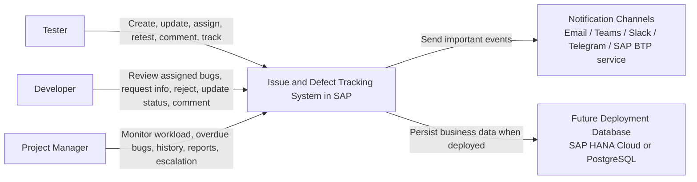
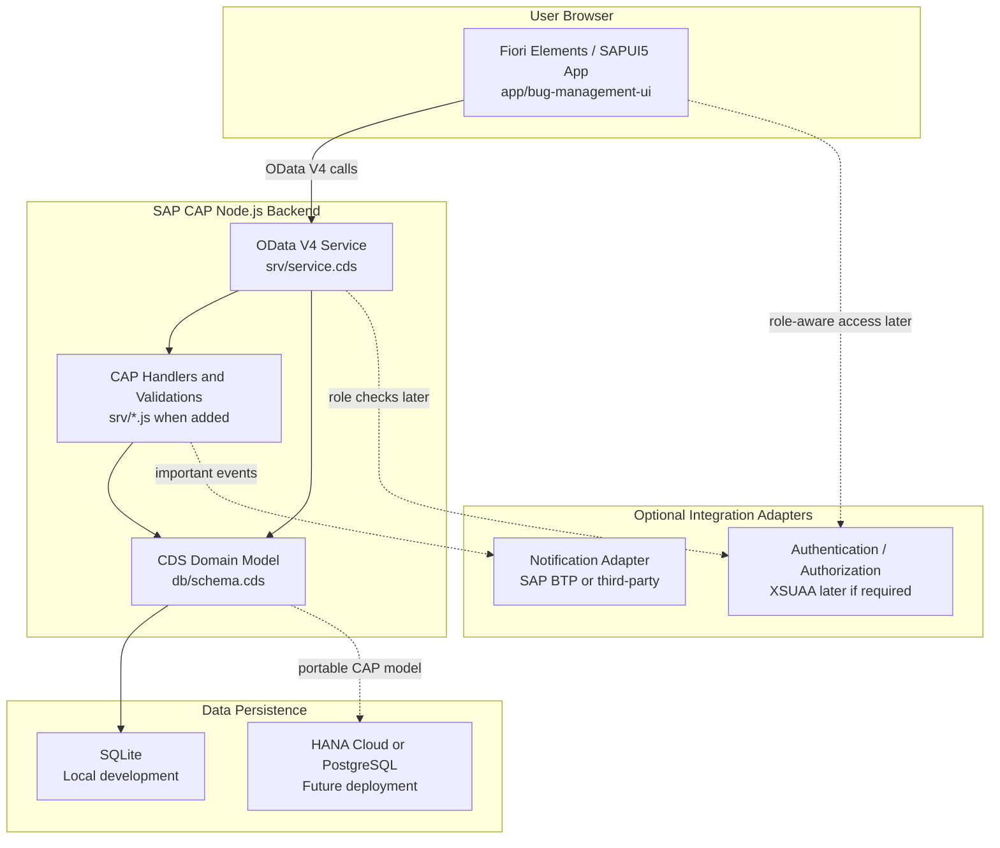

# 01 - System Context and SAP Architecture

## System Context

This context diagram shows who uses IDTS and which external channels may be connected later.

## SAP CAP/Fiori Architecture

This architecture diagram maps the current SAP technical direction without adding unsupported scope.

## Architecture Notes

- Current implementation is intentionally small: `Bugs` is exposed through `BugService`.
- Future entities should be added only when they support documented IDTS scope.
- Backend validation should live in CAP, not only in the UI.
- Fiori Elements should be preferred before custom SAPUI5 code.
