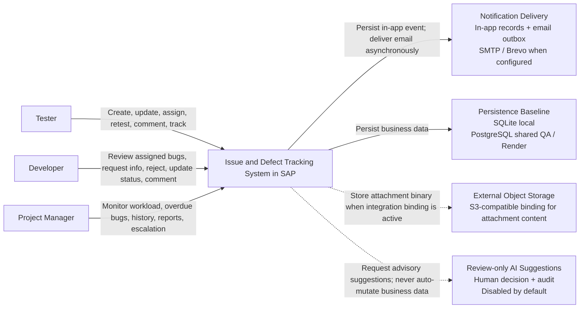
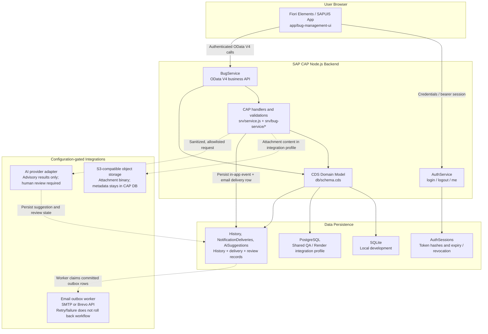

# 01 - System Context and SAP Architecture

## System Context

This context diagram shows the current IDTS runtime baseline. Email, external object storage, and AI provider calls remain configuration-gated integrations; they are not required for the local SQLite profile.

```mermaid
flowchart LR
    Tester["Tester"]
    Developer["Developer"]
    PM["Project Manager"]

    IDTS["Issue and Defect Tracking System in SAP"]

    Notifications["Notification Delivery\nIn-app records + email outbox\nSMTP / Brevo when configured"]
    Data["Persistence Baseline\nSQLite local\nPostgreSQL shared QA / Render"]
    ObjectStore["External Object Storage\nS3-compatible binding for attachment content"]
    AI["Review-only AI Suggestions\nHuman decision + audit\nDisabled by default"]

    Tester -->|"Create, update, assign, retest, comment, track"| IDTS
    Developer -->|"Review assigned bugs, request info, reject, update status, comment"| IDTS
    PM -->|"Monitor workload, overdue bugs, history, reports, escalation"| IDTS

    IDTS -->|"Persist in-app event; deliver email asynchronously"| Notifications
    IDTS -->|"Persist business data"| Data
    IDTS -. "Store attachment binary when integration binding is active" .-> ObjectStore
    IDTS -. "Request advisory suggestions; never auto-mutate business data" .-> AI
```

## SAP CAP/Fiori Architecture

This architecture diagram maps the current SAP technical direction without adding unsupported scope.

```mermaid
flowchart TB
    subgraph Browser["User Browser"]
        FioriApp["Fiori Elements / SAPUI5 App\napp/bug-management-ui"]
    end

    subgraph CAP["SAP CAP Node.js Backend"]
        AuthService["AuthService\nlogin / logout / me"]
        BugService["BugService\nOData V4 business API"]
        Handlers["CAP handlers and validations\nsrv/service.js + srv/bug-service/*"]
        Model["CDS Domain Model\ndb/schema.cds"]
    end

    subgraph Data["Data Persistence"]
        SQLite["SQLite\nLocal development"]
        PostgreSQL["PostgreSQL\nShared QA / Render integration profile"]
        Sessions["AuthSessions\nToken hashes and expiry / revocation"]
        Audit["History, NotificationDeliveries, AiSuggestions\nHistory + delivery + review records"]
    end

    subgraph Integrations["Configuration-gated Integrations"]
        ObjectStore["S3-compatible object storage\nAttachment binary; metadata stays in CAP DB"]
        Email["Email outbox worker\nSMTP or Brevo API\nRetry/failure does not roll back workflow"]
        AI["AI provider adapter\nAdvisory results only; human review required"]
    end

    FioriApp -->|"Credentials / bearer session"| AuthService
    FioriApp -->|"Authenticated OData V4 calls"| BugService
    AuthService --> Sessions
    BugService --> Handlers
    BugService --> Model
    Handlers --> Model
    Model --> SQLite
    Model --> PostgreSQL
    Model --> Audit
    Handlers -. "Attachment content in integration profile" .-> ObjectStore
    Handlers -->|"Persist in-app event + email delivery row"| Audit
    Audit -. "Worker claims committed outbox rows" .-> Email
    Handlers -. "Sanitized, allowlisted request" .-> AI
    AI -. "Persist suggestion and review state" .-> Audit
```

## Architecture Notes

- `AuthService` owns login/session operations. `BugService` owns authenticated defect-management APIs and remains the business validation/authorization boundary.
- SQLite is the local development default. The shared QA/Render integration profile uses PostgreSQL; SAP HANA Cloud remains a future deployment option rather than the active review baseline.
- Attachment metadata is managed by CAP in the database. Binary content uses the configured S3-compatible object-store adapter in the integration profile; final external-storage acceptance depends on a valid private binding.
- `Notifications` is the in-app source event. `NotificationDeliveries` is the email outbox processed after the business transaction commits, so provider failure cannot roll back the bug workflow.
- AI features are disabled by default and advisory only. `AiSuggestions` records sanitized suggestion/review metadata; a user must review and explicitly perform any business action.
- Backend validation should live in CAP, not only in the UI.
- Fiori Elements should be preferred before custom SAPUI5 code.
