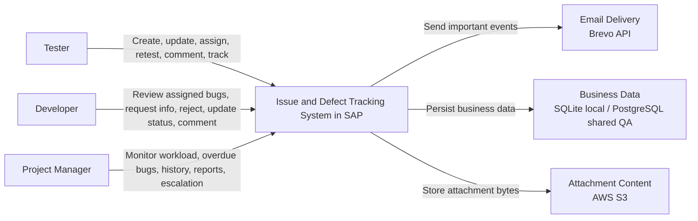
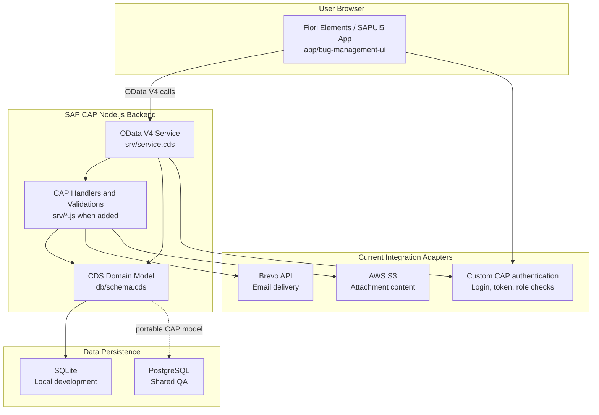

# 01 - System Context and SAP Architecture

## System Context

This context diagram shows the active IDTS users and the verified local/shared-QA integrations. Future alternatives are intentionally not shown as if they were already deployed.

```mermaid
flowchart LR
    Tester["Tester"]
    Developer["Developer"]
    PM["Project Manager"]

    IDTS["Issue and Defect Tracking System in SAP"]

    NotificationChannels["Email Delivery\nBrevo API"]
    SharedDB["Business Data\nSQLite local / PostgreSQL shared QA"]
    Attachments["Attachment Content\nAWS S3"]

    Tester -->|"Create, update, assign, retest, comment, track"| IDTS
    Developer -->|"Review assigned bugs, request info, reject, update status, comment"| IDTS
    PM -->|"Monitor workload, overdue bugs, history, reports, escalation"| IDTS

    IDTS -->|"Send important events"| NotificationChannels
    IDTS -->|"Persist business data"| SharedDB
    IDTS -->|"Store attachment bytes"| Attachments
```

## SAP CAP/Fiori Architecture

This architecture diagram maps the implemented CAP/Fiori direction without presenting future deployment options as current behavior.

```mermaid
flowchart TB
    subgraph Browser["User Browser"]
        FioriApp["Fiori Elements / SAPUI5 App\napp/bug-management-ui"]
    end

    subgraph CAP["SAP CAP Node.js Backend"]
        OData["OData V4 Service\nsrv/service.cds"]
        Handlers["CAP Handlers and Validations\nsrv/*.js when added"]
        Model["CDS Domain Model\ndb/schema.cds"]
    end

    subgraph Data["Data Persistence"]
        SQLite["SQLite\nLocal development"]
        DeployDB["PostgreSQL\nShared QA"]
    end

    subgraph IntegrationAdapters["Current Integration Adapters"]
        Notify["Brevo API\nEmail delivery"]
        Storage["AWS S3\nAttachment content"]
        Auth["Custom CAP authentication\nLogin, token, role checks"]
    end

    FioriApp -->|"OData V4 calls"| OData
    OData --> Handlers
    OData --> Model
    Handlers --> Model
    Model --> SQLite
    Model -. "portable CAP model" .-> DeployDB
    Handlers --> Notify
    Handlers --> Storage
    FioriApp --> Auth
    OData --> Auth
```

## Architecture Notes

- Current implementation is intentionally small: `Bugs` is exposed through `BugService`.
- Future entities should be added only when they support documented IDTS scope.
- Backend validation should live in CAP, not only in the UI.
- Fiori Elements should be preferred before custom SAPUI5 code.
