# 02 - Use Case Diagram

This PlantUML diagram captures the necessary use cases by role.

```plantuml
@startuml
left to right direction
skinparam packageStyle rectangle

actor "Tester" as Tester
actor "Developer" as Developer
actor "Project Manager" as PM
actor "Notification Channel" as Channel

rectangle "Issue and Defect Tracking System in SAP" {
  usecase "Search / Filter Bugs" as UC_Search
  usecase "Check Existing Bug" as UC_CheckDuplicate
  usecase "Follow Existing Open Bug" as UC_FollowExisting
  usecase "Update or Reopen Closed Bug" as UC_ReopenExisting

  usecase "Create Bug Report" as UC_Create
  usecase "Validate Required Fields" as UC_Validate
  usecase "Upload Evidence" as UC_Upload
  usecase "Submit Bug" as UC_Submit
  usecase "Assign Bug" as UC_Assign
  usecase "Set Pending Assignment" as UC_Pending
  usecase "Reassign Bug" as UC_Reassign
  usecase "Edit Submitted Bug\nwhile not Closed" as UC_Edit

  usecase "View Assigned Bugs" as UC_ViewAssigned
  usecase "Review Bug Information" as UC_Review
  usecase "Request More Information" as UC_RequestInfo
  usecase "Add Developer Note" as UC_DevNote
  usecase "Update Bug Status" as UC_UpdateStatus
  usecase "Reject Assigned Bug" as UC_Reject

  usecase "Add Comment / Feedback" as UC_Comment
  usecase "View Bug History" as UC_History
  usecase "Receive Notification" as UC_ReceiveNotification

  usecase "View All Bugs" as UC_ViewAll
  usecase "Monitor Developer Workload" as UC_Workload
  usecase "View Overdue Bugs" as UC_Overdue
  usecase "View Dashboard / Report" as UC_Dashboard
  usecase "Request Reassignment" as UC_RequestReassign
  usecase "Receive Escalation Notification" as UC_Escalation
}

Tester --> UC_Search
Tester --> UC_CheckDuplicate
Tester --> UC_Create
Tester --> UC_Upload
Tester --> UC_Submit
Tester --> UC_Assign
Tester --> UC_Pending
Tester --> UC_Reassign
Tester --> UC_Edit
Tester --> UC_Comment
Tester --> UC_History
Tester --> UC_ReceiveNotification

Developer --> UC_ViewAssigned
Developer --> UC_Review
Developer --> UC_RequestInfo
Developer --> UC_DevNote
Developer --> UC_UpdateStatus
Developer --> UC_Reject
Developer --> UC_Comment
Developer --> UC_ReceiveNotification

PM --> UC_Search
PM --> UC_ViewAll
PM --> UC_History
PM --> UC_Workload
PM --> UC_Overdue
PM --> UC_Dashboard
PM --> UC_RequestReassign
PM --> UC_Comment
PM --> UC_Escalation

Channel --> UC_ReceiveNotification
Channel --> UC_Escalation

UC_CheckDuplicate .> UC_FollowExisting : <<extend>>
UC_CheckDuplicate .> UC_ReopenExisting : <<extend>>
UC_Create .> UC_Validate : <<include>>
UC_Submit .> UC_Validate : <<include>>
UC_Submit .> UC_Assign : <<extend>>
UC_Submit .> UC_Pending : <<extend>>
UC_Edit .> UC_ReceiveNotification : <<include>>
UC_RequestInfo .> UC_ReceiveNotification : <<include>>
UC_Reject .> UC_ReceiveNotification : <<include>>
UC_UpdateStatus .> UC_History : <<include>>
UC_Assign .> UC_History : <<include>>
UC_Reassign .> UC_History : <<include>>
UC_Comment .> UC_History : <<include>>

note bottom of UC_Review
Developer review is information review,
status update, note, or rejection.
It is not direct code fixing.
end note

note bottom of UC_RequestReassign
PM requests reassignment.
Tester performs it unless
authorization is expanded later.
end note
@enduml
```

## Coverage Notes

- The diagram includes all in-scope role capabilities from the business rules.
- Direct code fixing, deployment, CI/CD, and code review are intentionally excluded.
