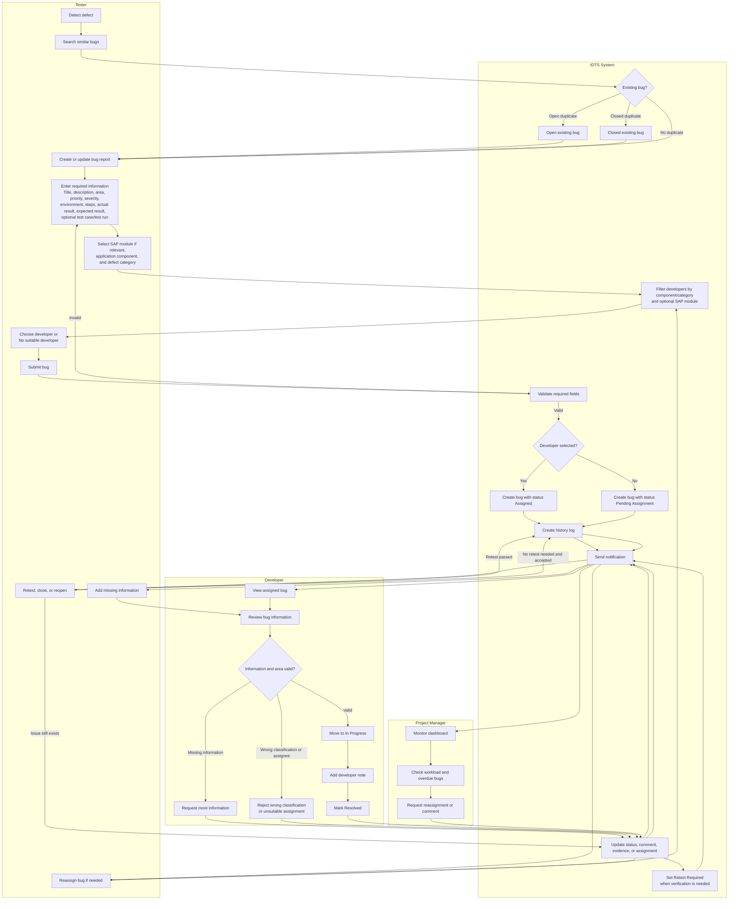
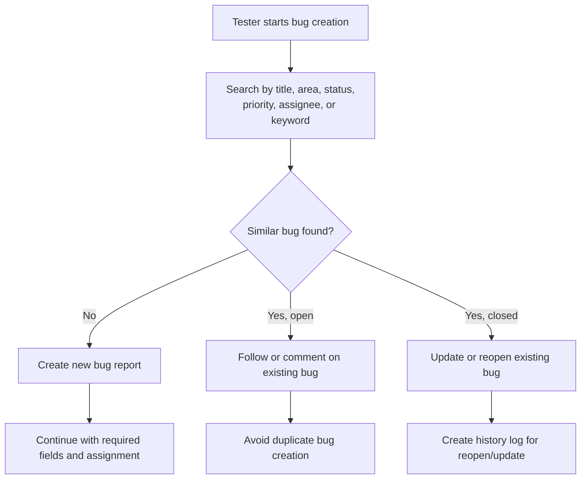
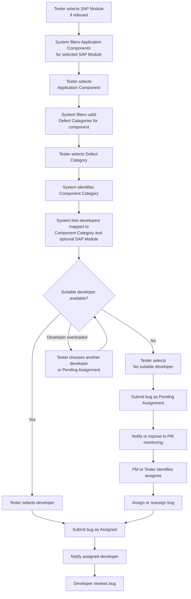
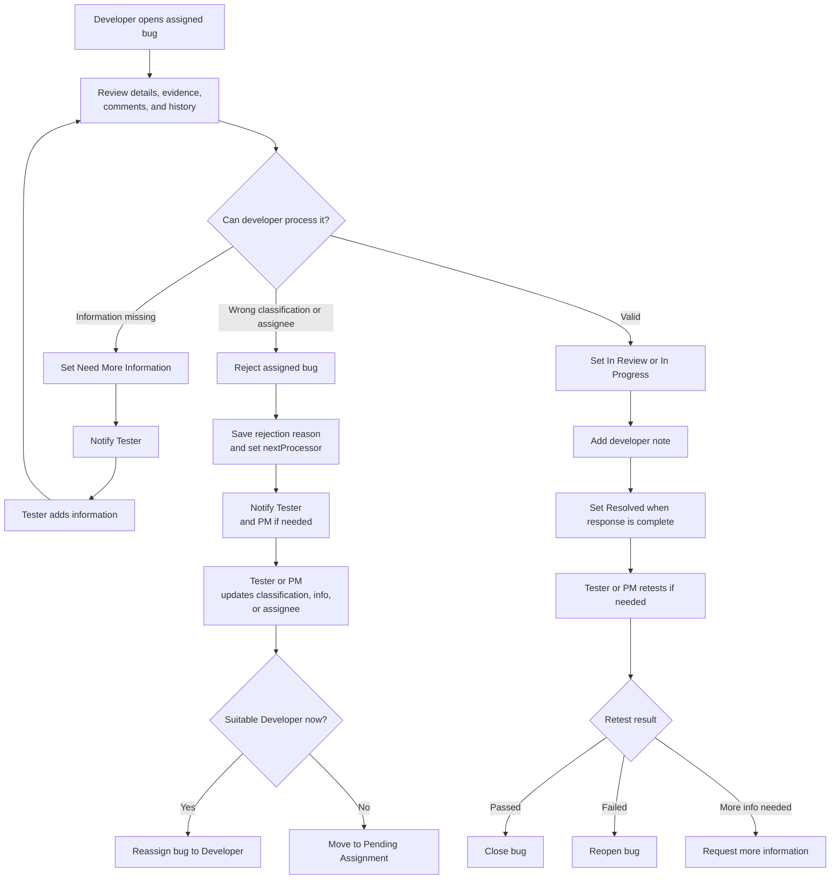

# 03 - Business Process Flows

## End-to-End Defect Tracking Flow

This diagram is the main cross-role business process from defect detection to closure or monitoring.

## Duplicate Checking Flow

## Assignment Decision Flow

## Developer Review Flow

English: In this flow, `Rejected` is not a final state. It requires a rejection reason, a nextProcessor, and a follow-up action by Tester or PM.

Vietnamese: Trong flow này, `Rejected` không phải trạng thái kết thúc. Nó bắt buộc phải có lý do reject, nextProcessor và action follow-up do Tester hoặc PM thực hiện.
