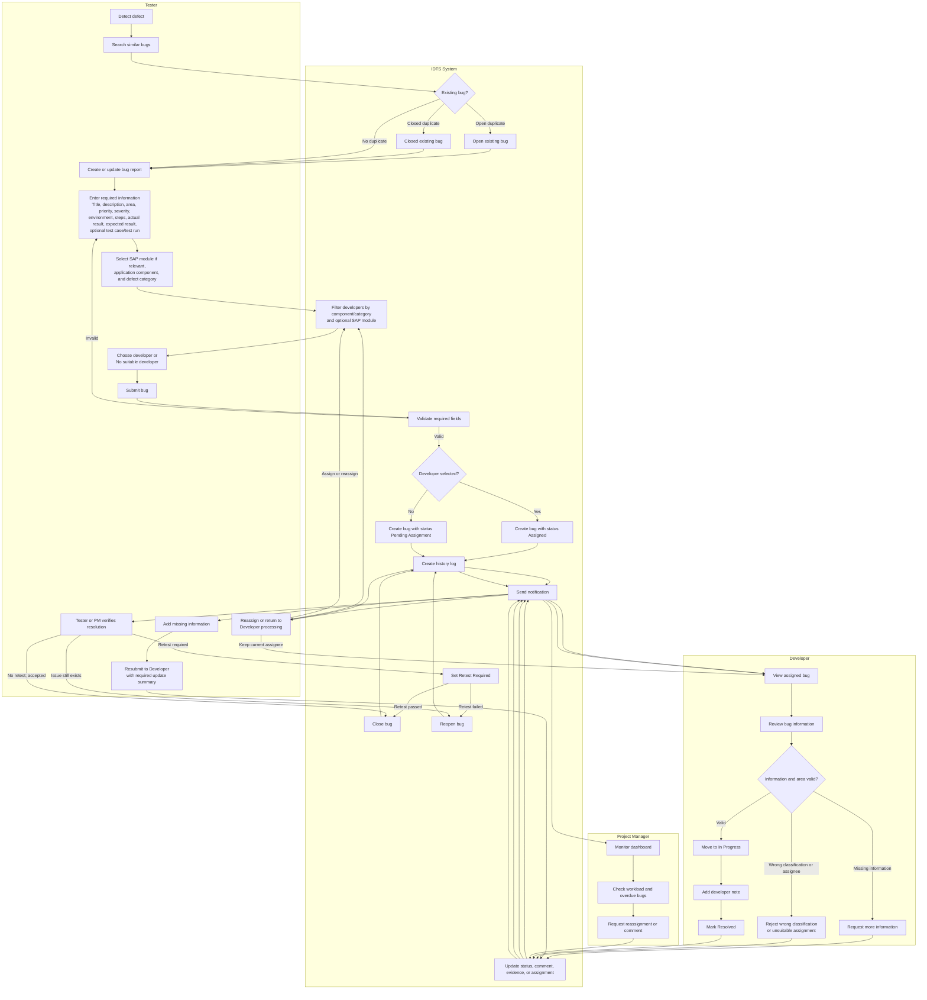
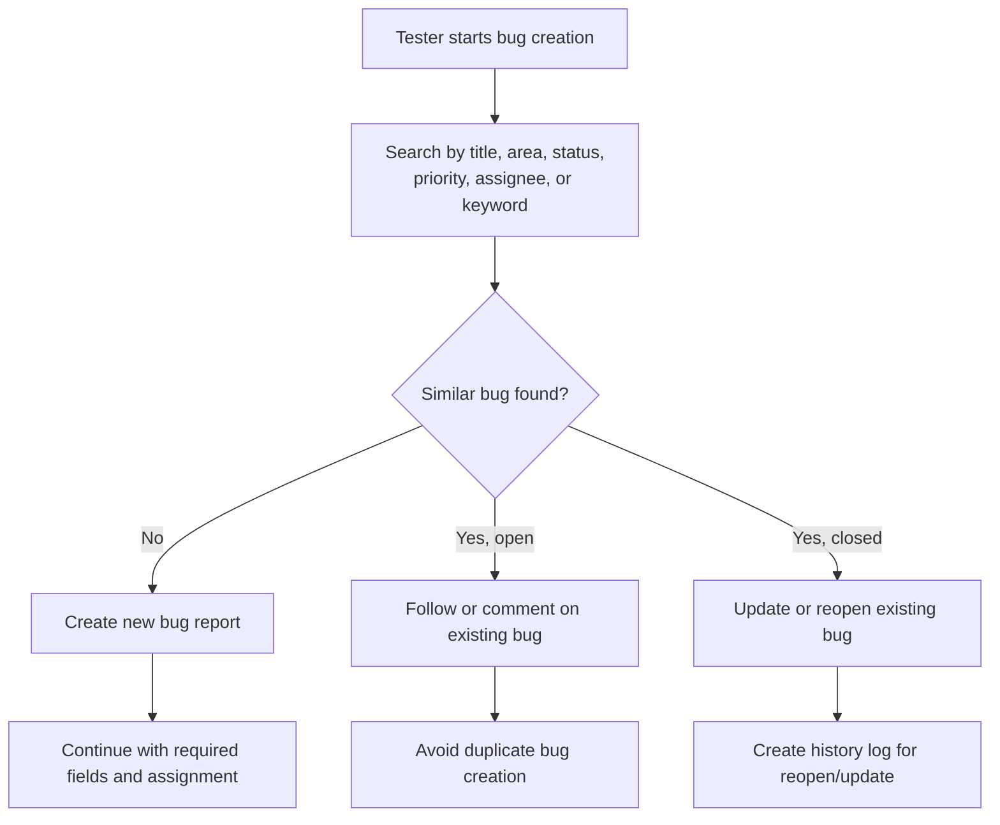
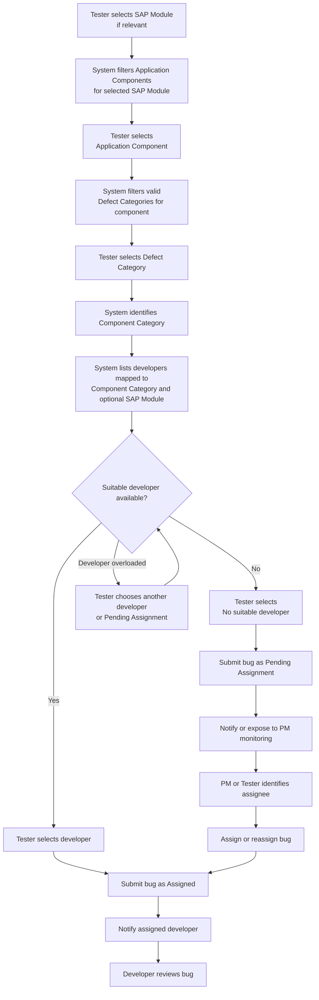
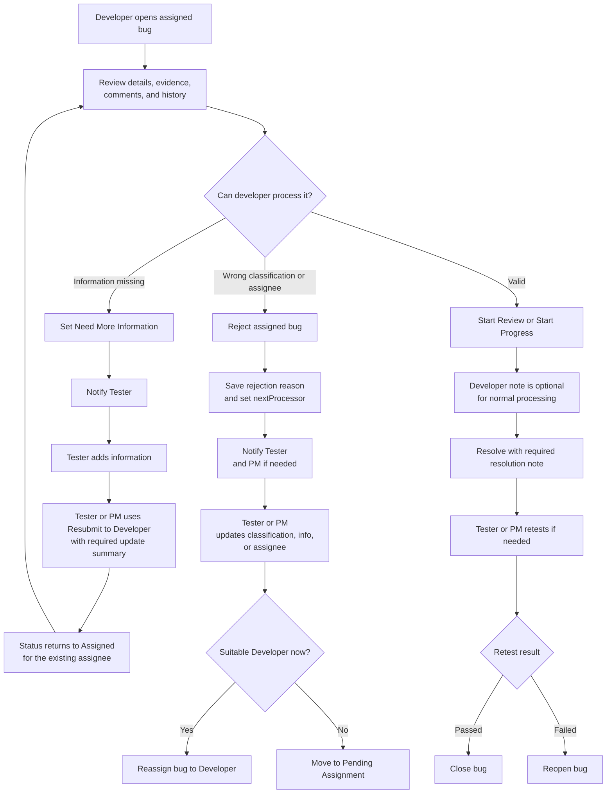

# 03 - Business Process Flows

## End-to-End Defect Tracking Flow

This diagram is the main cross-role business process from defect detection to closure or monitoring.

```mermaid
flowchart TD
    subgraph Tester["Tester"]
        R1["Detect defect"]
        R2["Search similar bugs"]
        R3["Create or update bug report"]
        R4["Enter required information\nTitle, description, area, priority, severity,\nenvironment, steps, actual result, expected result,\noptional test case/test run"]
        R5["Select SAP module if relevant,\napplication component, and defect category"]
        R6["Choose developer or\nNo suitable developer"]
        R7["Submit bug"]
        R8["Add missing information"]
        R8A["Resubmit to Developer\nwith required update summary"]
        R9["Reassign or return to\nDeveloper processing"]
        R10["Tester or PM verifies resolution"]
    end

    subgraph System["IDTS System"]
        S1{"Existing bug?"}
        S2["Open existing bug"]
        S3["Closed existing bug"]
        S4["Validate required fields"]
        S5["Filter developers by component/category\nand optional SAP module"]
        S6{"Developer selected?"}
        S7["Create bug with status Assigned"]
        S8["Create bug with status Pending Assignment"]
        S9["Create history log"]
        S10["Send notification"]
        S11["Update status, comment, evidence, or assignment"]
        S12["Set Retest Required"]
        S13["Close bug"]
        S14["Reopen bug"]
    end

    subgraph Dev["Developer"]
        D1["View assigned bug"]
        D2["Review bug information"]
        D3{"Information and area valid?"}
        D4["Request more information"]
        D5["Reject wrong classification\nor unsuitable assignment"]
        D6["Move to In Progress"]
        D7["Add developer note"]
        D8["Mark Resolved"]
    end

    subgraph PM["Project Manager"]
        P1["Monitor dashboard"]
        P2["Check workload and overdue bugs"]
        P3["Request reassignment or comment"]
    end

    R1 --> R2 --> S1
    S1 -->|"Open duplicate"| S2 --> R3
    S1 -->|"Closed duplicate"| S3 --> R3
    S1 -->|"No duplicate"| R3
    R3 --> R4 --> R5 --> S5 --> R6 --> R7 --> S4
    S4 -->|"Invalid"| R4
    S4 -->|"Valid"| S6
    S6 -->|"Yes"| S7
    S6 -->|"No"| S8
    S7 --> S9 --> S10 --> D1
    S8 --> S9 --> S10 --> P1
    D1 --> D2 --> D3
    D3 -->|"Missing information"| D4 --> S11 --> S10 --> R8 --> R8A --> S11 --> S10 --> D1
    D3 -->|"Wrong classification or assignee"| D5 --> S11 --> S10 --> R9 --> S5
    D3 -->|"Valid"| D6 --> D7 --> D8 --> S11 --> S10 --> R10
    R10 -->|"Retest required"| S12
    S12 -->|"Retest passed"| S13
    S12 -->|"Retest failed"| S14
    R10 -->|"No retest; accepted"| S13
    R10 -->|"Issue still exists"| S14
    S13 --> S9
    S14 --> S9 --> R9
    R9 -->|"Assign or reassign"| S5
    R9 -->|"Keep current assignee"| D1
    P1 --> P2 --> P3 --> S11
```

## Duplicate Checking Flow

```mermaid
flowchart TD
    A["Tester starts bug creation"] --> B["Search by title, area, status,\npriority, assignee, or keyword"]
    B --> C{"Similar bug found?"}
    C -->|"No"| D["Create new bug report"]
    C -->|"Yes, open"| E["Follow or comment on existing bug"]
    C -->|"Yes, closed"| F["Update or reopen existing bug"]
    D --> G["Continue with required fields and assignment"]
    E --> H["Avoid duplicate bug creation"]
    F --> I["Create history log for reopen/update"]
```

## Assignment Decision Flow

```mermaid
flowchart TD
    A["Tester selects SAP Module\nif relevant"] --> B["System filters Application Components\nfor selected SAP Module"]
    B --> C["Tester selects\nApplication Component"]
    C --> D["System filters valid\nDefect Categories for component"]
    D --> E["Tester selects Defect Category"]
    E --> F["System identifies Component Category"]
    F --> G["System lists developers mapped to\nComponent Category and optional SAP Module"]
    G --> H{"Suitable developer available?"}
    H -->|"Yes"| I["Tester selects developer"]
    I --> J["Submit bug as Assigned"]
    J --> K["Notify assigned developer"]
    K --> L["Developer reviews bug"]

    H -->|"No"| M["Tester selects\nNo suitable developer"]
    M --> N["Submit bug as Pending Assignment"]
    N --> O["Notify or expose to PM monitoring"]
    O --> P["PM or Tester identifies assignee"]
    P --> Q["Assign or reassign bug"]
    Q --> J

    H -->|"Developer overloaded"| R["Tester chooses another developer\nor Pending Assignment"]
    R --> H
```

## Developer Review Flow

```mermaid
flowchart TD
    A["Developer opens assigned bug"] --> B["Review details, evidence,\ncomments, and history"]
    B --> C{"Can developer process it?"}
    C -->|"Information missing"| D["Set Need More Information"]
    D --> E["Notify Tester"]
    E --> F["Tester adds information"]
    F --> F2["Tester or PM uses Resubmit to Developer\nwith required update summary"]
    F2 --> F3["Status returns to Assigned\nfor the existing assignee"]
    F3 --> B

    C -->|"Wrong classification or assignee"| G["Reject assigned bug"]
    G --> H["Save rejection reason\nand set nextProcessor"]
    H --> I["Notify Tester\nand PM if needed"]
    I --> J["Tester or PM\nupdates classification, info,\nor assignee"]
    J --> K2{"Suitable Developer now?"}
    K2 -->|"Yes"| L2["Reassign bug to Developer"]
    K2 -->|"No"| M2["Move to Pending Assignment"]

    C -->|"Valid"| K["Start Review or Start Progress"]
    K --> L["Developer note is optional\nfor normal processing"]
    L --> M["Resolve with required resolution note"]
    M --> N["Tester or PM retests if needed"]
    N --> O{"Retest result"}
    O -->|"Passed"| P["Close bug"]
    O -->|"Failed"| Q["Reopen bug"]
```

English: In this flow, `Rejected` is not a final state. It requires a rejection reason, a nextProcessor, and a follow-up action by Tester or PM. Request More Information is available only during assigned Developer handling (`Assigned`, `In Review`, or `In Progress`); after `Resolved` or `Retest Required`, Tester/PM may close or reopen according to the runtime transition rules.

Vietnamese: Trong flow này, `Rejected` không phải trạng thái kết thúc. Nó bắt buộc phải có lý do reject, nextProcessor và action follow-up do Tester hoặc PM thực hiện. Request More Information chỉ khả dụng trong giai đoạn Developer đang xử lý (`Assigned`, `In Review` hoặc `In Progress`); sau `Resolved` hoặc `Retest Required`, Tester/PM chỉ close hoặc reopen theo transition rule của runtime.
