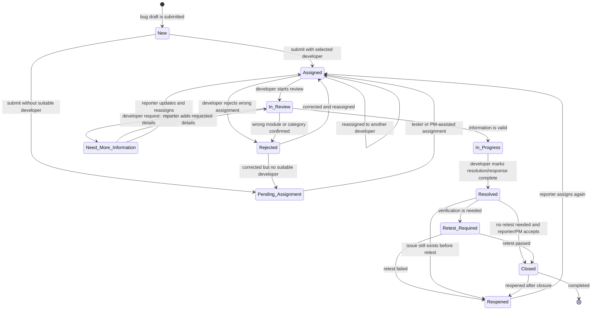

# 04 - Bug Status Lifecycle

The status lifecycle below follows the documented statuses and BR-24/BR-25.

## Status Ownership

| Status | Main owner | Meaning |
| --- | --- | --- |
| New | Tester/System | Bug is newly recorded or being submitted. |
| Pending Assignment | Tester/PM | Bug is valid enough to record but has no suitable developer yet. |
| Assigned | Tester/System | Bug has one main developer assignee. |
| In Review | Developer | Developer is checking information, area, evidence, and comments. |
| Need More Information | Developer/Tester | Developer needs more details; Tester must update the report. |
| In Progress | Developer | Developer is handling or tracking the resolution outside IDTS. |
| Resolved | Developer | Developer has provided a resolution result or response. |
| Retest Required | Tester/PM | Resolution needs verification before closure. |
| Rejected | Developer/Tester/PM | Developer rejected because of wrong classification or unsuitable assignment; follow-up is required. |
| Reopened | Tester | Bug is opened again after being resolved or closed. |
| Closed | Tester/PM | Bug is accepted as complete and should not be freely edited. |

## Notes

- `Reassign` is treated as an assignment action and history log, not a separate primary status.
- `Rejected` is treated as a follow-up status, not a terminal status. It must have a reason, nextProcessor, and a later transition.
- `Retest Required` keeps closure under Tester/PM control and mirrors common SAP ALM defect handling without adding a full test management module.
- Closed bugs should not be edited freely. Reopen should be used when the issue still exists.
- Comments do not directly change status. A separate status update must be recorded and logged.

Vietnamese:

- `Rejected` là trạng thái cần xử lý tiếp, không phải trạng thái kết thúc. Bug ở trạng thái này phải có lý do, nextProcessor và transition tiếp theo sau khi Tester hoặc PM xử lý.
