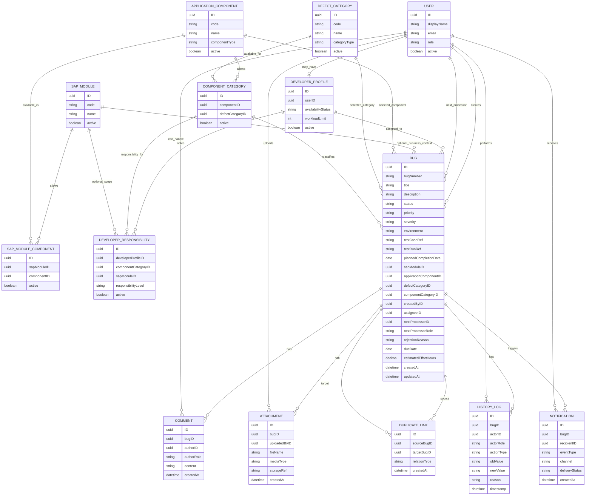

# 05 - Conceptual Data Model

This model is conceptual. It represents the target business scope, not the current minimal CAP schema.

The classification model separates SAP functional modules from IDTS/application components. This avoids calling an IDTS feature such as Bug Report a "SAP module".

## Entity Notes

- `USER` represents Tester, Developer, and PM users. Reporter and Admin are not separate MVP roles.
- `DEVELOPER_PROFILE` exists only for users who can receive bug assignments.
- `SAP_MODULE` is a real SAP functional/business module such as FI, MM, SD, CO, PP, or HCM. It should not contain IDTS feature names.
- `APPLICATION_COMPONENT` is the concrete application component or feature area where the bug appears. Examples: IDTS Bug Report, IDTS Assignment, IDTS Notification, Dashboard, a custom Fiori app, or a CAP service.
- `SAP_MODULE_COMPONENT` controls which application components are relevant for each SAP module. This supports dependent value help in Fiori: choose SAP Module first, then show relevant application components.
- `DEFECT_CATEGORY` is the type or technical layer of the defect. Examples: Fiori/UI5, SAP CAP Backend, Database, Workflow, Integration, Authorization, Performance.
- `COMPONENT_CATEGORY` controls which defect categories are valid for each application component. This supports dependent value help in Fiori.
- `DEVELOPER_RESPONSIBILITY` maps a developer to a valid `COMPONENT_CATEGORY`. It can optionally be scoped to a `SAP_MODULE` when responsibility differs by SAP business area.
- `BUG` stores an optional `sapModuleID`, selected `applicationComponentID`, selected `defectCategoryID`, and validated `componentCategoryID`. The UI can still show SAP Module, Application Component, and Category as separate fields while the backend keeps the validated assignment key.
- `BUG.environment`, `testCaseRef`, and `testRunRef` provide lightweight traceability to the SAP test context without creating a full test management module.
- `BUG.nextProcessorID`, `nextProcessorRole`, `plannedCompletionDate`, `dueDate`, and `estimatedEffortHours` support SAP Cloud ALM-style ownership and PM monitoring while staying inside the IDTS MVP scope.
- `BUG.rejectionReason` stores the latest visible rejection reason. Full immutable rejection history stays in `HISTORY_LOG.reason`.
- `COMMENT`, `ATTACHMENT`, `HISTORY_LOG`, and `NOTIFICATION` are lifecycle-owned child records of a bug.
- `DUPLICATE_LINK` records relationships between similar bugs without forcing duplicate data into the main bug record.

## Fiori Selection Flow

The recommended Fiori create/edit form flow is:

1. Tester selects `SAP Module` only when the defect belongs to a SAP business area. For pure IDTS defects, this field can be empty or "Not Applicable".
2. Fiori value help for `Application Component` is filtered by the selected SAP Module through `SAP_MODULE_COMPONENT`. If SAP Module is empty or "Not Applicable", show general/IDTS components.
3. Tester selects `Application Component`, such as IDTS Bug Report, IDTS Assignment, Dashboard, or a custom SAP/Fiori component.
4. Fiori value help for `Defect Category` is filtered by the selected Application Component through `COMPONENT_CATEGORY`.
5. The selected Application Component/Defect Category pair identifies one `COMPONENT_CATEGORY`.
6. Fiori value help for `Assignee` is filtered through `DEVELOPER_RESPONSIBILITY` for that `COMPONENT_CATEGORY`, and optionally by `SAP_MODULE` if selected.
7. The `Next Processor` should default to the selected assignee when the bug is assigned, or to Tester/PM when more classification work is needed.
8. If no matching Developer exists, Tester can choose "No suitable developer" and the Bug status becomes `Pending Assignment`.

## Relationship Clarification

`SAP_MODULE`, `APPLICATION_COMPONENT`, `DEFECT_CATEGORY`, `COMPONENT_CATEGORY`, and `DEVELOPER_RESPONSIBILITY` serve different purposes:

| Entity | Purpose | Example |
| --- | --- | --- |
| `SAP_MODULE` | SAP business/functional context | FI, MM, SD |
| `APPLICATION_COMPONENT` | Where the bug appears in the application/system | IDTS Bug Report, Dashboard, Custom Fiori App |
| `SAP_MODULE_COMPONENT` | Which Application Components are relevant for a SAP Module | FI + Custom FI Fiori App |
| `DEFECT_CATEGORY` | What kind of defect it is | Fiori/UI5, CAP Backend, Database |
| `COMPONENT_CATEGORY` | Which Application Component/Defect Category pairs are valid | IDTS Bug Report + Fiori/UI5 |
| `DEVELOPER_PROFILE` | Represents a user who can receive bug assignments | Dev A |
| `DEVELOPER_RESPONSIBILITY` | Defines which Developer can handle a valid Component/Category pair, optionally within a SAP Module | Dev A handles IDTS Bug Report + Fiori/UI5 |

There is no direct business relationship line between `APPLICATION_COMPONENT` and `DEFECT_CATEGORY`. The relationship is expressed through `COMPONENT_CATEGORY`, which is the bridge table.

`DEVELOPER_RESPONSIBILITY` references `COMPONENT_CATEGORY` directly through `componentCategoryID`. This prevents assigning a developer to an invalid component/category pair. If `sapModuleID` is filled, the responsibility is restricted to that SAP Module. If it is empty, the responsibility applies regardless of SAP Module.

## SAP Module vs Component Category

`SAP_MODULE` and `COMPONENT_CATEGORY` are separate classification dimensions. They should not have a direct master-data relationship by default.

- `SAP_MODULE` answers: which SAP business/functional area is involved?
- `COMPONENT_CATEGORY` answers: which application component and defect category classify the bug?

`SAP_MODULE` can relate to `APPLICATION_COMPONENT` through `SAP_MODULE_COMPONENT` when the UI needs to filter components by SAP module. It still does not need a direct relationship to `DEFECT_CATEGORY`, because defect categories are technical classifications reused across many SAP modules and application components.

They meet on transactional or responsibility records:

- On `BUG`, the Tester may select `sapModuleID`, `applicationComponentID`, and `defectCategoryID`; the backend validates or derives `componentCategoryID`.
- On `DEVELOPER_RESPONSIBILITY`, a developer may be mapped to a `componentCategoryID`, optionally restricted by `sapModuleID`.

Only add a stricter bridge such as `SAP_MODULE_COMPONENT_CATEGORY` if the business later requires rules like "this component/category pair is valid for FI but not valid for MM". For the current IDTS scope, `SAP_MODULE_COMPONENT` is enough for component filtering, and `COMPONENT_CATEGORY` is enough for category filtering.

## Current Implementation Gap

Before WP1 implementation, the CAP model only contained a minimal `Bugs` entity. After WP1 Data Model Foundation, the implemented CDS model now follows this conceptual structure at entity/relationship level. Handler rules, Fiori annotations, and dependent value-help behavior still belong to later work packages.

Vietnamese: Trước WP1, CAP model chỉ có entity `Bugs` tối giản. Sau WP1 Data Model Foundation, CDS model đã đi theo cấu trúc conceptual này ở mức entity/relationship. Handler rules, Fiori annotations và dependent value-help behavior vẫn thuộc các work package sau.
