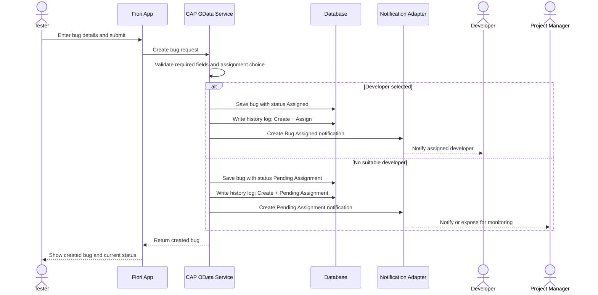
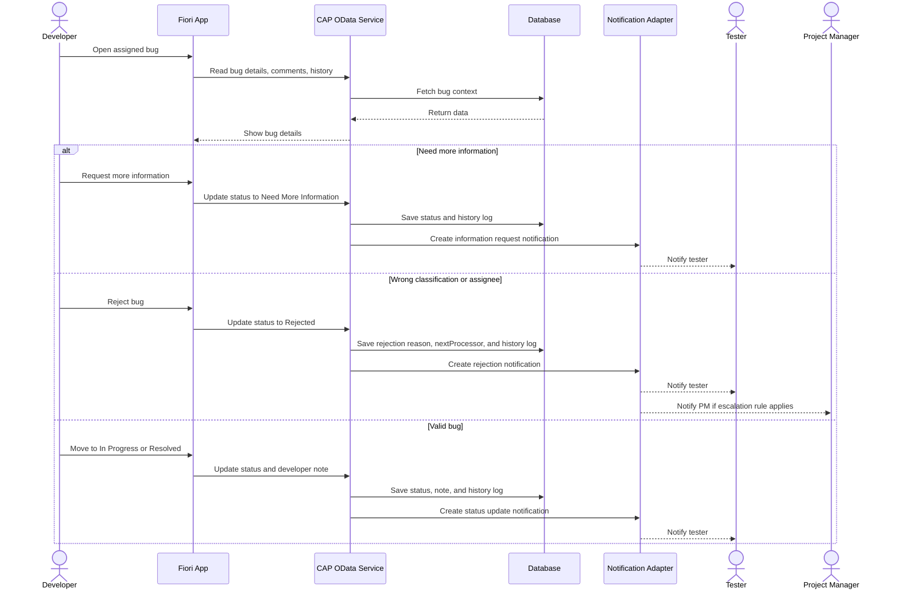
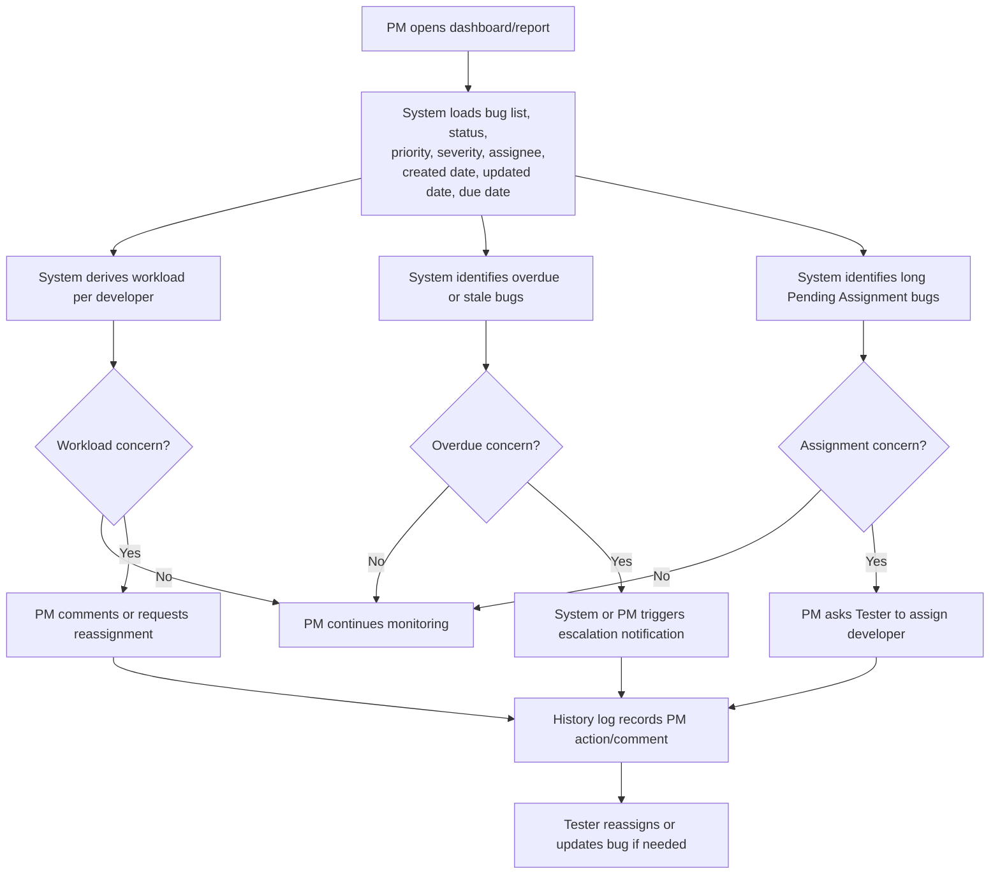

# 06 - Notification, Audit, and PM Monitoring

## Submit Bug and Notification Sequence

## Developer Review Notification Sequence

## PM Monitoring and Escalation Flow

## Audit Rules Represented

- Create bug, edit bug, assign, reassign, status change, comment, evidence upload, request more information, reject, close, and reopen should create history logs.
- Each history log should capture actor, role, timestamp, action type, old value, new value, and reason when available.
- Notification is separate from history. A notification may fail to deliver, but the business action should still be logged.
- Rejected notifications must make the follow-up owner clear. Rejected is not a terminal state.

Vietnamese:

- Notification khi bug bị Rejected phải làm rõ ai là người follow-up tiếp theo. Rejected không phải trạng thái kết thúc.
