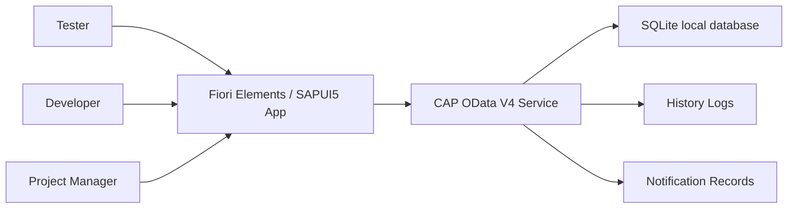

# 07 - SRS System Context

This diagram was extracted from the formal SRS deliverable so the diagram pack contains every diagram used by BRD/SRS/FRS.

Vietnamese: Diagram này được trích từ SRS chính thức để thư mục diagram chứa đầy đủ các diagram đang được dùng trong BRD/SRS/FRS.

## Notes

- This is the concise SRS system context diagram.
- The broader architecture diagram remains in `01-system-context-and-architecture.md`.

Vietnamese:

- Đây là system context diagram dạng ngắn trong SRS.
- Diagram kiến trúc rộng hơn vẫn nằm trong `01-system-context-and-architecture.md`.
