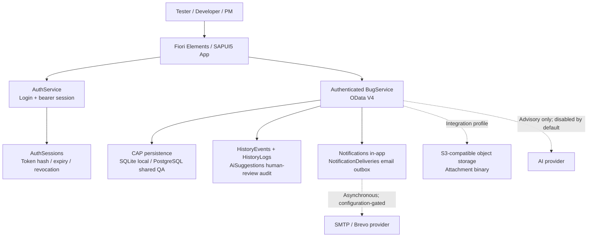

# 07 - SRS System Context

This diagram was extracted from the formal SRS deliverable so the diagram pack contains every diagram used by BRD/SRS/FRS.

Vietnamese: Diagram này được trích từ SRS chính thức để thư mục diagram chứa đầy đủ các diagram đang được dùng trong BRD/SRS/FRS.

```mermaid
flowchart TB
    Users["Tester / Developer / PM"] --> Fiori["Fiori Elements / SAPUI5 App"]
    Fiori --> Auth["AuthService\nLogin + bearer session"]
    Fiori --> OData["Authenticated BugService\nOData V4"]
    Auth --> Sessions["AuthSessions\nToken hash / expiry / revocation"]
    OData --> DB["CAP persistence\nSQLite local / PostgreSQL shared QA"]
    OData --> Audit["HistoryEvents + HistoryLogs\nAiSuggestions human-review audit"]
    OData --> Notif["Notifications in-app\nNotificationDeliveries email outbox"]
    OData -. "Integration profile" .-> Storage["S3-compatible object storage\nAttachment binary"]
    Notif -. "Asynchronous; configuration-gated" .-> Email["SMTP / Brevo provider"]
    OData -. "Advisory only; disabled by default" .-> AI["AI provider"]
```

## Notes

- This is the concise SRS system context diagram.
- The broader architecture diagram remains in `01-system-context-and-architecture.md`.
- PostgreSQL/Render is the shared QA baseline; SQLite remains the local default. External object storage, email delivery, and AI provider calls require private configuration and degrade without changing the core defect workflow.
- AI output requires human review and never mutates defect business data automatically.

Vietnamese:

- Đây là system context diagram dạng ngắn trong SRS.
- Diagram kiến trúc rộng hơn vẫn nằm trong `01-system-context-and-architecture.md`.
- PostgreSQL/Render là baseline shared QA; SQLite vẫn là local default. External object storage, email delivery và AI provider cần private config và không được làm thay đổi core defect workflow khi tạm thời không khả dụng.
- AI chỉ đưa suggestion, cần human review và không tự động sửa business data của bug.
