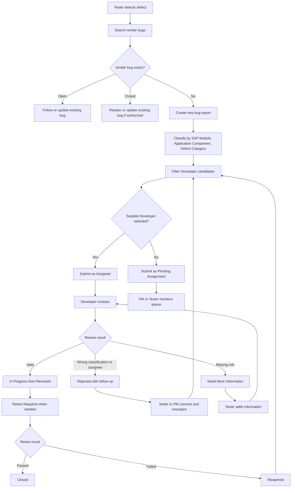
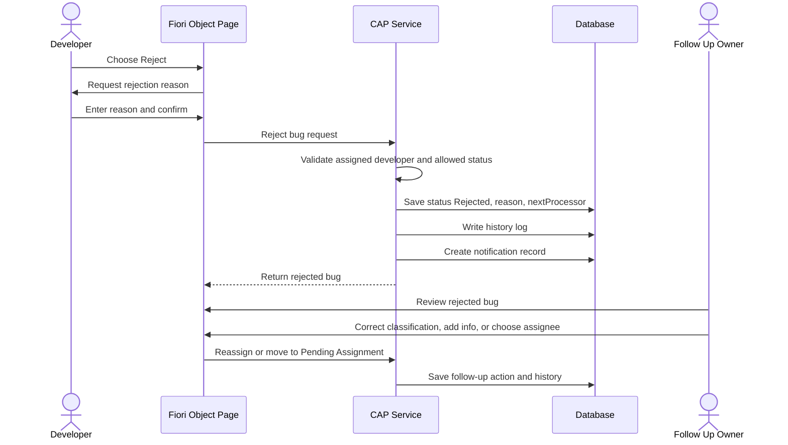
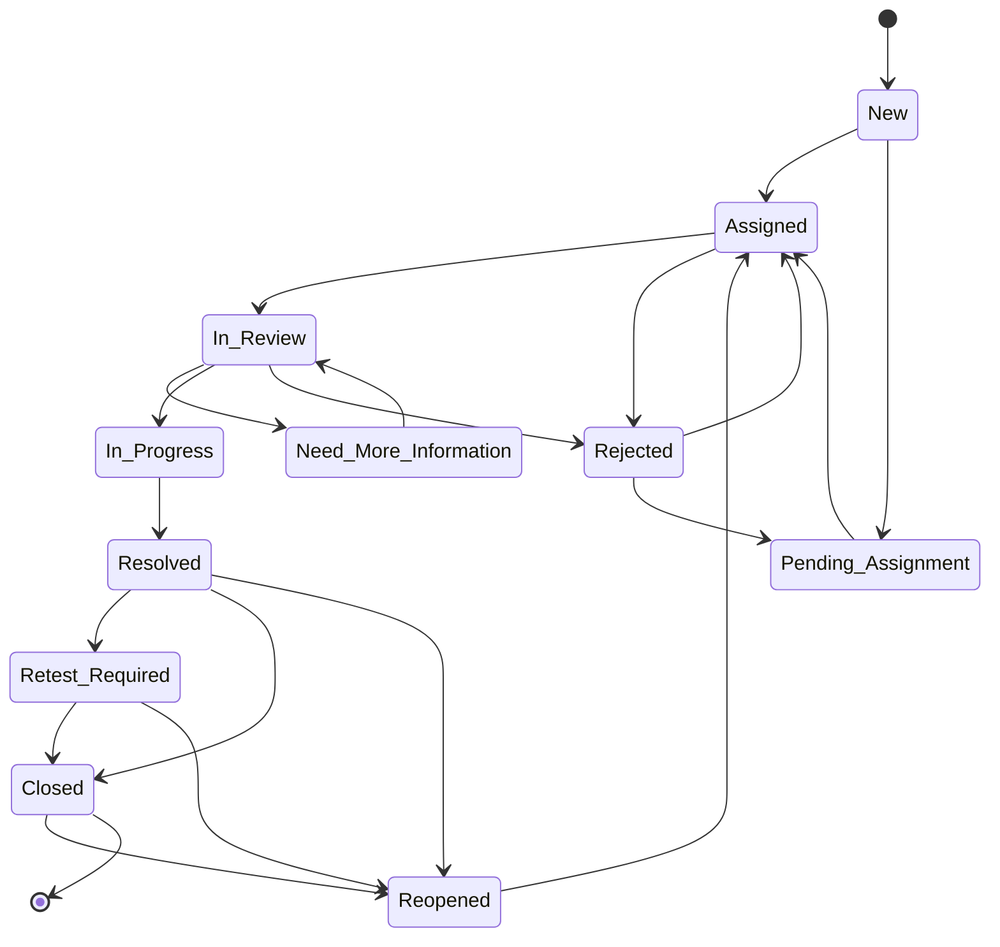
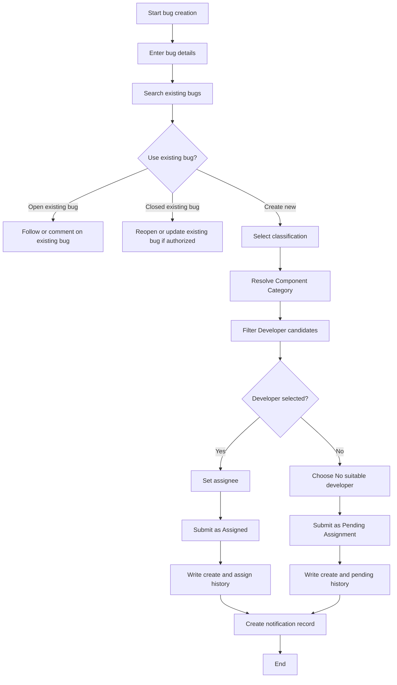
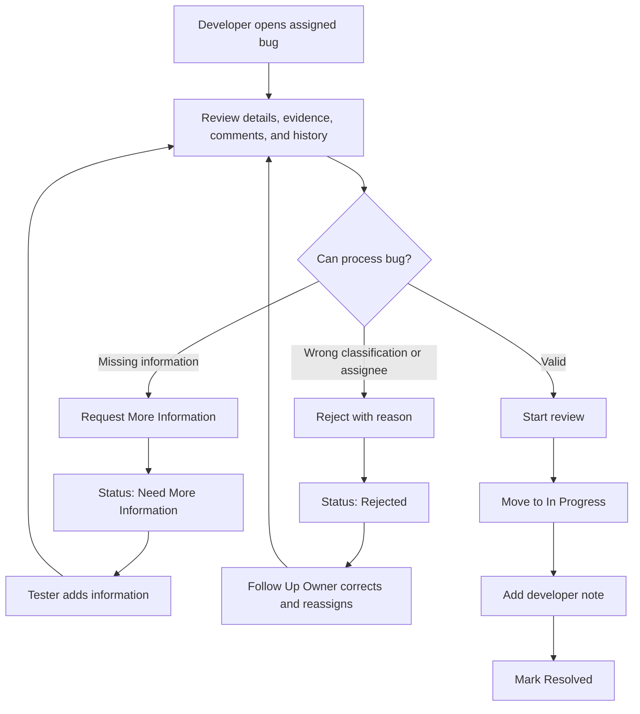
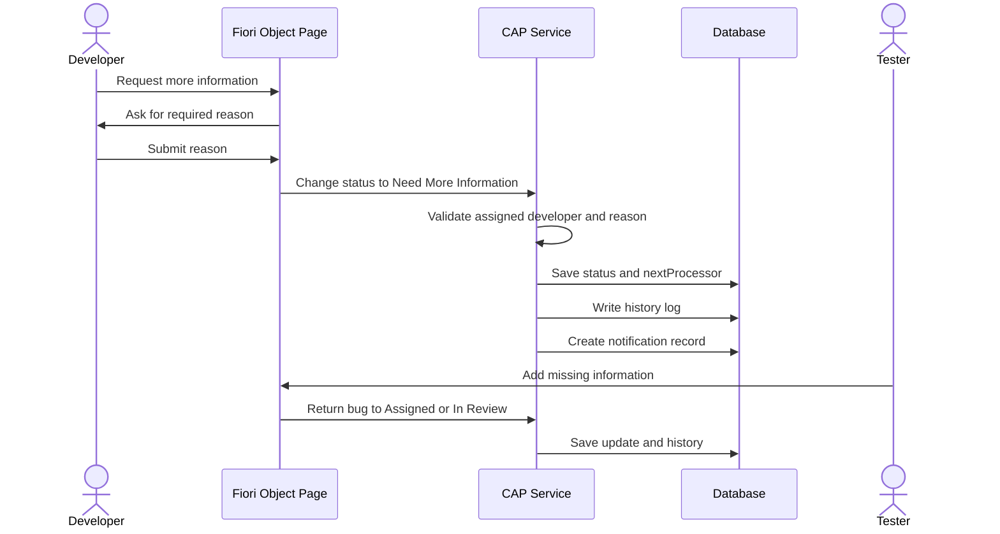
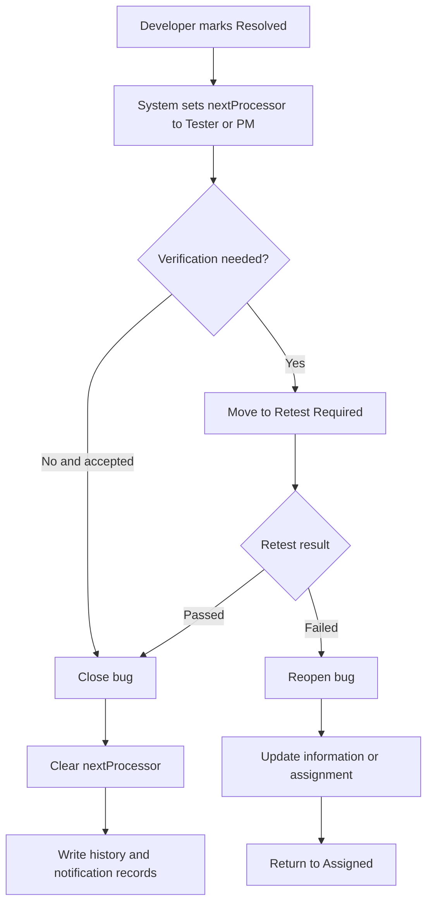
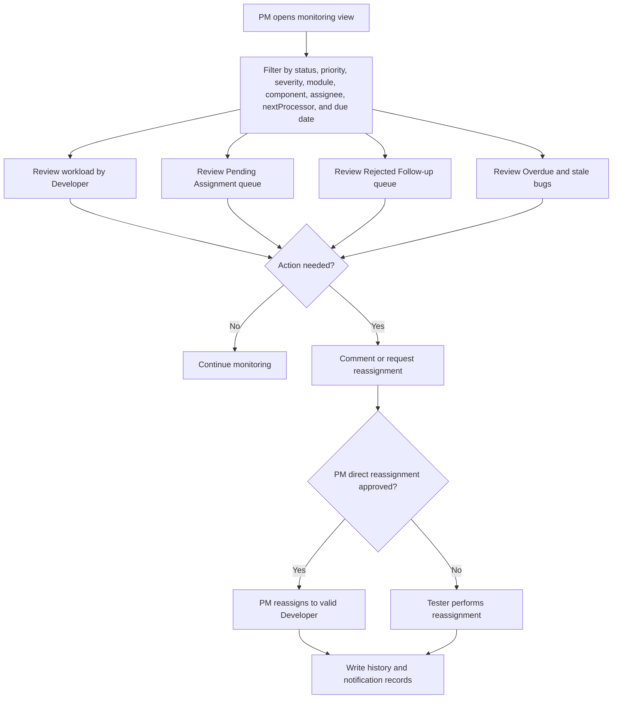

# 08 - FRS Functional Workflows

This file centralizes the workflow diagrams embedded in the FRS so the diagram pack can be reviewed independently from the formal specification documents.

Vietnamese: File này tập trung các workflow diagram đang được nhúng trong FRS để có thể review bộ diagram độc lập với tài liệu đặc tả chính thức.

## Main Defect Tracking Flow

## Rejected Follow-up Flow

## Status Lifecycle

## Bug Creation and Assignment Activity Flow

## Developer Review Decision Flow

## Request More Information Flow

## Resolve, Retest, Close, and Reopen Flow

## PM Monitoring and Escalation Flow

## Notes

- These diagrams are intentionally close to FRS wording for traceability.
- Some concepts overlap with earlier BA diagrams, but the exact FRS versions are kept here for formal specification alignment.

Vietnamese:

- Các diagram này được giữ gần với wording trong FRS để dễ trace.
- Một số khái niệm có thể trùng với diagram BA trước đó, nhưng bản FRS exact được giữ ở đây để đồng bộ với tài liệu đặc tả chính thức.
