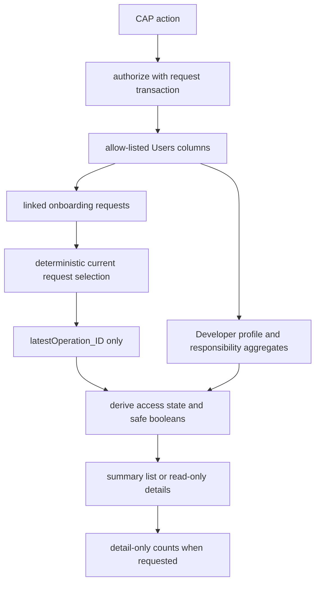

# Knowledge: `srv/user-admin/active-users.js`

## Overview / Tổng quan

`active-users.js` is the Gate 2 request-local read-model module for the User Administration service. It returns one safe row per persisted IDTS user, separates the current access state from invitation history, and exposes read-only details. It does not call a provider, mutate a role or session, write a business entity, or cache rows between requests.

`active-users.js` là module read-model theo từng request của User Administration cho Gate 2. Module trả về một dòng an toàn cho mỗi user IDTS đã lưu, tách access state hiện tại khỏi lịch sử invitation và cung cấp details chỉ đọc. Module không gọi provider, không đổi role/session, không ghi business entity và không cache row giữa các request.

## Entry points / Điểm vào

- `registerActiveUserHandlers(service, { authorize })` attaches the two service actions and requires an authorization function.
- `searchActiveUsers(req, { authorize })` normalizes the bounded search and `skip/top` inputs, authorizes, builds the read model, excludes only `REVOKED` by default, and returns one stable sorted page with `top` bounded to 100. Callers request the next page by increasing `skip`; the action does not claim an OData entity nextLink.
- `readActiveUserDetails(req, { authorize })` validates the UUID, authorizes, builds the detail-capable read model, and returns one display-only details object.
- `deriveAccessState({ userActive, requestStatus })` is a pure helper used by the programmatic fixture test.

- `registerActiveUserHandlers(service, { authorize })` gắn hai service action và bắt buộc có hàm authorization.
- `searchActiveUsers(req, { authorize })` chuẩn hóa query và `skip/top` có giới hạn, authorize, dựng read model, mặc định chỉ loại `REVOKED`, sau đó trả một page summary sort ổn định với `top` tối đa 100. Caller lấy page tiếp theo bằng cách tăng `skip`; action không claim OData entity nextLink.
- `readActiveUserDetails(req, { authorize })` validate UUID, authorize, dựng read model đủ cho details và trả một object details chỉ hiển thị.
- `deriveAccessState({ userActive, requestStatus })` là helper thuần được test bằng fixture programmatic.

## Read-model flow / Luồng read model

1. The module selects explicit user columns only, including the internal immutable-link comparison value. That value is never mapped to the public result.
2. It loads explicit user columns without an early 200-row truncation, then loads onboarding requests for that user set and selects only relevant lifecycle states. The selection order is `modifiedAt desc`, then `createdAt desc`, then `ID desc`; duplicate `ACTIVE` requests are marked ambiguous and fail closed as `INCOMPLETE` rather than choosing an arbitrary row.
3. It follows only the selected request's `latestOperation_ID`. A newer operation attached to an older request cannot replace the selected request's safe result.
4. It aggregates active Developer profile responsibilities for readiness. Bug rows are loaded only for the details path to calculate the open-impact count; audit rows are never loaded for the list path.
5. It derives `ACTIVE`, `SUSPENDED`, `REVOKED`, or `INCOMPLETE`. A row can be `ACTIVE`, `SUSPENDED`, or `REVOKED` only when the selected request and internal user have the same immutable identity hash; a missing or mismatched link fails closed as `INCOMPLETE`. Identity linkage is exposed only as the boolean `identityLinked`.
6. Search filters and sorts the complete derived set before applying explicit `skip/top` paging. The default page excludes only `REVOKED`; the explicit option includes it.
7. Details count request IDs associated with the user ID or normalized contact email and count audit IDs for the target user. The details response contains counts, not request or audit rows.

1. Module chỉ select các column user được allow-list, trong đó có giá trị internal phục vụ so sánh immutable link. Giá trị đó không bao giờ được map ra public result.
2. Module load column user explicit không cắt sớm ở 200 row, sau đó load onboarding request của tập user đó và chỉ chọn lifecycle state liên quan. Thứ tự chọn là `modifiedAt desc`, sau đó `createdAt desc`, rồi `ID desc`; duplicate `ACTIVE` bị đánh dấu ambiguous và fail closed thành `INCOMPLETE`, không chọn bừa một row.
3. Module chỉ đi theo `latestOperation_ID` của request đã chọn. Operation mới hơn nhưng thuộc request cũ không thể thay thế safe result của request đã chọn.
4. Module aggregate responsibility active của Developer để tính readiness. Bug row chỉ load ở details để tính open-impact count; list không load audit row.
5. Module suy ra `ACTIVE`, `SUSPENDED`, `REVOKED` hoặc `INCOMPLETE`. Row chỉ có thể là `ACTIVE`, `SUSPENDED` hoặc `REVOKED` khi request được chọn và internal user có cùng immutable identity hash; link thiếu hoặc không khớp fail closed thành `INCOMPLETE`. Link identity chỉ lộ ra dưới dạng boolean `identityLinked`.
6. Search filter và sort toàn bộ derived set rồi mới paging bằng `skip/top` explicit. Page mặc định chỉ loại `REVOKED`; tùy chọn rõ ràng sẽ thêm row này.
7. Details đếm request ID gắn với user ID hoặc normalized contact email và đếm audit ID theo target user. Response details chỉ có count, không có request/audit row.

## Public safe fields / Field an toàn công khai

The CDS contract is the source of truth. Summary fields are `userID`, `displayName`, `email`, `businessRole`, `userAdminCapability`, `accessState`, `identityLinked`, `developerReady`, `activeResponsibilityCount`, `pendingOperationType`, `pendingOperationState`, `lastSafeResultCode`, and `lastReconciledAt`. Details add request/audit counts and the allow-listed Developer profile summary.

The response intentionally excludes provider identifiers, identity claims, immutable-link values, credential material, operation leases, idempotency values, raw provider results, and audit/request bodies. The source test rejects the named forbidden identity output keys from the contract and returned objects.

CDS contract là nguồn chuẩn. Summary gồm `userID`, `displayName`, `email`, `businessRole`, `userAdminCapability`, `accessState`, `identityLinked`, `developerReady`, `activeResponsibilityCount`, `pendingOperationType`, `pendingOperationState`, `lastSafeResultCode` và `lastReconciledAt`. Details thêm count request/audit và summary profile Developer được allow-list.

Response cố ý không chứa provider identifier, identity claim, giá trị immutable-link, credential, operation lease, idempotency value, raw provider result hoặc body audit/request. Test source reject các forbidden identity output key đã nêu khỏi contract và object trả về.

## Authorization and errors / Phân quyền và lỗi

`srv/user-admin.js` registers this module with `requireActiveUserAdministrator`. The guard requires the existing exact PM + `UserAdmin` boundary and a matching active internal PM. The module calls `authorize(req, tx)` before its first query on both actions. Invalid UUID input returns a bounded 400 error; a user outside the read model returns a safe 404.

`srv/user-admin.js` đăng ký module bằng `requireActiveUserAdministrator`. Guard dùng boundary hiện có: đúng PM + `UserAdmin` và internal PM tương ứng vẫn active. Module gọi `authorize(req, tx)` trước query đầu tiên ở cả hai action. UUID không hợp lệ trả lỗi 400 có giới hạn; user ngoài read model trả 404 an toàn.

## Dependencies and editing guide / Dependency và hướng chỉnh sửa

- Direct dependency: `@sap/cds` transaction and explicit-column CQL.
- Registration dependency: `srv/user-admin.js` only; unrelated onboarding handlers stay in that file.
- Persisted sources: existing `Users`, `UserOnboardingRequests`, `UserAccessOperations`, `DeveloperProfiles`, `DeveloperResponsibilities`, `Bugs`, and `UserIdentityAuditEvents` entities. No CDS entity or database column is added.
- Keep state request-local. Do not add module-level row caches, provider calls, hidden identifiers, or mutation actions.
- When changing the contract, update `srv/user-admin.cds`, the focused fixture, the UI mirror, and the source evidence together; rerun CAP/UI/security gates before claiming a result.

- Dependency trực tiếp: transaction và CQL explicit-column của `@sap/cds`.
- Dependency đăng ký: chỉ `srv/user-admin.js`; handler onboarding không liên quan vẫn giữ ở file đó.
- Nguồn persisted: các entity hiện có `Users`, `UserOnboardingRequests`, `UserAccessOperations`, `DeveloperProfiles`, `DeveloperResponsibilities`, `Bugs` và `UserIdentityAuditEvents`. Không thêm CDS entity hay database column.
- Giữ state theo request. Không thêm row cache cấp module, provider call, hidden identifier hay mutation action.
- Khi đổi contract, cập nhật đồng thời `srv/user-admin.cds`, fixture focused, UI mirror và source evidence; chạy lại CAP/UI/security gate trước khi claim kết quả.

## Verification / Xác minh

The focused test at `scripts/qa/test-user-admin-active-users.js` covers deduplication, deterministic request ordering, stale-operation exclusion, default/non-active filtering, case-insensitive search, bounded input denial, explicit page bounds, 205-row page boundaries without duplicates/data loss, ambiguous active requests, safe identity booleans, details counts, and the PM/UserAdmin authorization matrix. The exact source evidence record is `docs/pm/evidence/user-administration/gate-2-active-users-source.md`.

Test focused tại `scripts/qa/test-user-admin-active-users.js` bao phủ deduplicate, thứ tự request deterministic, loại stale operation, filter mặc định/non-active, search không phân biệt hoa thường, từ chối input quá dài, page bound explicit, boundary 205 row qua nhiều page không duplicate/mất data, duplicate active ambiguous, boolean identity an toàn, details count và ma trận authorization PM/UserAdmin. Record source evidence chính xác là `docs/pm/evidence/user-administration/gate-2-active-users-source.md`.

## Metadata / Metadata

- Date: 2026-08-20
- Depth: source entry point plus dependencies through the persisted read model
- Source: `srv/user-admin/active-users.js`
- Related: `srv/user-admin.cds`, `srv/user-admin.js`, `scripts/qa/test-user-admin-active-users.js`

## Gate 3 lifecycle visibility / Hiển thị vòng đời Gate 3

`SUSPENDED` belongs to both the relevant request statuses and the suspended-request status set. Therefore an actively suspended user remains visible in Active Users with `accessState=SUSPENDED` while a `REACTIVATE` operation is queued or processing; the pending operation summary does not incorrectly collapse the row to `INCOMPLETE`. The read model still returns only the safe identity booleans and never returns immutable-link hashes or provider identifiers.

Vietnamese: `SUSPENDED` nam trong ca tap relevant request status va tap suspended-request status. Vi vay user dang suspend van hien trong Active Users voi `accessState=SUSPENDED` khi operation `REACTIVATE` dang queued hoac processing; pending operation khong lam row bi ha sai ve `INCOMPLETE`. Read model van chi tra boolean identity an toan va khong tra immutable-link hash hay provider identifier.
## Gate 3B identity readiness and link eligibility / Readiness va eligibility link identity Gate 3B

The read model now consumes `srv/access/identity-readiness.js`. `identityLinked` is true only for one exact matching `ACTIVE` request and user hash; `developerReady` additionally requires an active Developer Profile and active responsibility. `linkEligible` is a safe server-owned Boolean for active legacy TESTER/DEVELOPER rows that are unlinked, incomplete, non-pending, and still on the legacy email domain. Linked, PM, inactive, revoked, pending, or non-legacy rows are hidden from the link action.

Read model dung `srv/access/identity-readiness.js`. `identityLinked` chi true khi co dung mot request `ACTIVE` khop hash user; `developerReady` con can Developer Profile active va responsibility active. `linkEligible` la Boolean an toan do server tinh cho row TESTER/DEVELOPER legacy active, chua link, incomplete, khong pending va van dung domain email legacy. Row da link, PM, inactive, revoked, pending hoac non-legacy deu bi an action link.
