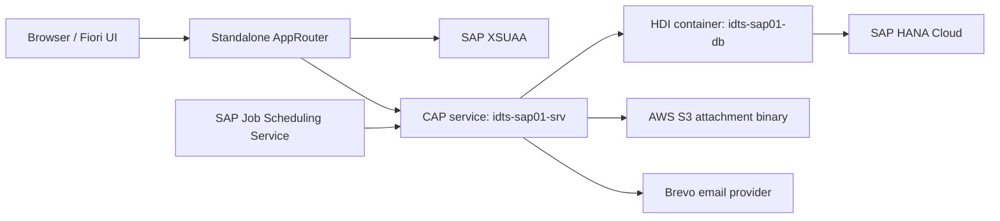

# IDTS-107 — Technical Design, database and persistence candidate

> Gate status: **GATE 1 CANDIDATE — DONHV APPROVAL AND IDTS-112 INTEGRATION PENDING**
>
> This package is generated from the CDS model at baseline `362ace2a39a82d19c4acc723fe96a15bf7373f5e`. It is not the
> official Technical Specification workbook and must not be synchronized to Google Drive
> before the required human approval and template integration gates.

## 1. Source-of-truth baseline

| Item | Candidate value |
| --- | --- |
| Repository baseline | `362ace2a39a82d19c4acc723fe96a15bf7373f5e` |
| Logical data model | `db/schema.cds` |
| HANA deployment | `idts-sap01-db` HDI container through `mta.yaml` |
| Runtime service | `idts-sap01-srv` on SAP BTP Cloud Foundry |
| Local persistence | SQLite |
| Rollback baseline | Render/PostgreSQL; not a hot replica of HANA |
| Attachment binary | AWS S3 retained outside BTP; HANA stores metadata/reference |
| Email delivery | HANA outbox + SAP Job Scheduling Service + Brevo |
| AI acceptance | Disabled-provider/fallback only; live OpenAI is not accepted |

## 2. Persistence architecture

The CAP service owns validation, authorization and transaction boundaries. UI visibility is
not an authorization control. HANA is authoritative for the active BTP runtime; the retained
PostgreSQL environment is a rollback baseline and does not receive HANA changes automatically.

## 3. Physical HANA table inventory

The CDS compiler produces 35 physical tables and 326 physical
columns for the current HANA dialect. HANA Database Explorer may display unquoted artifact names
in uppercase; the compiler names below are the reproducible source mapping.

| Logical entity | Physical HANA artifact | Columns | Purpose |
| --- | --- | ---: | --- |
| `idts.cap.UserRoles` | `idts_cap_UserRoles` | 6 | Business-role code list for Tester, Developer and PM profiles. |
| `idts.cap.StatusValues` | `idts_cap_StatusValues` | 6 | Bug lifecycle status code list. |
| `idts.cap.PriorityValues` | `idts_cap_PriorityValues` | 6 | Bug priority code list. |
| `idts.cap.SeverityValues` | `idts_cap_SeverityValues` | 6 | Bug severity code list. |
| `idts.cap.EnvironmentValues` | `idts_cap_EnvironmentValues` | 6 | Execution-environment code list. |
| `idts.cap.ProcessorRoleValues` | `idts_cap_ProcessorRoleValues` | 6 | Current-action-owner role or queue code list. |
| `idts.cap.AvailabilityStatuses` | `idts_cap_AvailabilityStatuses` | 6 | Developer availability code list. |
| `idts.cap.ResponsibilityLevels` | `idts_cap_ResponsibilityLevels` | 6 | Developer responsibility strength code list. |
| `idts.cap.ActionTypes` | `idts_cap_ActionTypes` | 6 | Exact workflow and audit action type catalog. |
| `idts.cap.NotificationEventTypes` | `idts_cap_NotificationEventTypes` | 6 | Notification business-event code list. |
| `idts.cap.NotificationChannels` | `idts_cap_NotificationChannels` | 6 | In-app and email channel code list. |
| `idts.cap.NotificationDeliveryStatuses` | `idts_cap_NotificationDeliveryStatuses` | 6 | Delivery state catalog for in-app and email processing. |
| `idts.cap.DuplicateRelationTypes` | `idts_cap_DuplicateRelationTypes` | 6 | Confirmed duplicate/similar/related relation catalog. |
| `idts.cap.AiSuggestionFeatureTypes` | `idts_cap_AiSuggestionFeatureTypes` | 6 | AI advisory feature catalog. |
| `idts.cap.AiSuggestionReviewStates` | `idts_cap_AiSuggestionReviewStates` | 6 | Human review-state catalog for AI suggestions. |
| `idts.cap.Users` | `idts_cap_Users` | 11 | Internal IDTS business profile mapped to a platform identity on SAP BTP. |
| `idts.cap.AuthSessions` | `idts_cap_AuthSessions` | 12 | Custom-auth session store used outside the XSUAA production profile. |
| `idts.cap.DeveloperProfiles` | `idts_cap_DeveloperProfiles` | 9 | Developer capacity and availability profile. |
| `idts.cap.SAPModules` | `idts_cap_SAPModules` | 8 | Optional SAP module classification master data. |
| `idts.cap.ApplicationComponents` | `idts_cap_ApplicationComponents` | 9 | Application component classification master data. |
| `idts.cap.SAPModuleComponents` | `idts_cap_SAPModuleComponents` | 8 | Allowed SAP module-to-component mapping. |
| `idts.cap.DefectCategories` | `idts_cap_DefectCategories` | 9 | Defect category master data. |
| `idts.cap.ComponentCategories` | `idts_cap_ComponentCategories` | 8 | Validated component and defect-category combination used for assignment. |
| `idts.cap.DeveloperResponsibilities` | `idts_cap_DeveloperResponsibilities` | 10 | Developer capability mapping used by assignment and workload views. |
| `idts.cap.Bugs` | `idts_cap_Bugs` | 30 | Authoritative defect record and workflow state. |
| `idts.cap.Comments` | `idts_cap_Comments` | 9 | User-authored collaboration records linked to a Bug. |
| `idts.cap.Bugs.attachments` | `idts_cap_Bugs_attachments` | 15 | Attachment metadata and object-store reference; binary content is provided by AWS S3 in BTP. |
| `sap.attachments.ScanStates` | `sap_attachments_ScanStates` | 4 | Attachment scan-state catalog supplied by @cap-js/attachments. |
| `sap.attachments.ScanStates.texts` | `sap_attachments_ScanStates_texts` | 4 | Localized attachment scan-state texts supplied by @cap-js/attachments. |
| `idts.cap.HistoryEvents` | `idts_cap_HistoryEvents` | 11 | User-facing immutable audit event grouped by business action. |
| `idts.cap.HistoryLogs` | `idts_cap_HistoryLogs` | 17 | Append-only field-level changes belonging to a HistoryEvent. |
| `idts.cap.Notifications` | `idts_cap_Notifications` | 12 | In-app notification event and recipient state. |
| `idts.cap.NotificationDeliveries` | `idts_cap_NotificationDeliveries` | 22 | Email outbox payload, retry, lock and provider delivery state. |
| `idts.cap.DuplicateLinks` | `idts_cap_DuplicateLinks` | 8 | Human-confirmed relation between two Bugs. |
| `idts.cap.AiSuggestions` | `idts_cap_AiSuggestions` | 20 | Sanitized AI advisory audit record and human review state. |

The complete column-level dictionary is stored in
`docs/pm/evidence/idts-107/technical-spec/database-dictionary.csv`. It includes datatype,
primary key, nullability, default, relationship target, purpose, owner and retention.

## 4. Transaction and rollback boundaries

| Flow | Entry and source | Transaction behavior | Persistent side effects | Failure behavior |
| --- | --- | --- | --- | --- |
| Authentication | `AuthService.login` → `srv/auth.js::login` | `cds.tx(req)` reads Users and inserts AuthSessions for custom-auth profiles. XSUAA production resolves the active Users profile without creating a custom session. | Users read; AuthSessions insert only outside XSUAA production. | Invalid credentials return a safe denial. Unexpected errors are sanitized. |
| Draft create/save | Fiori draft `NEW/PATCH/SAVE` → `srv/bug-service/drafts.js` | Draft validation and activation run in the CAP request transaction. | Active Bugs row plus required history/notification side effects. | Validation failure prevents activation; transaction rollback prevents partial business state. |
| Active create/update | `srv/service.js` → `prepareBugWrite` | Backend derives status/classification and enforces permissions before persistence. | Bugs and associations are written only after validation. | Direct OData calls cannot bypass backend role, code-list or transition rules. |
| Lifecycle action | `srv/bug-service/actions.js::transitionBug` | Bug update, history, comment where applicable, and notification use the request transaction. | Bugs, HistoryEvents, HistoryLogs, Notifications and outbox rows. | Any required database side-effect failure rolls back the action. |
| Comment | `addComment` / `prepareCommentCreate` | Comment insert and audit side effects share the request transaction. | Comments plus history/notification records. | Invalid actor/content is rejected before a durable audit record is created. |
| Attachment | `prepareAttachmentWrite` plus @cap-js/attachments | CAP authorizes metadata operations; provider processing uses the configured attachment adapter. | HANA metadata/reference and AWS S3 binary. | Provider error is sanitized; no credential is exposed. Browser pre-save files remain client-memory only until Bug activation. |
| History | `writeHistoryEvent` in `srv/bug-service/history.js` | Event and field-level logs are inserted through `cds.tx(req)`. | Immutable HistoryEvents and HistoryLogs. | A required audit failure rolls back the related business action. |
| Notification/outbox | `writeNotificationRecord` in `srv/email/outbox.js` | In-app Notification and email delivery row are created with the business transaction; provider send is asynchronous. | Notifications and NotificationDeliveries. | Provider failure changes delivery state but does not roll back an already committed Bug workflow. |
| Email processing | Job Scheduler → `processEmailOutbox` → `processEmailDeliveries` | Eligible rows are claimed with lockToken/lockedUntil and updated per attempt. | attemptCount, retry time, SENT/FAILED/SKIPPED state and sanitized provider summary. | Locking prevents duplicate workers from claiming the same delivery; retries stop at the configured maximum. |
| HANA migration | `scripts/btp/import-hana.js` | All allowlisted entity replacement/import operations execute inside one `db.tx`. | UUID-preserving import into HDI-managed tables. | Count/key/checksum mismatch throws and rolls back the complete import. AuthSessions are explicitly omitted. |

## 5. Migration, security and retention controls

| Control | Candidate explanation |
| --- | --- |
| Allow-list | Migration uses a fixed entity order rather than exporting every database object. |
| Identity continuity | UUID keys and association values are preserved. Approved FPT member profiles and intentional demo Developers remain separate records. |
| Session safety | AuthSessions are not migrated. Historical password hashes are not used by XSUAA production login. |
| Email safety | Historical retryable email rows were normalized so cutover cannot resend old mail. |
| Secret safety | BTP bindings provide HANA, S3 and Brevo values. Workbooks/evidence contain no service key, token, DB URL or recipient list. |
| Attachment boundary | HANA stores metadata and reference fields; AWS S3 stores binary objects. |
| Audit retention | HistoryEvents/HistoryLogs are append-only evidence for the project lifecycle. |
| Rollback | Render/PostgreSQL can restore the previous platform baseline, but HANA-only deltas require explicit reconciliation because replication is not continuous. |

## 6. Accepted evidence references

- `docs/pm/evidence/idts-113/btp-hana-migration-integrations-local-verification-20260728.md`
- `docs/pm/evidence/idts-113/btp-auth-jobscheduler-smoke-20260728.md`
- `docs/pm/evidence/idts-113/btp-render-rollback-drill-20260728.md`
- `docs/pm/evidence/idts-113/hana-final-container-user-classification-20260728.md`
- `docs/pm/evidence/idts-113/technical-spec-btp-delta-candidate.md`

## 7. Missing evidence and approval register

| Item | Status | Required owner action |
| --- | --- | --- |
| DonHV briefing acknowledgment | PENDING | DonHV reads the committed IDTS-105 briefing and records the Jira/repo acknowledgment personally. |
| DonHV candidate approval | PENDING | Review the generated table/column dictionary, transaction descriptions and evidence links. |
| HANA Database Explorer image for dictionary section | MISSING EVIDENCE — owner action required | Capture a sanitized screenshot of the final HDI container/table view without credentials or private values. |
| Native Fiori attachment picker | MISSING EVIDENCE — owner action required | Enable approved Chrome upload permission and capture upload/download/reload/delete evidence. |
| Developer and Tester role matrix | MISSING EVIDENCE — member action required | Provisioned members sign in with their own SAP identities; DonHV records authorized and denied cases. |
| IDTS-112 workbook integration | BLOCKED | Integrate only after IDTS-107/108/109 packages receive their respective human approvals. |

## 8. Gate decision

This package completes the agent-prepared candidate portion only. It deliberately does not mark
IDTS-107 Done, approve on behalf of DonHV, update the official Technical Specification workbook,
or synchronize Google Drive.
